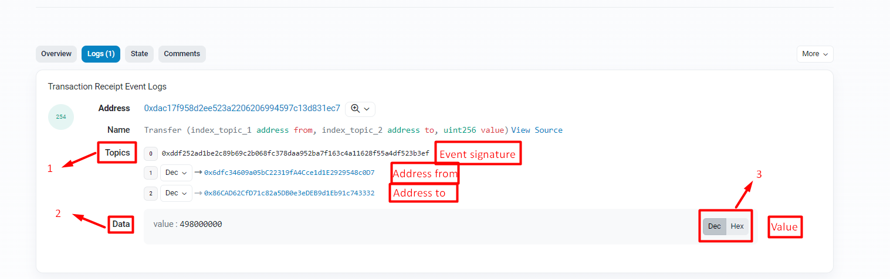

# Event argument indexing

**Автор:** [Найданов Павел](https://github.com/PavelNaydanov) 🕵️‍♂️

Прежде чем разобрать индексирование аргументов в событиях определим что такое Events в Solidity. Перед чтением этой статьи рекомендуем ознакомиться с устройством работы EVM от Luit Hollander ["The Ethereum Virtual Machine — How does it work?"](https://medium.com/mycrypto/the-ethereum-virtual-machine-how-does-it-work-9abac2b7c9e).

## Events

```solidity
event Transfer(address from, address to, uint256 amount);
```
События в Solidity являются своего рода абстракцией над системой логирования в EVM. Приложения могут подписываться и слушать события через RPC-интерфейс клиента Ethereum. Вызов события сохраняет параметры события в специальный журнал транзакций.

События этого журнала связаны с адресом контракта, включены в цепочку блоков и остаются там до тех пор пока блок доступен(на данный момент навсегда, но это может измениться с [Serenity](https://medium.com/pnetwork/eth-2-0-what-is-it-6104a86ff634), так как там будет реализован sharding, proof-of-stake, and moving EVM to eWASM)

**Для чего нужны Events?**
1. Для тестирования. В тестах можно получать события со смарт-контрактов из данных транзакции и проверять их.
2. Для восстановления состояния хранилища. Все события хранятся в журнале EVM и могут быть прочитаны.
3. Прослушивание событий. Необходимо для оперативного реагирования на изменения во внешнем интерфейсе.
4. Создание сабграфов для конвертации и более быстрого чтения данных.

Возможны и другие области применения событий.

## Argument indexing

Мы определили, что события в Solidity используют инструмент логирования EVM. Для логирования событий в журнал EVM предоставляет 5 opcodes.
>*LOG0, LOG1, LOG2, LOG3, LOG4*

При помощи этих opcodes можно создать запись в журнал. Такая запись состоит из двух частей:
- **topic**
- **data**

**Topic** - это 32-байтные слова, которые используются для описания того, что происходит в событии. Например, трансфер от одного адреса к другому.

**Data** - это закодированные данные. Например, количество токенов переданных при трансфере.

Различные коды операций **(LOG0 … LOG4)** необходимы для описания количества тем, которые необходимо включить в запись журнала. Например, **LOG1** включает один topic , а **LOG4** включает четыре topics. Таким образом, максимальное количество topics, которые могут быть включены в одну запись журнала, равно четырем.

Первый **topic** всегда является *signature* события с типами. Другими словами он представлен, как hash ```keccak(Transfer(address,address,uint256))```. Таким образом для своих событий можно добавить 3 параметра в topics.

_Важно!_ В Solidity существуют анонимные события. Для этого используется ключевое слово ```anonymous```. Подробнее [тут](https://docs.soliditylang.org/en/latest/abi-spec.html#events). Для таких событий не используется **topic** по умолчанию с сигнатурой события. Это значит, что можно добавить 4 собственных **topics**.

В Solidity для того, чтобы указать, какой параметр необходимо добавить в **topic** используется ключевое слово ```indexed``` перед названием параметра. Например,
```solidity
Transfer(address indexed from, address indexed to, uint256 value)
```

Другими словами параметры событий бывают двух типов:
1. indexed
2. non-indexed

Параметры с атрибутом ```indexed``` будут записаны в **topic** записи журнала EVM. Все остальные параметры автоматически будут ```non-indexed```. Это будет означать, что параметр будет добавлен в специальную структуру данных(**data**) записи журнала EVM.

**Topic** и **data** или **indexed** и **non-indexed** лучше всего работают вместе. У каждого есть свои плюсы и минусы. Например, **topic** доступны для поиска, **data** — нет. Но включение **data** намного *дешевле*, чем включение **topic**. Кроме того, **topic** ограничены 4 **topic** по 32 байта, **data** не ограничены. Это означает, что **data** могут включать большие или сложные данные, массивы или структуры.

Подробнее, как работает логирование событий в Ethereum blockchain можно почитать [тут](https://medium.com/mycrypto/understanding-event-logs-on-the-ethereum-blockchain-f4ae7ba50378).

## Для чего нужны indexed параметры?

Каждый ```indexed``` параметр создает **topic**. Этот параметр исключается из данных и не кодируется. По этому параметру можно обеспечить эффективный поиск.

При помощи запросов [JSON-RPC](https://github.com/ethereum/execution-apis) к полными nodes, таким как geth или parity, или сервисам, таким как Infura можно запросить данные событий из блокчейн. Делается это на основе [фильтра Блума](https://habr.com/ru/company/otus/blog/541378/), который придуман для быстрой проверки принадлежности элемента к множеству.

Для Solidity разработчика важно понимать, как ```indexed``` параметры будут использоваться для фильтров за пределами контрактов. Поэтому предлагаем ознакомиться с документацией [ethers js](https://docs.ethers.org/v5/concepts/events/#events--filters), которая позволяет получать данные из отфильтрованных событий.

## Как это выглядит в Etherscan



Под цифровой **1** мы видим раздел **Topics** в котором хранятся ```indexed``` параметры. Нулевой параметр - это хеш signature события ```Transfer(address,address,uint256)```.

Под цифрой **2** мы видим раздел **Data** в котором хранится ```non-indexed``` параметр ```uint256 value```.

Под цифрой **3** мы видим переключение типа отображения раздела **Data**. Помним, что **Data** хранится в зашифрованном виде.

## Examples

Простое объяснение использование Solidity Events можно посмотреть в статье от [ChainLink](https://blog.chain.link/events-and-logging-in-solidity/).

Пример, где можно посмотреть как работают ```indexed``` и ```non-indexed``` параметры можно в примере из этой же статьи. Ссылка на [репозиторий](https://github.com/PatrickAlphaC/hardhat-events-logs). В репозитории есть пример простого скрипта, который выводит события в консоль.

## Links

1. [Solidity documentation. Events](https://docs.soliditylang.org/en/v0.8.18/contracts.html#events)
2. [Understanding event logs on the Ethereum blockchain](https://medium.com/mycrypto/understanding-event-logs-on-the-ethereum-blockchain-f4ae7ba50378)
3. [The Ethereum Virtual Machine — How does it work?](https://medium.com/mycrypto/the-ethereum-virtual-machine-how-does-it-work-9abac2b7c9e)
4. [Deep dive into Ethereum logs](https://codeburst.io/deep-dive-into-ethereum-logs-a8d2047c7371)