# Yul

-   [Введение](#введение)
    -   [Основные понятия](#основные-понятия)
    -   [Для чего нужен Yul](#для-чего-нужен-yul)
    -   [С чего начать изучение?](#с-чего-начать-изучение)
-   [Особенности языка](#особенности-языка)
    -   [Область видимости](#область-видимости)
    -   [Синтаксис](#синтаксис)
    -   [Типы](#типы)
    -   [Литералы](#литералы)
    -   [Поток управления](#поток-управления)
-   [Инструкции](#инструкции)
    -   [Операции сравнения](#операции-сравнения)
    -   [Битовые операции](#битовые-операции)
    -   [Другие полезные функции](#другие-полезные-функции)
-   [Работа с памятью](#работа-с-памятью)
    -   [Storage](#storage)
        -   [Структуры в storage](#структуры-в-storage)
        -   [Массивы фиксированной длины](#массивы-фиксированной-длины)
        -   [Динамические массивы](#динамические-массивы)
        -   [Маппинги](#маппинги)
        -   [Вложенные маппинги](#вложенные-маппинги)
        -   [Маппинги с массивами](#маппинги-с-массивами)
        -   [Массивы байтов и строки](#массивы-байтов-и-строки)
    -   [Memory](#memory)
        -   [Структуры в memory](#структуры-в-memory)
        -   [Массивы фиксированной длины](#массивы-фиксированной-длины-в-memory)
        -   [Динамические массивы](#динамические-массивы-в-memory)
        -   [Массивы байтов и строки](#массивы-байтов-и-строки-в-memory)
        -   [abi.encode](#abiencode)
        -   [abi.encodePacked](#abiencodepacked)
        -   [return](#return)
        -   [revert](#revert)
        -   [keccak256](#keccak256)
    -   [Calldata](#calldata)
        -   [Срез данных](#срез-данных)
-   [Вызов других смарт-контрактов](#вызов-других-смарт-контрактов)
-   [Events](#events)
-   [Смарт-контракты на языке Yul](#смарт-контракты-на-языке-yul)
-   [Ссылки](#ссылки)

## Введение

### Основные понятия

**Yul** — это ассемблер среднего уровня, разработанный специально для EVM (виртуальной машины Ethereum). Он предлагает баланс между высокоуровневым и низкоуровневым программированием, предоставляя разработчикам прямой контроль над операциями EVM, сохраняя при этом читаемый и структурированный синтаксис.

Но это не изобретение Ethereum, к примеру программа, написанная на языке высокого уровня, таком как C, Go или Java, также перед выполнением сначала компилируется в так называемый язык ассемблера.

**Ассемблер** - это любой язык программирования низкого уровня, который преобразуется в машинный код (байт-код) с помощью ассемблера. Языки ассемблера привязаны либо к физической, либо к виртуальной машине, поскольку реализуют ее набор команд.

**Байт-код EVM** - это компактное представление низкоуровневых инструкций, которые в дальнейшем интерпретируются виртуальной машиной Ethereum (EVM).

_Примечание!_ Перед изучением Yul рекомендуется разобраться как работают [битовые операции](https://github.com/fullstack-development/blockchain-wiki/blob/main/solidity/bitwise-operators/bitwise-operators.md), как устроена стековая машина [EVM](https://github.com/fullstack-development/blockchain-wiki/blob/main/ehtereum-virtual-machine/README.md), как работают [опкоды](https://github.com/fullstack-development/blockchain-wiki/blob/main/ehtereum-virtual-machine/evm-opcodes/README.md) и как устроена кодировка [abi](https://github.com/fullstack-development/blockchain-wiki/blob/main/solidity/ABI/readme.md). Также в изучении очень поможет понимание устройства различных видов памяти в EVM (storage, memory, calldata) и какие есть особенности при работе с ними.

### Для чего нужен Yul

Основная задача Yul - это оптимизация смарт-контрактов по газу, как на уровне языка так и на уровне компилятора, а также гораздо больший контроль над выполнением кода.

Yul можно использовать в режиме [inline assembly](https://docs.soliditylang.org/en/latest/assembly.html) («встроенной сборки») в коде solidity, а можно [написать смарт-контракты на чистом Yul](#смарт-контракты-на-языке-yul) вообще без использования solidity.

Компилятор использует Yul в качестве промежуточного языка в генераторе кода на основе [IR](https://docs.soliditylang.org/en/latest/ir-breaking-changes.html) (Intermediate Representation).

Дизайн Yul пытается достичь следующих целей:

1. Программы, написанные на Yul, должны быть читабельными, даже если код сгенерирован компилятором из solidity или другого языка высокого уровня.
2. Поток управления должен быть простым для понимания, чтобы облегчить ручную проверку, формальную проверку и оптимизацию.
3. Перевод из Yul в байт-код должен быть максимально простым.
4. Yul должен подходить для оптимизации всего приложения целиком.

Для достижения первой и второй цели Yul предоставляет высокоуровневые конструкции, такие как циклы `for`, операторы `if` и `switch`, инструкции и вызовы функций. Этого достаточно для представления потока управления программами на ассемблере. При этом нет явных инструкций для управление стеком - `SWAP`, `DUP`, `JUMPDEST` `JUMP` и `JUMPI`, поскольку первые две запутывают поток данных, а последние три запутывают поток управления.

_Примечание!_ В Yul все же существует возможность получить доступ к стеку с помощью функции [verbatim](https://docs.soliditylang.org/en/latest/yul.html#verbatim).

### С чего начать изучение?

Если вы уже изучили или повторили темы озвученные [выше](#основные-понятия), то для начала можно посмотреть [серию коротких видео](https://youtube.com/playlist?list=PL5hld-skrdFrxGUmmEbG1LBvYVyTE9M62&si=jwXH_rtSvoNfrDPg), а также разобрать [вот эту](https://medium.com/lumos-labs/inline-assembly-in-solidity-34d3ba2cfa7a) статью. В официальной документации для начала можно подсматривать [инструкции](https://docs.soliditylang.org/en/latest/yul.html#evm-dialect) которые используются в Yul.

Лучше понять что происходит в коде поможет [Remix Debugger](https://medium.com/@kulman.david/how-to-use-remix-debugger-to-learn-solidity-assembly-5a745a22bb07), это очень мощный инструмент для низкоуровневого дебаггинга кода solidity и Yul. Также подойдет [debugger от foundry](https://book.getfoundry.sh/forge/debugger?highlight=debugger#debugger) или [Playground от evm.codes](https://www.evm.codes/playground) (далее в тексте вместо "debugger" я буду употреблять слово "отладчик").

Можно глянуть серию коротких статей от Naveen: [часть 0](https://mirror.xyz/0xB38709B8198d147cc9Ff9C133838a044d78B064B/nk40v2MJKSHXXNSlbqqhpwJf4MtZ9V2Vp8P_bSNwjYc), [часть 1](https://mirror.xyz/0xB38709B8198d147cc9Ff9C133838a044d78B064B/PpA5KdQhrE_2Bf-USfKePROJ5tE-raL7_VGBR8HE39E), [часть 2](https://mirror.xyz/0xB38709B8198d147cc9Ff9C133838a044d78B064B/Hh69VJWM5eiFYFINxYWrIYWcRRtPm8tw3VFjpdpx6T8).

После чего можно преходить непосредственно к [документации](https://docs.soliditylang.org/en/latest/yul.html) и пробовать писать что-то самостоятельно, а также разбирать примеры которые приведены ниже.

## Особенности языка

Код Yul может быть как написан разработчиком, так и скомпилирован из более высокоуровневых языков таких как solidity или vyper. Но в отличие от solidity в нем почти все делается вручную: управление памятью, отправка событий, abi.encode, хеширование, проверки на переполнение и т.д.

Единственное, что ассемблер делает за вас, - это переупорядочивает коды операций в функциональном стиле, подсчитывает высоту стека для доступа к переменным и удаляет слоты стека для локальных переменных сборки, когда достигается конец их блока.

Учитывая все это ошибку можно совершить при использовании любой инструкции Yul: неправильно передав аргументы, неверно определив смещение в памяти или размер данных. Нужно четко понимать что нужно сделать и зачем. Самым оптимальным считается сочетание solidity + inline assembly для оптимизаций отдельных частей кода, а также для написания эффективных по газу библиотек, таких как библиотека для работы со строками - [strings](https://github.com/Arachnid/solidity-stringutils) или библиотека для работы с [bytes](https://github.com/GNSPS/solidity-bytes-utils/blob/master/contracts/BytesLib.sol).

### Область видимости

Если говорить про inline assembly, то такие блоки не могут «общаться» между собой. Это означает, что переменные и функции, определенные в одном `assembly { ... }` блоке, не могут быть доступны из другого `assembly { ... }` блока. При этом доступ к solidity переменным будет у всех блоков, так как они проинициализированы в memory.

Также внутри assembly блока можно создавать внутренние области видимости через `{ ... }`:

```js
    assembly {
        let x := 3          // x будет доступна во всех областях видимости

        // Область видимости 1
        {
            let y := x     // тут все проидет нормально
        }

        // Область видимости  2
        {
            let z := y     // а тут получим ошибку
        }
    }
```

Но это не относится к циклу `for` и `function`.

В standalone assembly (код контракта на чистом Yul) существуют различные виды отношений между объектами, подробнее об этом [здесь](https://docs.soliditylang.org/en/latest/yul.html#specification-of-yul-object).

### Синтаксис

Синтаксис Yul отличается от solidity. Первое что бросается в глаза - после инструкций не нужно ставить точку с запятой `;`, вместо привычных операторов (например, математических - `+`, `-` и т.д.) нужно вызывать соответствующие [инструкции](https://docs.soliditylang.org/en/latest/yul.html#evm-dialect), а оператор присваивания будет выглядеть вот так `:=`.
Чтобы объявить переменную, нужно использовать ключевое слово `let`. Если объявить переменную и не присвоить ей значение - переменная проинициализируется нулем.

Во внутренней работе EVM `let` выполняет следующее:

-   создает новый слот стека;
-   новый слот резервируется для переменной;
-   затем слот снова автоматически удаляется при достижении конца блока.

Вот так будет выглядеть присваивание результата математических операций в solidity и в Yul:

```js
    // solidity
    uint256 a = (3 + 3) / 2;

    // Yul
    assembly {
        let b := div(add(3, 3), 2)
    }
```

В примере выше сначала выполнится `add`, затем `div`, затем присваивание. Первой всегда выполняется самая внутренняя инструкция.

Синтаксис функции тоже отличается. В функциях не нужно указывать область видимости, они никогда не будут частью внешнего интерфейса контракта и являются частью пространства имен, отдельного от пространства имен функций Solidity. Возвращаемые значения указываются после символа `->` через запятую, то есть из функции можно получать несколько возвращаемых значений. Внутри функций в блоке inline assembly невозможно получить доступ к переменным, объявленным вне этой функции.

```js
    function foo() external {
        assembly {
            function bar(param1, param2, ...) -> return1, return2, ... {
                // code
            }

            let x, y := bar(1, 2)
        }
    }
```

Ключевое слово `leave` можно поместить в любом месте тела ассемблерной функции, чтобы остановить поток ее выполнения и выйти из нее. Оно работает точно так же, как пустой `return` оператор, за одним исключением: функция вернет любое значение, которое последним было присвоено возвращаемой переменной.

```js
    assembly {
        function increment() -> result {
            let param := calldataload(4)
            result := add(param, 1)
            // leave вернет "result", но не завершит выполнение кода
            // как это произошло бы с return
            // выполнение assembly или solidity кода продолжится
            leave
        }
    }

```

_Важно!_ Ключевое слово `leave` можно использовать только внутри Yul функции.

Yul анализирует комментарии так же, как Solidity, поэтому можно использовать `//` и `/* */` для обозначения комментариев.

### Типы

На момент написания статьи в Yul используется всего один тип - `u256` который соответствует `uint256`, но будет легче его воспринимать как `bytes32`, потому что стековая машина работает с 32-x байтовыми словами. В документации также используется понятие 256-битное слово, но все это разные названия одного и того же.

В [этом видео](https://www.youtube.com/watch?v=ZGDQMS9GWo8&list=PL5hld-skrdFrxGUmmEbG1LBvYVyTE9M62&index=3) хорошо показано как ведут себя разные типы в Yul. Любые значения преобразуются в `bytes32`, поэтому в Yul не так просто работать с динамическими типами данных (к которым также относятся строки).

_Важно!_ Нужно быть осторожным при работе с булевыми значениями, булево значение для Yul - это проверка нулевого байта с помощью опкода `ISZERO`, поэтому значением `true` будет любое значение отличное от 0.

```js
    function getBool() external pure returns (bool res) {
        uint256 a = 42; // 42 (decimal) == 0x2a (hex)

        assembly {
            res := a // 0x000000000000000000000000000000000000000000000000000000000000002a
        }
        // res == true
    }
```

### Литералы

В качестве литералов вы можете использовать:

-   Целочисленные константы в десятичной или шестнадцатеричной записи (`42`, `0x2a`);
-   Строки ASCII (например, «abc»), которые могут содержать шестнадцатеричные escape-символы `\xNN` и escape-символы Юникода `\uNNNN`, где N — шестнадцатеричные цифры.
-   Шестнадцатеричные строки (например `hex"616263"`).

```js
    assembly {
        let a := 0x123             // Hexadecimal
        let b := 42                // Decimal
        let c := "hello world"     // String
        let d := "very long string more than 32 bytes" // Error
    }
```

Помним, что стек работает с 32-х байтовыми словами, поэтому строку длиной больше 32 байт нельзя положить в переменную объявленную через `let`.

### Поток управления

Поток управления в Yul выстраивается операторами `if` и `switch`, а также циклом `for`, их синтаксис отличается от solidity, но механики те же.

Из особенностей: цикла `while` в Yul нет, а у оператора `if` нет условия `else` (несколько условий делаются с помощью `switch`). Также нельзя написать однострочный `if` без фигурных скобок.

Пример с оператором `if`:

```js
    function ifStatement(uint256 n) external {
        assembly {
            if iszero(n) {
                // если true, выполнить действие
            }
        }
    }
```

Пример с оператором `switch`:

```js
    function switchStatement(uint256 n) external {
        assembly {
            switch n
            case 0 {
                // если n == 0 выполнить действие
            }
            case 1 {
                // если n == 1 выполнить действие
            }
            default {
                // если ни один вариант не сработал
                // выполнить действие по умолчанию
            }
        }
    }
```

Примеры цикла `for`:

```js
    function forLoop(uint256 n) external {
        assembly {
            for { let i := 0 } lt(i, n) { i := add(i, 1) } {
                // выполнить действие
            }
        }
    }

    function forLoopWithAnotherCondition(uint256 n) external {
        assembly {
            let i := 0
            for {} lt(i, n) {} {
                // выполнить действие
                i := add(i, 1)
            }
        }
    }
```

Примеры выше [тут](./examples/ControlFlow.sol).

## Инструкции

Здесь приведены только некоторые внутренние функции языка Yul. Актуальный список можно посмотреть в [документации](https://docs.soliditylang.org/en/latest/yul.html#evm-dialect).
В описании функций (в документации) можно часто встретить запись по типу `mem[a...b]` - она обозначает байты памяти, начиная с позиции `a` до позиции `b`, но не включая ее, а `storage[p]` обозначает содержимое памяти в слоте `p`.

### Операции сравнения

| Функция     | Описание                                    |
| ----------- | ------------------------------------------- |
| `eq(x, y)`  | Проверка на равенство `x` и `y` (`x == y`). |
| `iszero(x)` | Возвращает 1, если `x == 0`, иначе 0.       |
| `lt(x, y)`  | Возвращает 1, если `x < y`, иначе 0.        |
| `gt(x, y)`  | Возвращает 1, если `x > y`, иначе 0.        |

### Битовые операции

| Функция      | Описание                                                             |
| ------------ | -------------------------------------------------------------------- |
| `and(x, y)`  | Побитовое "И" (AND) между `x` и `y`.                                 |
| `or(x, y)`   | Побитовое "ИЛИ" (OR) между `x` и `y`.                                |
| `xor(x, y)`  | Побитовое "ИСКЛЮЧАЮЩЕЕ ИЛИ" (XOR) между `x` и `y`.                   |
| `not(x)`     | Побитовое "НЕ" (NOT) для `x`.                                        |
| `byte(n, x)` | Возвращает `n`-й байт из числа `x`, где старший байт - это 0-й байт. |
| `shl(x, y)`  | Логический сдвиг `y` влево на `x` бит.                               |
| `shr(x, y)`  | Логический сдвиг `y` вправо на `x` бит.                              |

### Другие полезные функции

| Функция         | Описание                                                                                                                                                                                                                                                                                                                                      |
| --------------- | --------------------------------------------------------------------------------------------------------------------------------------------------------------------------------------------------------------------------------------------------------------------------------------------------------------------------------------------- |
| `pop(x)`        | Удаляет значение `x` (полезно для удаления возвращаемых значений функций) из стека                                                                                                                                                                                                                                                            |
| `gas()`         | Возвращает оставшийся газ                                                                                                                                                                                                                                                                                                                     |
| `address()`     | Возвращает адрес текущего контракта                                                                                                                                                                                                                                                                                                           |
| `caller()`      | Возвращает адрес вызывающего (аналог msg.sender)                                                                                                                                                                                                                                                                                              |
| `origin()`      | Возвращает адрес отправителя оригинальной транзакции (аналог tx.origin)                                                                                                                                                                                                                                                                       |
| `callvalue()`   | Возвращает количество wei, отправленное с текущим вызовом                                                                                                                                                                                                                                                                                     |
| `selfbalance()` | Возвращает баланс текущего контракта                                                                                                                                                                                                                                                                                                          |
| `balance(a)`    | Возвращает баланс адреса `a`                                                                                                                                                                                                                                                                                                                  |
| `gasprice()`    | Возвращает цену газа текущей транзакции                                                                                                                                                                                                                                                                                                       |
| `timestamp()`   | Возвращает временную метку текущего блока                                                                                                                                                                                                                                                                                                     |
| `number()`      | Возвращает номер текущего блока                                                                                                                                                                                                                                                                                                               |
| `return(p, s)`  | Завершает выполнение программы и возвращает данные, хранящиеся в памяти, начиная с позиции `p` и занимающие `s` байтов. Эти данные будут возвращены в результате выполнения контракта или функции                                                                                                                                             |
| `revert(p, s)`  | Завершает выполнение программы, отменяет изменения состояния (state changes) в смарт-контракте и возвращает данные, хранящиеся в памяти, начиная с позиции `p` и занимающие `s` байтов. Эти данные будут возвращены в результате выполнения контракта или функции, при этом состояние контракта на момент вызова `revert` будет восстановлено |
| `mod(x, y)`     | Возвращает остаток от деления `x` на `y` (x % y). Если `y` равно 0, то возвращается 0                                                                                                                                                                                                                                                         |

## Работа с памятью

Для работы с Yul очень важно понимать как устроена память в EVM потому что практически любое действие связано с чтением или записью в память. В EVM существует три вида памяти - memory, calldata и storage, при работе с каждой из них есть свои особенности.

_Примечание!_ Технически стек в EVM тоже является своего рода памятью, но т.к. возможности взаимодействия с ним крайне ограничены, здесь мы не будем его рассматривать.

### Storage

Storage представляет собой постоянное хранилище данных, которое сохраняется между вызовами функций контракта и между блоками, что делает его подходящим для сохранения важной и постоянной информации.

Хранилище смарт-контракта это всего лишь [один астрономически большой массив](https://programtheblockchain.com/posts/2018/03/09/understanding-ethereum-smart-contract-storage/) заполненный нулями, т.е. уже проинициализированный. Каждая ячейка это 32-байтовый слот. Все что нам остается это правильно записывать и извлекать данные.

В storage существует 2 вида переменных: фиксированного и динамического размера. В связи с этим существуют особенности о которых необходимо знать для работы с Yul:

-   запись в storage дорогая операция, поэтому для типов данных короче 32 байт по возможности применяется упаковка и важно понимать как это работает;
-   хранение динамических типов данных отличается от хранения данных фиксированного размера и понимание этих особенностей тоже сильно пригодится.

Подробнее обо всем этом можно почитать [тут](https://noxx.substack.com/p/evm-deep-dives-the-path-to-shadowy-3ea?s=r) и [тут](https://medium.com/@hayeah/diving-into-the-ethereum-vm-part-2-storage-layout-bc5349cb11b7).
Свериться с документацией [тут](https://docs.soliditylang.org/en/latest/internals/layout_in_storage.html).

Для работы со storage используются следующие инструкции:

| Функция        | Описание                                                              |
| -------------- | --------------------------------------------------------------------- |
| `sload(p)`     | Загружает значение из storage по ключу `p` и возвращает его значение. |
| `sstore(p, v)` | Записывает значение `v` в storage по ключу `p`.                       |

Чтобы получить слот хранения переменной используется ключевое слово `.slot`.

```js
contract Storage {
    uint256 x;

    function setStorageValue(uint256 _x) public {
        assembly {
            sstore(x.slot, _x)
        }
    }

    function getStorageValue() public view returns (uint256 ret) {
        assembly {
            ret := sload(x.slot)
        }
    }

}
```

Для работы с упакованными данными используется ключевое слово `.offset`.

Offset или смещение — это количество байт от начала слота, с которого начинается переменная.

Например тут все пять переменных будут храниться в слоте 0 с разным смещением. Упаковка будет производится справа-налево (в данном примере `a` будет занимать правые 16 байт, затем `b` займет еще 12, `c` - 2 байта, `d` и `e` по одному). Перед тем как записать в одну из этих переменных данные нужно сначала обнулить соответствующий диапазон байт. В таком случае для операций записи и чтения используются побитовые операции.

```js
contract Storage {
    uint256 x; // slot 0 - 32 bytes

    uint128 a; // slot 1 - 16 bytes
    uint96 b; // slot 1 - 12 bytes
    uint16 c; // slot 1 - 2 bytes
    uint8 d; // slot 1 - 1 bytes
    uint8 e; // slot 1 - 1 bytes

    function setCToPackedSlot(uint16 _c) public {
        assembly {
            // Загружаем данные из слота
            let data := sload(c.slot)

            // Обнуляем байты в которых хранится переменная.
            // Так как это uint16, он занимает 2 байта (расположение в таком же порядке что и при объявлении в storage)
            let cleared := and(data, 0xffff0000ffffffffffffffffffffffffffffffffffffffffffffffffffffffff)

            // Сдвигаем новое значение влево на смещение переменной умноженное на 8 (1 байт = 8 бит)
            // Дело в том, что offset возвращает число в байтах, а сдвиг мы делаем  в битах
            let shifted := shl(mul(c.offset, 8), _c)

            // Объединяем очищенный слот и сдвинутое значение
            let newValue := or(shifted, cleared)

            // Сохраняем новое значение в слоте
            sstore(c.slot, newValue)
        }
    }

    function getCFromPackedSlot() public view returns (uint16 ret) {
        assembly {
            // Загружаем данные из слота
            let data := sload(c.slot)

            // Делаем сдвиг вправо используя смещение нужной переменной
            let shifted := shr(mul(c.offset, 8), data)

            // Применяем маску, чтобы получить значение переменной
            ret := and(shifted, 0xffff)
        }
    }
}
```

#### Структуры в storage

Структуры в storage являются всего лишь семантической оберткой, а все содержимое располагается в слотах так же, как если бы они были не в структуре, включая те переменные которые были упакованы.

Пример:

```js
    // Можем записать все переменные по отдельности

    // uint256 x; // slot 0 - 32 bytes

    // uint128 a; // slot 1 - 16 bytes
    // uint96 b; // slot 1 - 12 bytes
    // uint16 c; // slot 1 - 2 bytes
    // uint8 d; // slot 1 - 1 bytes
    // uint8 e; // slot 1 - 1 bytes

    // А можем объединить их в одну структуру, при этом для переменных ничего не изменится
    struct MyStruct {
        uint256 x; // slot 0 - 32 bytes
        uint128 a; // slot 1 - 16 bytes
        uint96 b; // slot 1 - 12 bytes
        uint16 c; // slot 1 - 2 bytes
        uint8 d; // slot 1 - 1 bytes
        uint8 e; // slot 1 - 1 bytes
    }

    MyStruct myStruct; // slot 0 - 62 bytes
    uint256 value; // slot 2 - 32 bytes
```

-   В первом случае переменные занимают слот 0 и 1 (потому что в слоте 1 происходит упаковка переменных)
-   Когда бы оборачиваем те же переменные в структуру `MyStruct` абсолютно ничего не меняется, они так же занимают слоты 0 и 1.

Вот так это будет выглядеть если сделать `forge inspect`
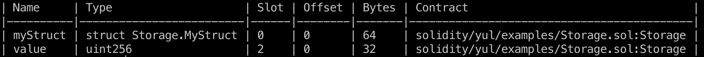

В foundry есть возможность просмотреть в каких слотах располагаются данные контракта, для этого нужно выполнить команду в терминале:

```bash
    forge inspect <contract-name> storage-layout --pretty
```

Команда выдаст таблицу вроде той, что я привел выше.

#### Массивы фиксированной длины

Чтобы получить значение по определенному индексу фиксированного массива, необходимо использовать инструкцию `sload`. Нужный нам слот будет вычисляться по формуле `слот хранения массива + индекс массива`. Когда массив фиксированной длины и его значения соответствуют `bytes32`, то все значения просто записываются по порядку друг за другом:

-   slot 0: слот массива 0 + индекс элемента в массиве 0 = значение хранится в слоте 0;
-   slot 1: 0 + 1 = 1;
-   slot 2: 0 + 2 = 2;
-   ...

```js
contract Storage {
    // ...

    uint256[5] arr = [11, 22, 33, 44, 55]; // slot 2 - 6
    uint256 amount; // slot 7

    function getValueFromArray(uint256 index) public view returns (uint256 value) {
        assembly {
            value := sload(add(arr.slot, index))
        }
    }
}
```

Для примера выше получится вот такая таблица. Здесь видно что массив занимает 5 слотов (со 2го по 6 включительно) и 160 байт памяти (32 \* 5).
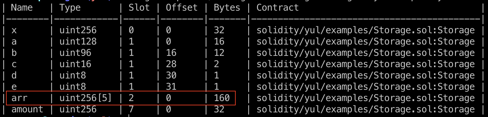

Для массивов с размером значений менее 32 байт компилятор по возможности упаковывает значения в один слот. В примере ниже обратите внимание на `packedArr`, он занимает 1 слот (32 байта), хотя содержит 2 элемента.

```js
contract Storage {
    // ...

    uint256[5] arr = [11, 22, 33, 44, 55]; // slot 2 - 6
    uint256 amount; // slot 7
    uint128[2] packedArr = [21, 42]; // slot 8
    uint256 amount2; // slot 9

    function getPackedValueFromArray() public view returns (uint128 value) {
        bytes32 packed;

        assembly {
            // Загружаем упакованные данные
            packed := sload(packedArr.slot)

            // Делаем сдвиг вправо на 16 байт (128 бит),
            // чтобы получить значение массива по индексу 1
            value := shr(mul(16, 8), packed)
        }
    }
}
```

Это же видно и в таблице
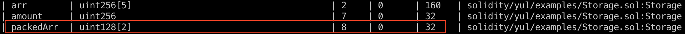

#### Динамические массивы

Из-за своего непредсказуемого размера типы массивов динамического размера не могут храниться «между» переменными состояния, предшествующими и следующими за ними. Вместо этого считается, что они занимают всего 32 байта, а содержащиеся в них элементы хранятся, начиная с другого слота хранилища, который вычисляется с использованием хеша Keccak-256.

Для динамических массивов в этом слоте хранится количество элементов массива (исключением являются байтовые массивы и строки).

Данные динамического массива располагаются начиная с `keccak256(p)` и располагаются так же, как и данные массива статического размера: один элемент за другим. Динамические массивы динамических массивов применяют это правило рекурсивно. Подробности в [документации](https://docs.soliditylang.org/en/latest/internals/layout_in_storage.html#mappings-and-dynamic-arrays).

Вот так будет выглядеть чтение из динамического массива:

-   получаем слот в котором лежит длина массива
-   записываем номер слота в memory
-   хешируем номер слота (указываем местоположение в memory и размер данных для хеширования)
-   добавляем к хешу индекс элемента, чтобы получить необходимое значение слота в storage

```js
contract Storage {
    // ...

    uint256[] dynamicArr = [123, 345, 678];

    function getValueFromDynamicArray(uint256 index) external view returns (uint256 value) {
        uint256 slot;

        assembly {
            // Получаем слот в котором лежит длина массива
            slot := dynamicArr.slot

            // Вычисляем хеш который укажет на слот где хранятся значения массива
            // Эквивалентно записи в solidity:
            // bytes32 ptr = keccak256(abi.encode(slot));
            mstore(0x00, slot)
            let ptr := keccak256(0x00, 0x20)

            // Загружаем необходимый элемент массива по индексу
            value := sload(add(ptr, index))
        }
    }
}
```

Чтобы получить размер динамического массива нужно вызвать `sload` для слота в котором он хранится:

```js
    uint256[] dynamicArr = [123, 345, 678]; // slot 10

    function getDynamicArrayLength() external view returns (uint256 length) {
        assembly {
            length := sload(dynamicArr.slot)
        }
    }
```

#### Маппинги

Маппинги ведут себя аналогично динамическим массивам, но они объединяют ключ и слот хранения маппинга, чтобы получить местоположение значения:

-   получаем слот
-   записываем в memory ключ
-   записываем в memory слот
-   хешируем ключ и слот
-   получаем по хешу значение

```js
contract Storage {
    // ...

    mapping(uint256 => uint256) map;

    function getValueFromMapping(uint256 key) public view returns (uint256 value) {
        bytes32 slot;

        assembly {
            // Получаем слот маппинга
            slot := map.slot

            // Вычисляем хеш который укажет на слот где хранятся значения маппинга
            // Эквивалентно записи в solidity:
            // bytes32 ptr = keccak256(abi.encode(key, uint256(slot)));
            mstore(0x00, key)
            mstore(0x20, slot)
            let ptr := keccak256(0x00, 0x40)

            // Загружаем необходимый элемент маппинга
            value := sload(ptr)
        }
    }
}
```

#### Вложенные маппинги

Вложенные маппинги аналогичны, но для получения местоположения значения используются хеши хешей. Конкатенация и хеширование выполняются справа налево.

Здесь все очень похоже с предыдущим примером, только результирующий хеш будет состоять из хеша второго ключа + хеш (слот + первый ключ):

```js
contract Storage {
    // ...

    mapping(uint256 => mapping(uint256 => uint256)) nestedMap;

    function getValueFromNestedMapping(uint256 key1, uint256 key2) public view returns (uint256 value) {
        bytes32 slot;
        assembly {
            slot := nestedMap.slot

            // bytes32 ptr2 = keccak256(abi.encode(key2, keccak256(abi.encode(key1, uint256(slot)))));
            mstore(0x00, key1)
            mstore(0x20, slot)
            let ptr1 := keccak256(0x00, 0x40)

            mstore(0x00, key2)
            mstore(0x20, ptr1)
            let ptr2 := keccak256(0x00, 0x40)

            value := sload(ptr2)
        }
    }
}
```

#### Маппинги с массивами

Чтобы вычислить слот с которого начинается динамический массив в маппинге нужно получить хеш от хеша (ключ + слот). Далее все так же как и с обычным динамическим массивом.

А чтобы получить длину массива необходимо выполнить `sload` для хеша (ключ + слот)

```js
contract Storage {
    // ...

    mapping(address => uint256[]) arrayInMap;

    function getValueFromArrayNestedInMapping(address key, uint256 index) public view returns (uint256 value, uint256 length) {
        bytes32 slot;

        assembly {
            slot := arrayInMap.slot
        }

        bytes32 arrSlot = keccak256(abi.encode(key, slot));
        bytes32 ptr = keccak256(abi.encode(arrSlot));

        assembly {
            value := sload(add(ptr, index))
            length := sload(arrSlot)
        }
    }
}
```

#### Массивы байтов и строки

_Предупреждение!_ Дальше будут много раз употребляться понятия "байт" и "бит", если вы все еще их путаете, лучше сначала разобраться.

_Примечание!_ Для конвертации значений могут пригодится команды утилиты cast фреймворка foundry:

-   `--to-base <number> <number system>` - для перевода чисел из однои системы счисления в другую, прим. `cast --to-base 0x20 10` даст число 32 и наоборот `--to-base 32 16` даст 0x20, можно также переводить в двоичную (из двоичной). Либо команды `--to-hex`, `--to-dec` и т.д.
-   `--format-bytes32-string <string>` - для перевода строки в hex
-   `--parse-bytes32-string <hex>` - для перевода hex в строку
    Если вы еще не используете cast, советую попробовать, там много полезного. Все команды `cast -h`.

Итак, `bytes` и `string` хранятся в storage одинаково, но тут есть одна важная особенность, которая не сразу понятна из [документации](https://docs.soliditylang.org/en/latest/internals/layout_in_storage.html#bytes-and-string).

В том случае, когда массив байт длиной больше 31 байта, в слот записывается его длина (причем не фактическая, но об этом позже), а по хешу этого слота - `keccak256(p)` можно получить местоположение в памяти с которого будет начинаться битовый массив. Напомню, что строки записываются от старшего бита к младшему.

_Важно!_ Взяв хеш от слота мы получим ссылку на слот где строка начинается, но в этом слоте будет только 32 байта (32 символа строки), если строка длиннее, остальные символы будут располагаться в следующих слотах, так же от старшего бита к младшему.

Но что если длина массива `bytes` (или `string`) меньше или равна 31 байту? Такой массив будет закодирован "на месте", то есть будет лежать в том слоте где строка объявлена, при этом 0-й (младший) байт будет так же указывать размер строки (не фактический, это важно).

Теперь про длину строки (массива байт). Есть 2 формулы:

-   если длина строки меньше или равна 31 байту - `length * 2`
-   если длина строки больше 31 байта - `length * 2 + 1`

Это сделано для того, чтобы можно было отличить по младшему биту (LSB - least significant bit) с какой строкой мы имеем дело. Если самый младший не установлен (равен 0), значит это короткая строка, а если установлен (равен 1) - длинная.

Разберем на примере:
Допустим у нас в storage есть строка "Hello, world!", длина этой строки 13 байт, при переводе в hex получим `0x48656c6c6f2c20776f726c6421`, тут каждый отдельный байт это символ UTF-8 (48 - заглавная "H", 65 - строчная "e", 2c - ",", 20 - пробел и т.д), теперь нужно дополнить это значение до 32 байт, а в последний записать длину рассчитанную по формуле `13 * 2 = 26` (`0x1a` в hex). Таким образом мы получаем вот такой 32-байтный массив `0x48656c6c6f2c20776f726c64210000000000000000000000000000000000001a`, если перевести его в двоичное представление, то самый младший бит будет равен 0 - 00000000010010000110010101101100011011000110111100101100001000000111011101101111011100100110110001100100001000010000000000000000000000000000000000000000000000000000000000000000000000000000000000000000000000000000000000000000000000000000000000000000000000000001101**0**.

При использовании формулы `length * 2`младший бит всегда будет нулевым (не установленным). И наоборот при использовании формулы`length * 2 + 1`, он всегда будет установлен в 1.

Теперь посмотрим как получить длину используя Yul. В примере ниже 3 строки разной длины - это сделано для того, чтобы можно было проверить в Remix как это работает (рекомендуется также заглядывать в отладчик). Не забудь оставить только одну строку а две остальные закомментировать.

```js
contract Storage {
    /// ...

    // так строка будет хранится в слоте, последний байт - закодированная длина (0x1a)
    // 0x48656c6c6f2c20776f726c64210000000000000000000000000000000000001a // str.slot
    string str = "Hello, world!"; // 13 символов

    // это максимальная короткая строка в 31 символ, в последнем байте также длина (0x3e)
    // 0x48656c6c6f2c207468697320697320612074657374207068726173652030323e // str.slot
    string str = "Hello, this is a test phrase 02"; // 31 символ

    // а это длинная строка, здесь в слоте закодирована только ее длина (0x4b)
    // 0x000000000000000000000000000000000000000000000000000000000000004b // str.slot
    // 0x48656c6c6f2c2074686973206973206120746573742070687261736520666f72 // keccak(str.slot)
    // 0x2077696b69000000000000000000000000000000000000000000000000000000 // keccak(str.slot) + 1
    string str = "Hello, this is a test phrase for wiki"; // 37 символов

    function getStringInfo() external view returns (uint256 length, bytes32 lsb, bytes32 strBytes, bytes32 slot) {
        assembly {
            // Кешируем слот
            slot := str.slot
            // Загружаем содержимое слота
            strBytes := sload(slot)
            // Копируем содержимое, чтобы получить младший бит
            let _arr := strBytes
            // Получаем значение младшего бита
            lsb := and(_arr, 0x1)

            // Проверяем, равен ли он 0
            if iszero(lsb) {
                // Берем младший байт и делим на 2 чтобы получить длину строки
                length := div(byte(31, strBytes), 2)
            }

            // Проверяем, если больше 0
            if gt(lsb, 0) {
                // Отнимаем 1 и делим на 2 чтобы получить длину строки
                length := div(sub(strBytes, 1), 2)

                // Записываем в memory номер слота
                mstore(0x00, slot)
                // Получаем хеш слота, чтобы узнать где фактически лежит строка
                slot := keccak256(0x00, 0x20)
            }
        }
    }
}
```

Итак, что происходит в коде:

-   запоминаем номер слота в котором лежит строка (или длина строки)
-   получаем содержимое слота с помощью `sload`
-   заводим отдельную переменную `_arr` в которую скопируем содержимое слота
-   с помощью побитового И (AND) получаем значение lsb (самого младшего бита)
-   дальше проверяем, если lsb равен 0 (`iszero(lsb)`), значит это короткая строка
    -   если строка короткая мы берем последний байт в котором указана длина (`and(_arr, 0x1)`)
    -   после чего делим эту длину на 2 (`div(byte(31, strBytes), 2)`) и получаем изначальную длину строки (с этим знанием можно выгрузить ее в memory и отдать наружу, но пока не будем перегружать функцию)
-   если lsb больше 0 (`gt(lsb, 0)`)
    -   отнимаем от загруженного значения длины 1 (`sub(strBytes, 1)`)
    -   полученное значение также делим на 2 (`div(sub(strBytes, 1), 2)`) и получаем длину строки
    -   далее загружаем номер слота в memory, чтобы получит его хеш
    -   получаем хеш по номеру слота (это и будет слот в котором находится строка или ее начало)

Все примеры собраны в одном контракте [Storage.sol](./examples/Storage.sol).

### Memory

Memory используется для временного хранения переменных. Она очищается по завершению вызова функции.

Память используется в следующих случаях:

-   Возврат значений для внешних вызовов;
-   Установка аргументов функции для внешних вызовов;
-   Получение значений из внешних вызовов;
-   Возврат сообщений об ошибке;
-   Журналирование сообщений;
-   Создание других контрактов;
-   Использование функции keccak256.

Вспоминаем что в memory память разбита на 32-байтовые слоты поэтому часто можно увидеть числа кратные 0x20 - (0x40, 0x60, 0x80, 0xa0, ...), так вот первые четыре слота всегда резервируются для служебных целей, это слоты с 0x00 по 0x60 включительно.

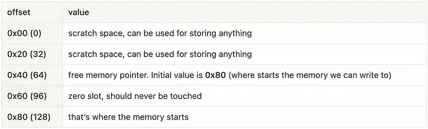

-   Первые два слота или 64 байта (0x00 - 0x3f) резервируются для методов хеширования;
-   Следующие 32 байта (0x40 - 0x5f) всегда будут хранить указатель на свободное место в памяти;
-   Далее следует нулевой слот (0x60 - 0x7f), эти 32 байта используются для заполнения массивов нулями, поэтому в них никогда ничего не записывается;

Выполнение любой функции в EVM начинается с трех опкодов: `PUSH1(0x80)`, `PUSH1(0x40)`,`MSTORE` - это инициализация памяти, где указатель свободной памяти `0x80` (128-й байт) записывается в слот 0x40, его также можно назвать смещением в памяти.
Таким образом первые два слота инициализируются нулями, а для дальнейшего добавления данных в memory будет использоваться память начиная со смещения 0x80.

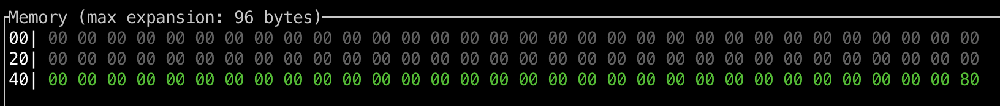

Например чтобы получить число которое хранится в нулевом слоте storage, для начала необходимо поместить его в memory.

Для этого нужно:

-   получить адрес (смещение) свободного слота,
-   записать туда значение из storage,
-   вернуть адрес и размер возвращаемых данных данных.

Пример смотреть в отладчике:

```js
contract Memory {
    uint256 value = 42; // slot 0

    function getValue() external view returns (uint256) {
        assembly {
            // Получаем значение для value, которое находится в соответствующем слоте
            let _value := sload(value.slot)

            // затем получаем "указатель" на свободную память memory
            let ptr := mload(0x40)

            // записываем туда наше число
            mstore(ptr, _value)

            // возвращаем это число
            return(ptr, 0x20)
        }
    }
}
```

Вот так это будет выглядеть в memory функция выше, где `value` равно 42 (0x2a в hex). Берем его из storage и помещаем в слот который располагается по адресу 0x80 (смещение на 128 байт от начала).

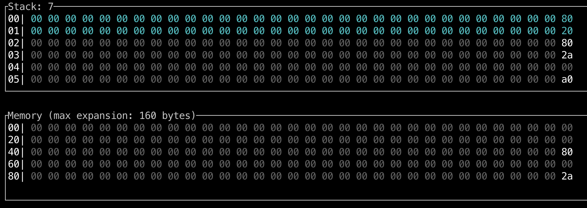

_Важно!_ Указатель свободной памяти автоматически обновляется в solidity, но **НЕ обновляется** ассемблерным кодом (Yul), поэтому вам придется делать это самостоятельно, в случае если код solidity следует за ассемблерным кодом. Каждый раз при переключении с Yul обратно на solidity указатель свободной памяти должен обновляться вручную, чтобы код solidity мог его использовать.

Можно написать функцию которая будет обновлять указатель свободной памяти.

Пример смотреть в отладчике:

```js
contract Memory {
    // ...

    function allocateMemory() external pure {
        assembly {
            // Выполняем некоторые операции в memory используя 3 слота
            let freeMemoryPointer := mload(0x40)
            mstore(freeMemoryPointer, 1)
            mstore(add(freeMemoryPointer, 0x20), 2)
            mstore(add(freeMemoryPointer, 0x40), 3)

            // вызываем функцию для обновления указателя
            allocate(0x60)

            // функция, которая получает размер памяти который мы использовали выше
            // и обновляет указатель на свободную память
            function allocate(length) {
                let pos := mload(0x40)
                mstore(0x40, add(pos, length))
            }
        }
    }
}
```

Для работы с memory в основном используются следующие инструкции:

| Функция         | Описание                                                                                                               |
| --------------- | ---------------------------------------------------------------------------------------------------------------------- |
| `mload(p)`      | Загружает 32-байтовое слово из памяти, начиная с позиции `p`, и возвращает его значение.                               |
| `mstore(p, v)`  | Сохраняет значение `v` в памяти, начиная с позиции `p`. Значение `v` должно быть 32 байта в длину.                     |
| `mstore8(p, v)` | Сохраняет младший байт значения `v` (т.е., `v & 0xff`) в памяти по адресу `p`. Это изменяет только один байт в памяти. |
| `msize()`       | Возвращает размер памяти, т.е. наибольший индекс памяти, к которому было обращение.                                    |

При работе с memory нужно понимать как в нее добавляются различные типы данных.

#### Структуры в memory

Структуры сохраняются по порядку начиная с указателя свободной памяти, после чего указатель на свободную память обновляется.

Пример смотреть в отладчике:

```js
contract Memory {
    // ...

    struct S {
        uint256 a;
        uint256 b;
    }

    function getStructValuesAndFreeMemoryPointer()
        external
        pure
        returns (uint256 a, uint256 b, bytes32 freeMemoryPointer)
    {
        // Создаем структуру и добавляем туда значения
        S memory s = S({a: 21, b: 42});

        assembly {
            a := mload(0x80) // вернет a (21), потому что по умолчанию указатель на свободную память в solidity - 0x80
            b := mload(0xa0) // вернет b (42), второе значение в структуре размещается следом за первым

            // Новый указатель на свободную память - 0xc0 (0x80 + 32 bytes * 2)
            freeMemoryPointer := mload(0x40)
        }
    }
}
```

_Важно!_ В отличие от storage в memory данные не будут упаковываться в случае если они занимают меньше 32 байт, например такая структура также займет 62 байта а не 32, хотя в storage данные были бы упакованы в 32:

```js
    struct S {
        uint128 a; // займет 32 байта
        uint128 b; // займет 32 байта
    }
```

#### Массивы фиксированной длины в memory

Фиксированные массивы работают так же, как структуры.

Пример смотреть в отладчике:

```js
contract Memory {
    // ...

    function getFixedArrayValues() external pure returns (uint256 a, uint256 b) {
        uint256[2] memory arr;
        arr[0] = 21;
        arr[1] = 42;

        assembly {
            a := mload(0x80) // вернет значение по индексу 0
            b := mload(0xa0) // вернет значение по индексу 1
        }
    }
}
```

#### Динамические массивы в memory

Для динамических массивов первый слот памяти объемом 32 байта используется для хранения длины массива. В Yul переменная массива - это местоположение массива в памяти.

Пример смотреть в отладчике:

```js
contract Memory {
    // ...

    function getDynamicArrayValues(uint256[] memory arr) external pure returns (uint256 a, uint256 b, uint256 length) {
        assembly {
            // местоположение - это первый свободный указатель (например 0x80)
            let ptr := arr
            // в нем находится длина массива
            length := mload(ptr)

            a := mload(add(ptr, 0x20)) // в следующей ячейке будет значение по индексу 0
            b := mload(add(ptr, 0x40)) // после по индексу 1 и т.д.
        }
    }
}
```

_Важно!_ Если вы объявили пустой динамический массив в solidity, он не проинициализируется в memory, точнее он будет указывать на нулевой слот 0x60, поэтому нужно будет вручную указать его длину и добавить элементы, а также обновить указатель на свободную память.

Пример смотреть в отладчике:

```js
contract Memory {
    // ...

    function setValuesToDynamicArray() external pure returns (uint256[] memory) {
        uint256[] memory arr;

        // Создадим массив в memory = [42, 43]
        assembly {
            // сейчас arr указывает на 0x60

            // сначала присвоим ему указатель на свободную память
            arr := mload(0x40)
            // запишем длину будущего массива - 2 элемента
            mstore(arr, 2)
            // добавим значения в массив
            mstore(add(arr, 0x20), 42)
            mstore(add(arr, 0x40), 43)

            // обновим указатель на свободную память
            mstore(0x40, add(arr, 0x60))
        }

        return arr;
    }
}
```

#### Массивы байтов и строки в memory

Элементы массивов в memory всегда занимают размер, кратный 32 байтам, это справедливо даже для `bytes1[]`, **но не для `bytes` и `string`**.

Переменные типа `bytes` и `string` - представляют собой специальные динамические массивы. Длина такого массива хранится в первом слоте массива, за ним следуют элементы массива.

_Важно!_ Если посмотреть на memory в отладчике такие массивы всегда будут отображаться выравненными по левому краю 32-х байтовых слотов, как это было в storage, но тут важно понимать, что слоты существуют только в storage, а в memory и calldata мы можем работать только со смещением. Поэтому то, что вы видите в отладчике - это всего лишь абстракция для лучшего восприятия.

Такое представление накладывает некоторые особенности на работу с `bytes` в memory.

Пример смотреть в отладчике:

```js
contract Memory {
    // ...

    function getStringInfo() external pure returns (uint256 len, bytes21 strInBytes) {
        string memory str = "Hello, this is a test"; // 21 символ (0x15 в hex)

        assembly {
            len := mload(0x80) // в этом слоте будет длина массива
            strInBytes := mload(0xa0) // а в следующем сам массив
        }
    }
}
```

Если создать простую строку и посмотреть в отладчике как она будет сохранена в memory, то можно увидеть следующую последовательность:

-   сначала будет взята ссылка на свободную память по адресу `0x40` (т.к. `0x60` это нулевой слот и в него нельзя записывать - свободная память начинается с `0x80`)
-   в `0x80` записывается длина массива (в случае нашей строкой "Hello, this is a test" - 21 байт (`0x15`))
-   в следующем "слоте" мы видим по левому краю сам массив из UTF-8 символов `48 65 6c 6c 6f 2c 20 74 68 69 73 20 69 73 20 61 20 74 65 73 74`
-   далее обновляется указатель на свободную память в `0x40`, теперь он `0xc0`

Фокус в том, что на самом деле в memory этот массив записан так `15 48 65 6c 6c 6f 2c 20 74 68 69 73 20 69 73 20 61 20 74 65 73 74`. Чуть позже мы увидим как можно сместить все это дело относительно тех слотов которые мы видим в отладчике. Напомню, что это сделано только для удобства работы (стековая машина работает с 32-x байтовыми словами) и отображения.

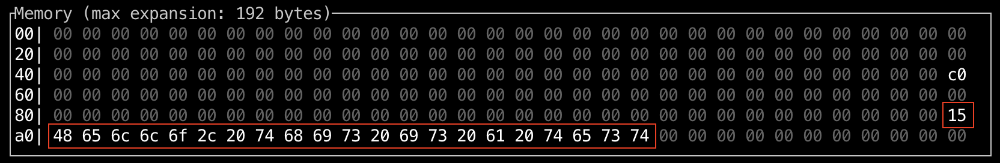

Выше был пример как в момент выполнения строка сохраняется в memory, но если такую строку нужно вернуть из функции, то механизм будет немного другой.

Пример смотреть в отладчике:

```js
contract Memory {
    // ...

    function getString() external pure returns (string memory str) {
        str = "Hello, this is a test";
    }
}
```

-   Во-первых будет возвращен не тот массив байтов, который уже записан в память, все данные продублируются и запишутся в memory снова.
-   Во-вторых перед длиной массива будет добавлено 32 байта со значением `0x20` (32). Вы можете возразить что добавлено больше 32 байт, т.к. предыдущая запись массива занимала меньше места (21 байт), но как мы помним указатель свободной памяти обновился до `0xc0`.

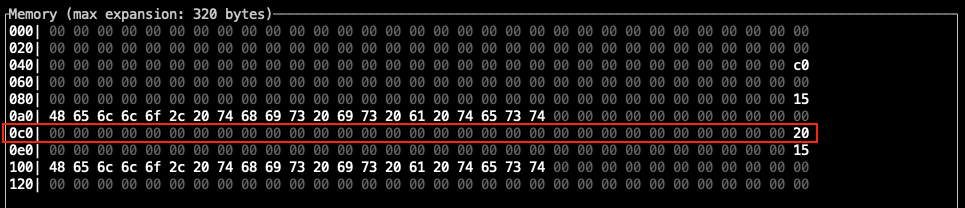

Что касается добавления `0x20 `, я не нашел в документации, желтой бумаге или где-то еще доказательств моим словам, но предположение такое: таким образом мы явно говорим виртуальной машине, что если она возьмет следующие 32 байта, то там будет длина массива. То есть эта длина как бы "откусывается" от основного массива байтов. Скорее всего это сделано для удобства работы с такими структурами данных. Вы можете увеличить длину самой строки, но добавиться все равно `0x20`.

Вот пример для строки длиной 153 символа:
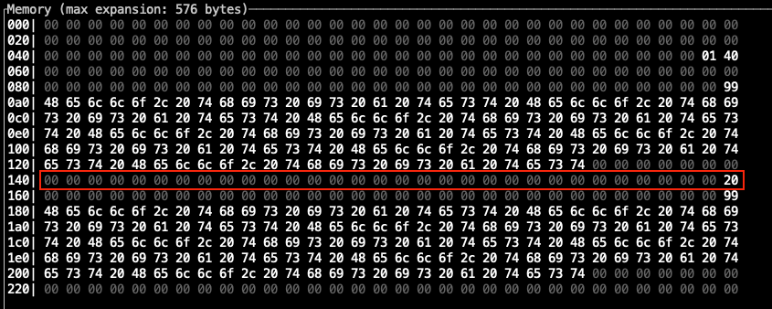

Чтобы посмотреть как "вручную" вернуть строку из функции с помощью Yul возьмем в качестве примера смарт-контракт [Seaport](https://github.com/ProjectOpenSea/seaport/blob/539f0c18af85152aff9d64d90a55cf1627fd3e25/contracts/Seaport.sol#L102C9-L102C9) от OpenSea и его функцию [\_name()](https://github.com/ProjectOpenSea/seaport/blob/539f0c18af85152aff9d64d90a55cf1627fd3e25/contracts/Seaport.sol#L102C9-L102C9) у которой одна задача - возвращать название протокола из 7-ми символов - Seaport. В виде массива байтов это слово будет закодировано так: `07 53 65 61 70 6f 72 74`.

```js
    function _name() internal pure override returns (string memory) {
        // Return the name of the contract.
        assembly {
            mstore(0x20, 0x20)
            mstore(0x47, 0x07536561706f7274)
            return(0x20, 0x60)
        }
    }
```

Разберем по порядку что происходит в этой функции:

-   `mstore(0x20, 0x20)` - берем смещение `0x20` и записываем туда значение `0x20`
-   `mstore(0x47, 0x07536561706f7274)` - берем смещение `0x47` и записываем туда наш массив
-   `return(0x20, 0x60)` - возвращаем данные из функции размером `0x60` байт начиная со смещения `0x20`

А теперь посмотрим как это выглядит в memory:
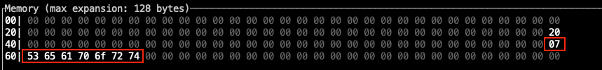

И видим что данные расположились как надо, есть `0x20`, затем длина массива `0x07` и сам массив по левому краю. Обратите внимание, что местом записи было смещение `0x47`, а не привычное смещение кратное 32-м байтам (`0x20`). Дальше станет понятно почему так.

Вот изначальные 32 байта которые записывались в память, они выделены зеленым, потому что когда мы вызвали `mstore(0x47, 0x07536561706f7274)` перед записью массив `0x07536561706f7274` был дополнен нулями спереди до 32-x байт.
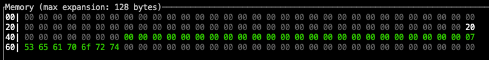

То же самое можно сделать вот так:

```js
contract Memory {
    // ...

    function getSeaport() external pure returns (string memory, uint256 len, bytes7 arr) {
        assembly {
            mstore(0x20, 0x20) // второй слот взят для схожести с ориг. примером
            mstore(0x40, 0x07) // сюда явно указываем длину
            mstore(0x60, 0x536561706f727400000000000000000000000000000000000000000000000000) // а сюда записываем только значения
            return(0x20, 0x60) // также возвращаем 96 байт
        }
    }
}
```

Также можно увидеть что я добавил два возвращаемых параметра - `len` и `arr`, которые покажут длину массива и сам массив (без указания длины вначале).

Ну и напоследок покажу, что в memory на самом деле нет никаких слотов. Возьмем функцию `name` и добавим небольшое смещение в 5 байт.

```js
contract Memory {
    // ...

    function getSeaportSecondVariant() external pure returns (string memory, uint256 len, bytes7 arr) {
        assembly {
            // старый код закомментирую чтобы был перед глазами
            // mstore(0x20, 0x20)
            // mstore(0x47, 0x07536561706f7274)
            // return(0x20, 0x60)

            mstore(0x25, 0x20) // 0x20 + 5 = 0x25
            mstore(0x4c, 0x07536561706f7274) // 0x47 + 5 = 0x4c
            return(0x25, 0x60) // 0x20 + 5 = 0x25
        }
    }
}
```

Смотрим, что происходит в memory. Сначала добавление `0x20`:

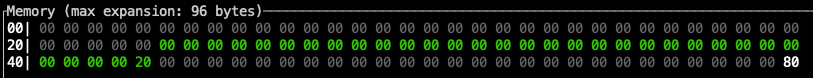

Затем добавление массива байтов:

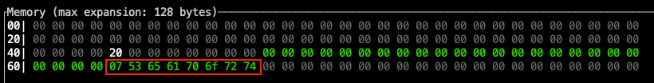

Можно также заметить что мы затираем указатель на свободную память, который был добавлен до при вызове функции, а почему бы и нет `¯\_(ツ)_/¯`

Результат:

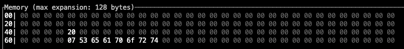

Видно что данные казалось бы расположены неверно, если рассуждать в парадигме 32-байтовых слотов, но это будет работать корректно. Проверьте сами.

#### abi.encode

Операция abi.encode сначала помещает в память длину аргументов в байтах, а затем сами аргументы. Если какой-либо аргумент меньше 32 байтов, он будет увеличен до 32 байтов.

Пример смотреть в отладчике:

```js
contract Memory {
    // ...

    function abiEncode() external pure {
        abi.encode(uint256(1), uint256(2));

        assembly {
            let length := mload(0x80) // 0x0000...000040 (64 байт)
            let arg1 := mload(0xa0) // 0x0000...000001 (32 байт)
            let arg2 := mload(0xc0) // 0x0000...000002 (32 байт)
        }
    }
}
```

#### abi.encodePacked

По сравнению с `abi.encode` функция `abi.encodePacked` не добавляет дополнительный байты к аргументам.

Пример смотреть в отладчике:

```js
contract Memory {
    // ...

    function abiEncodePacked() external pure {
        abi.encodePacked(uint256(1), uint128(2));

        assembly {
            let length := mload(0x80) // 0x0000...000030 (48 байт)
            let arg1 := mload(0xa0) // 0x0000...000001 (32 байт)
            let arg2 := mload(0xc0) // 0x00...0002 (16 байт)
        }
    }
}
```

#### return

Функция `return(p,s)` возьмет данные из памяти размером `s`, начиная со слота `p`. Это позволяет возвращать данные размером более 32 байт.

```js
contract Memory {
    // ...

    function returnValues() external pure returns (uint256, uint256) {
        assembly {
            // запишем значения в слоты 0x80 и 0xa0
            mstore(0x80, 1)
            mstore(0xa0, 2)
            // вернем данные начиная со смещения 0x80 размером 0x40 (64 байте)
            return(0x80, 0x40)
        }
    }
}
```

_Важно!_ Если возвращаемые данные меньше 32 байт, они не будут дополнены до 32 байт.

#### revert

Аргументы функции `revert(p,s)` такие же, как и у `return(p,s)`, в том смысле, что она также возвращает данные из памяти размером `s`, начиная со слота `p`. Разница в том, что `revert` остановит выполнение транзакции.

```js
contract Memory {
    // ...

    function revertExecution() external {
        assembly {
            if iszero(eq(mul(2, 2), 5)) {
                revert(0, 0)
            }
        }
    }
}
```

#### keccak256

Вызов `keccak256(p, n)` - возвращает хеш данных хранящихся в памяти начиная с позиции `p` и занимающих `n` байтов.

Пример смотреть в отладчике:

```js
contract Memory {
    // ...

    function getKeccak() external pure {
        assembly {
            // запишем значения в слоты 0x80 и 0xa0
            mstore(0x80, 1)
            mstore(0xa0, 2)

            // хешируем данные начиная с 0x80 размером 0x40 и сохраним их в слоте 0xc0
            mstore(0xc0, keccak256(0x80, 0x40))
        }
    }
}
```

Все примеры собраны в смарт-контракте [Memory.sol](./examples/Memory.sol).

### Calldata

Calldata — это специальное расположение данных в EVM, которые относится к необработанным байтам, отправляемым c любой транзакцией вызова сообщения между двумя адресами.

При вызове контракта (либо из EOA, либо из другого контракта) calldata — это местоположение данных, содержащих начальные входные аргументы вызываемой функции.

Calldata можно назвать самым дешевым типом хранения данных. Эти данные доступны только для чтения и не могут быть изменены в теле функции, также они являются временными, т.к. содержаться только в самой транзакции (поле msg.data).

Основное преимущество в том, что мы можем брать данные из calldata и помещать их сразу в стек для выполнения тех или иных операций, но можем также загружать в memory или storage. Можно сказать, что calldata выделяется **вызывающей** стороной, в то время как memory выделяется уже **вызываемой** стороной. То есть вызывающая сторона (EOA или смарт-контракт) формирует эти данные и отправляет с транзакцией, а вызываемая сторона их каким-то образом обрабатывает.

Данные для вызова кодируются в соответствие с abi, об этом можно почитать [тут](https://github.com/fullstack-development/blockchain-wiki/blob/main/solidity/ABI/readme.md) и в [документации](https://docs.soliditylang.org/en/latest/abi-spec.html).

Основные моменты:

-   Данные calldata нельзя модифицировать, они неизменяемы и потенциально имеют неограниченный размер (технически ограничение будет в виде доступного газа в блоке);
-   Первые 4 байта всегда представляют сигнатуру функции, а остальные — аргументы;
-   При использовании типов `array`, `bytes` или `string` первым параметром будет смещение, с которого начинается параметр, а по этому смещению будет его длина;
-   Аргументы размером менее 32 байт дополняются до 32 байт.

_Интересный факт!_ После [EIP-2028](https://eips.ethereum.org/EIPS/eip-2028) стоимость ненулевых данных для calldata была снижена с 68 до 16 газ за байт. Это сделано для увеличения "пропускной способности" сети, в том числе для улучшения масштабируемости с помощью L2. К примеру роллапы объединяют множество транзакций в единый пакет и тут более дешевый calldata как раз кстати.

Основные функции для работы с calldata:

| Функция                 | Описание                                                                                              |
| ----------------------- | ----------------------------------------------------------------------------------------------------- |
| `calldataload(p)`       | Загружает 32-байтовое слово из входных данных вызова, начиная с позиции `p`.                          |
| `calldatasize()`        | Возвращает размер входных данных вызова в байтах.                                                     |
| `calldatacopy(t, f, s)` | Копирует `s` байтов из входных данных вызова, начиная с позиции `f`, в memory, начиная с позиции `t`. |

Что касается работы с calldata, тут мы снова возвращаемся к условным "слотам" или 32-байтовым словам. Главное не забывать про сдвиг в 4 байта для сигнатуры функции. В качестве примера разберем данные calldata которые содержат строку. Вспоминаем что строка будет закодирована в формате `offset + length + data`.

```js
contract Calldata {

    function getString(string calldata) external pure returns(string memory, uint256 len) {
        assembly {
            // получаем смещение строки, добавляем 4 байта сигнатуры чтобы скорректировать смещение
            let strOffset := add(4, calldataload(4))
            // получаем длину строки
            len := calldataload(strOffset)
            // получаем указатель на свободную память
            let ptr := mload(0x40)
            // вычисляем размер данных без сигнатуры
            let dataSize := sub(calldatasize(), 4)
            // копируем в memory все данные о строке кроме сигнатуры
            calldatacopy(ptr, 0x04, dataSize)

            // возвращаем строку
            return(0x80, dataSize)
        }
    }
}
```

Следовательно порядок действий такой:

-   сначала с помощью `calldataload` достаем смещение с которого начинаются данные о строке. Прибавляем 4 байта сигнатуры
-   по этому смещению получаем длину строки
-   получаем указатель на свободную память
-   вычисляем размер данных (`calldatasize` возвращает полный размер)
-   за исключением селектора функции копируем все данные calldata начиная с 5го байта (0x04) в memory начиная с указателя на свободную память `ptr`
-   возвращаем строку (тут если непонятно смотреть раздел [про строки в memory](#массивы-байтов-и-строки-в-memory))

Здесь важно оговориться что этот код сделан исключительно для демонстрации и немного упрощен. Дело в том, что в этом примере мы знаем две вещи которыми вероломно воспользовались:

-   смещение строки 32 байта
-   кроме строки в функцию больше ничего не передается

Поэтому мы можем себе позволить копировать все данные сразу после сигнатуры, но если перед строкой к примеру будет число, то этот код сломается. Это сделано намерено и я настоятельно рекомендую поиграть с ним в Remix используя отладчик. Попробуйте принимать в функции что-то перед строкой, но при этом также копировать ее в memory и вернуть из функции, к примеру с вот такой сигнатурой `foo(uint256 amount, string calldata)`.

Пример в контракте [Calldata.sol](./examples/Calldata.sol).

Кстати в отладчике Remix всегда отображаются переданные calldata.
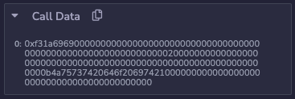

#### Срез данных

Эта тема не совсем про Yul, но вы можете встретить подобную запись (`data[:4]`) где-то "неподалеку" от inline assembly, поэтому лучше знать что это означает.

Начиная с solidity 0.6.0 стал доступен синтаксис `data[start:end]` ("срезы") для переменных `bytes`, переданных с calldata (в memory это не работает).

Это работает так:

-   `start` - смещение, с которого следует начать срез
-   `end` - смещение, которое определяет, где закончить срез
-   двоеточие `:` - разделяет начало и конец

Можно не указывать начало или конец. Если пропустить начало, по умолчанию срез будет сделан со смещения 0. Если не указать конец, по умолчанию будет сделан срез до последнего байта в calldata.

Таким образом можно получить к примеру селектор функции: `bytes4 selector = msg.data[:4];` или наоборот только закодированные данные `bytes data = msg.data[4:0]`. Также можно указать промежуток `bytes data = msg.data[4:8]`.

## Вызов других смарт-контрактов

В Yul есть возможность вызова других смарт-контрактов, для этого используются следующие инструкции:

| Функция                                        | Описание                                                                                                                                                                                                                                                              |
| ---------------------------------------------- | --------------------------------------------------------------------------------------------------------------------------------------------------------------------------------------------------------------------------------------------------------------------- |
| `call(g, a, v, in, insize, out, outsize)`      | Вызывает контракт по адресу `a`, передавая входные данные из памяти `[in...(in+insize))`, предоставляя `g` газа и `v` вей. Результат записывается в память `[out...(out+outsize))`. Возвращает 0 в случае ошибки (например, из-за нехватки газа) и 1 в случае успеха. |
| `callcode(g, a, v, in, insize, out, outsize)`  | Подобно `call`, но использует только код контракта по адресу `a`, оставаясь в контексте текущего контракта.                                                                                                                                                           |
| `delegatecall(g, a, in, insize, out, outsize)` | Подобно `callcode`, но также сохраняет адрес вызывающего контракта и переданное значение (callvalue).                                                                                                                                                                 |
| `staticcall(g, a, in, insize, out, outsize)`   | Подобно `call`, но не позволяет модифицировать состояние контракта.                                                                                                                                                                                                   |

Все эти функции возвращают 1 в случае успешного выполнения и 0 в случае неудачи.

Также часто в связке с ними идут инструкции, которые позволяют работать с возвращаемыми данными:

| Функция                   | Описание                                                                                   |
| ------------------------- | ------------------------------------------------------------------------------------------ |
| `returndatasize()`        | Возвращает размер последних возвращенных данных (returndata).                              |
| `returndatacopy(t, f, s)` | Копирует `s` байтов из returndata, начиная с позиции `f`, в memory, начиная с позиции `t`. |

Самым частым примером применения являются прокси-контракты, возьмем приватную функцию `_delegate` контракта [Proxy](https://github.com/OpenZeppelin/openzeppelin-contracts/blob/master/contracts/proxy/Proxy.sol) от Open Zeppelin.

```js
    function _delegate(address implementation) internal virtual {
        assembly {
            // Copy msg.data. We take full control of memory in this inline assembly
            // block because it will not return to Solidity code. We overwrite the
            // Solidity scratch pad at memory position 0.
            calldatacopy(0, 0, calldatasize())

            // Call the implementation.
            // out and outsize are 0 because we don't know the size yet.
            let result := delegatecall(gas(), implementation, 0, calldatasize(), 0, 0)

            // Copy the returned data.
            returndatacopy(0, 0, returndatasize())

            switch result
            // delegatecall returns 0 on error.
            case 0 {
                revert(0, returndatasize())
            }
            default {
                return(0, returndatasize())
            }
        }
    }
```

Эта функция вызывается функцией `fallback()`, которая в свою очередь добавляет адрес имплементации, который хранится в контракте Proxy, давайте посмотрим что происходит дальше:

-   для начала в memory копируются все данные calldata (как мы помним тип памяти calldata неизменяемый, поэтому адрес имплементации туда не попадает, все что пришло с транзакцией в msg.data таким и останется)
-   далее мы вызываем delegatecall и передаем туда все необходимые параметры:
    -   количество оставшегося газа
    -   адрес контракта который будет выполнять код
    -   смещение данных в memory куда мы скопировали calldata, в данном случае 0
    -   размер данных которые мы берем из memory для отправки контракту (calldata size)
    -   смещение в memory куда будут записаны возвращаемые данные, в данном случае тоже без смещения
    -   размер возвращаемых данных, мы его не знаем, поэтому 0
-   после этого мы копируем возвращаемые данные в memory (здесь такой же принцип как и с `calldatacopy`), т.к. на предыдущем шаге в `delegatecall` мы не знали размер возвращаемых данных и не указали место для копирования и размер
-   проверяем `result`, если все прошло успешно, отдаем возвращенные данные
-   если транзакция упала, отдаем ошибки которые вернул смарт-контракт

С `call` все будет также, только добавится еще один параметр для передачи - `value`. Подробнее о том как работают `call` и `delegatecall` можно почитать [тут](https://noxx.substack.com/p/evm-deep-dives-the-path-to-shadowy-a5f).

_Важно!_ Если адрес передаваемый в качестве параметра как подконтекст не имеет кода (например EOA), то вызов call вернет true (1). И обратная ситуация (возврат false - 0) может произойти если не хватит газа или закончится место в стеке.

Вот [ссылка на смарт-контракт](./examples/Delegatecall.sol) с которым можно протестировать вызовы одного контракта из другого, он также сделан на примере прокси и имплементации. Взаимодействовать с прокси-контрактом можно через low level iterations в Remix.
Данные для него можно подготовить с помощью cast, ну либо воспользоваться `abi.encode`. Через cast это будет выглядеть примерно так:

```bash
    cast calldata "increment(uint256)" 42

    >> 0x7cf5dab0000000000000000000000000000000000000000000000000000000000000002a
```

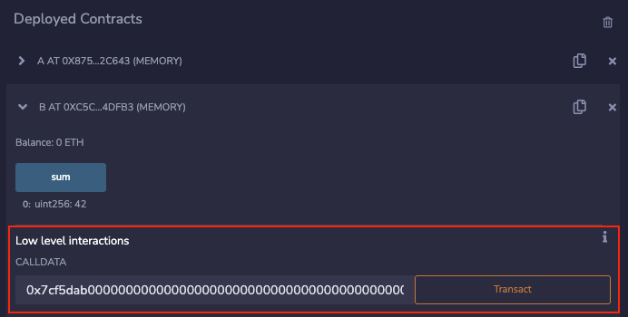

_Важно!_ После хардфорка Byzantium можно не указывать размер возвращаемых данных (последний параметр в `call`, `delegatecall`, `callcode` и `staticcall`) и копировать их с помощью `returndatacopy` и `returndatasize`. В примерах так и сделано, но должно работать и обратное (если указать размер возвращаемых данных, то не нужно будет делать `returndatacopy`). По факту когда я проводил тесты - если после `delegatecall` не делать `returndatacopy` (даже с нулевыми аргументами) то данные не копируются в memory `¯\_(ツ)_/¯`.

## Events

Для событий в Yul существует 5 различных инструкций, но если вы знаете как в EVM создаются события, то здесь для вас не будет ничего сложного.

В событии может быть четыре темы (топика) и непроиндексированные данные. Первый топик, если он есть, это всегда хеш сигнатуры события, а три остальных - проиндексированные параметры. Для непроиндексированных данных указывается смещение в памяти и размер этих данных.

| Функция                      | Описание                                                                                                                         |
| ---------------------------- | -------------------------------------------------------------------------------------------------------------------------------- |
| `log0(p, s)`                 | Создает событие (event) без тем с данными размером `s`, начиная со смещения в памяти `p`. Такие события еще называют анонимными. |
| `log1(p, s, t1)`             | Создает событие (event) с одной темой (topic) `t1` и данными размером `s`, начиная со смещения в памяти `p`.                     |
| `log2(p, s, t1, t2)`         | Создает событие (event) с двумя темами `t1` и `t2` и данными размером `s`, начиная со смещения в памяти `p`.                     |
| `log3(p, s, t1, t2, t3)`     | Создает событие (event) с тремя темами `t1`, `t2` и `t3` и данными размером `s`, начиная со смещения в памяти `p`.               |
| `log4(p, s, t1, t2, t3, t4)` | Создает событие (event) с четырьмя темами `t1`, `t2`, `t3` и `t4` и данными размером `s`, начиная со смещения в памяти `p`.      |

t1 — это хеш keccak256 сигнатуры события, t2 — это первый индексированный аргумент события, t3 — второй индексированный аргумент события и так далее.

В примере ниже показано как работает `log3` если создать событие `SomeLog(2, 3, true)`:

```js
contract EmitEvent {
    event SomeLog(uint256 indexed a, uint256 indexed b, bool c);

    function emitEvent() external {
        assembly {
            // Хеш собтия - keccak256("SomeLog(uint256,uint256,bool)")
            let signature := 0x39cf0823186c1f89c8975545aebaa16813bfc9511610e72d8cff59da81b23c72

            // получаем указатель на свободную память
            let ptr := mload(0x40)

            // записываем число 1 по этому адресу (0x80)
            mstore(ptr, 1)

            // создаем событие SomeLog(2, 3, true)
            log3(0x80, 0x20, signature, 2, 3)
        }
    }
}
```

-   `log3` включает в себя `topic 1`, т.е. хеш сигнатуры события, поэтому записываем его в переменную
-   получаем смещение для записи в memory
-   записываем туда значение `1` (`true`)
-   создаем событие `log3` передав все необходимые аргументы

А вот так это будет выглядеть на уровне stack и memory:

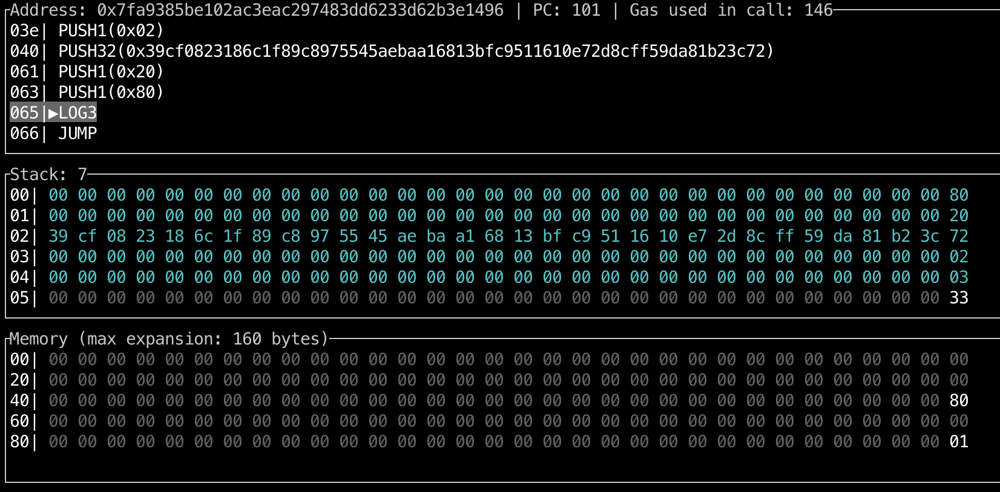

-   в memory записываются непроиндексированные данные
-   в stack в необходимом порядке складываются:
    -   смещение в памяти с которого начинаются непроиндексированные данные (0x80)
    -   размер непроиндексированных данных (0x20 - 32 байта)
    -   хеш keccak256 сигнатуры события `SomeLog(uint256,uint256,bool)`
    -   первый проиндексированный аргумент
    -   второй проиндексированный аргумент
-   вызывается опкод `LOG3` который забирает 5 последних элементов из stack

Смарт-контракт EmitEvent [тут](./examples/EmitEvent.sol).

## Смарт-контракты на языке Yul

Можно написать смарт-контракт с помощью Standalone Assembly - на чистом Yul в файле `.yul`, но это довольно экзотическое направление и больше относится к теме оптимизации кода solidity компилятором.

Общий синтаксис довольно простой, но как и всегда с Yul - в нем очень много "ручной" работы, а все взаимодействия с таким контрактом будут происходить через `msg.data`, то есть вышеупомянутые `calldata` и low level interactions в Remix (если вы делаете это в Remix).

В коде файла `.yul` все строится на объектах. Контракт — это объект в Yul, а раздел `code` — это фактический код.

Функции `datasize`, `dataoffset` и `datacopy` можно использовать для доступа к разделам кода. Шестнадцатеричные строки можно использовать для указания данных в шестнадцатеричной кодировке, а обычные строки — в собственной кодировке. Что касается `code` - `datacopy` получит доступ к его собранному двоичному представлению.

| Функция             | Описание                                                                                                                                                                               |
| ------------------- | -------------------------------------------------------------------------------------------------------------------------------------------------------------------------------------- |
| `datasize(x)`       | Функция `datasize(x)` возвращает размер объекта Yul `x` в области данных. `x` должен быть строковым литералом, представляющим имя другого объекта.                                     |
| `dataoffset(x)`     | Функция `dataoffset(x)` возвращает смещение объекта Yul `x` в области данных. `x` должен быть строковым литералом, представляющим имя другого объекта.                                 |
| `datacopy(t, f, l)` | Функция `datacopy(t, f, l)` копирует `l` байтов из области данных, начиная с позиции `f`, в память, начиная с позиции `t`. Для EVM функция `datacopy` эквивалентна функции `codecopy`. |

Чуть более подробную информацию можно получить из [документации](https://docs.soliditylang.org/en/latest/yul.html#specification-of-yul-object), но я также рекомендую попробовать поработать с контрактом [ERC20-токена](https://remix.ethereum.org/?#language=yul&version=0.8.22&code=b2JqZWN0ICJUb2tlbiIgewogICAgY29kZSB7CiAgICAgICAgLy8gU3RvcmUgdGhlIGNyZWF0b3IgaW4gc2xvdCB6ZXJvLgogICAgICAgIHNzdG9yZSgwLCBjYWxsZXIoKSkKCiAgICAgICAgLy8gRGVwbG95IHRoZSBjb250cmFjdAogICAgICAgIGRhdGFjb3B5KDAsIGRhdGFvZmZzZXQoInJ1bnRpbWUiKSwgZGF0YXNpemUoInJ1bnRpbWUiKSkKICAgICAgICByZXR1cm4oMCwgZGF0YXNpemUoInJ1bnRpbWUiKSkKICAgIH0KICAgIG9iamVjdCAicnVudGltZSIgewogICAgICAgIGNvZGUgewogICAgICAgICAgICAvLyBQcm90ZWN0aW9uIGFnYWluc3Qgc2VuZGluZyBFdGhlcgogICAgICAgICAgICByZXF1aXJlKGlzemVybyhjYWxsdmFsdWUoKSkpCgogICAgICAgICAgICAvLyBEaXNwYXRjaGVyCiAgICAgICAgICAgIHN3aXRjaCBzZWxlY3RvcigpCiAgICAgICAgICAgIGNhc2UgMHg3MGEwODIzMSAvKiAiYmFsYW5jZU9mKGFkZHJlc3MpIiAqLyB7CiAgICAgICAgICAgICAgICByZXR1cm5VaW50KGJhbGFuY2VPZihkZWNvZGVBc0FkZHJlc3MoMCkpKQogICAgICAgICAgICB9CiAgICAgICAgICAgIGNhc2UgMHgxODE2MGRkZCAvKiAidG90YWxTdXBwbHkoKSIgKi8gewogICAgICAgICAgICAgICAgcmV0dXJuVWludCh0b3RhbFN1cHBseSgpKQogICAgICAgICAgICB9CiAgICAgICAgICAgIGNhc2UgMHhhOTA1OWNiYiAvKiAidHJhbnNmZXIoYWRkcmVzcyx1aW50MjU2KSIgKi8gewogICAgICAgICAgICAgICAgdHJhbnNmZXIoZGVjb2RlQXNBZGRyZXNzKDApLCBkZWNvZGVBc1VpbnQoMSkpCiAgICAgICAgICAgICAgICByZXR1cm5UcnVlKCkKICAgICAgICAgICAgfQogICAgICAgICAgICBjYXNlIDB4MjNiODcyZGQgLyogInRyYW5zZmVyRnJvbShhZGRyZXNzLGFkZHJlc3MsdWludDI1NikiICovIHsKICAgICAgICAgICAgICAgIHRyYW5zZmVyRnJvbShkZWNvZGVBc0FkZHJlc3MoMCksIGRlY29kZUFzQWRkcmVzcygxKSwgZGVjb2RlQXNVaW50KDIpKQogICAgICAgICAgICAgICAgcmV0dXJuVHJ1ZSgpCiAgICAgICAgICAgIH0KICAgICAgICAgICAgY2FzZSAweDA5NWVhN2IzIC8qICJhcHByb3ZlKGFkZHJlc3MsdWludDI1NikiICovIHsKICAgICAgICAgICAgICAgIGFwcHJvdmUoZGVjb2RlQXNBZGRyZXNzKDApLCBkZWNvZGVBc1VpbnQoMSkpCiAgICAgICAgICAgICAgICByZXR1cm5UcnVlKCkKICAgICAgICAgICAgfQogICAgICAgICAgICBjYXNlIDB4ZGQ2MmVkM2UgLyogImFsbG93YW5jZShhZGRyZXNzLGFkZHJlc3MpIiAqLyB7CiAgICAgICAgICAgICAgICByZXR1cm5VaW50KGFsbG93YW5jZShkZWNvZGVBc0FkZHJlc3MoMCksIGRlY29kZUFzQWRkcmVzcygxKSkpCiAgICAgICAgICAgIH0KICAgICAgICAgICAgY2FzZSAweDQwYzEwZjE5IC8qICJtaW50KGFkZHJlc3MsdWludDI1NikiICovIHsKICAgICAgICAgICAgICAgIG1pbnQoZGVjb2RlQXNBZGRyZXNzKDApLCBkZWNvZGVBc1VpbnQoMSkpCiAgICAgICAgICAgICAgICByZXR1cm5UcnVlKCkKICAgICAgICAgICAgfQogICAgICAgICAgICBkZWZhdWx0IHsKICAgICAgICAgICAgICAgIHJldmVydCgwLCAwKQogICAgICAgICAgICB9CgogICAgICAgICAgICBmdW5jdGlvbiBtaW50KGFjY291bnQsIGFtb3VudCkgewogICAgICAgICAgICAgICAgcmVxdWlyZShjYWxsZWRCeU93bmVyKCkpCgogICAgICAgICAgICAgICAgbWludFRva2VucyhhbW91bnQpCiAgICAgICAgICAgICAgICBhZGRUb0JhbGFuY2UoYWNjb3VudCwgYW1vdW50KQogICAgICAgICAgICAgICAgZW1pdFRyYW5zZmVyKDAsIGFjY291bnQsIGFtb3VudCkKICAgICAgICAgICAgfQogICAgICAgICAgICBmdW5jdGlvbiB0cmFuc2Zlcih0bywgYW1vdW50KSB7CiAgICAgICAgICAgICAgICBleGVjdXRlVHJhbnNmZXIoY2FsbGVyKCksIHRvLCBhbW91bnQpCiAgICAgICAgICAgIH0KICAgICAgICAgICAgZnVuY3Rpb24gYXBwcm92ZShzcGVuZGVyLCBhbW91bnQpIHsKICAgICAgICAgICAgICAgIHJldmVydElmWmVyb0FkZHJlc3Moc3BlbmRlcikKICAgICAgICAgICAgICAgIHNldEFsbG93YW5jZShjYWxsZXIoKSwgc3BlbmRlciwgYW1vdW50KQogICAgICAgICAgICAgICAgZW1pdEFwcHJvdmFsKGNhbGxlcigpLCBzcGVuZGVyLCBhbW91bnQpCiAgICAgICAgICAgIH0KICAgICAgICAgICAgZnVuY3Rpb24gdHJhbnNmZXJGcm9tKGZyb20sIHRvLCBhbW91bnQpIHsKICAgICAgICAgICAgICAgIGRlY3JlYXNlQWxsb3dhbmNlQnkoZnJvbSwgY2FsbGVyKCksIGFtb3VudCkKICAgICAgICAgICAgICAgIGV4ZWN1dGVUcmFuc2Zlcihmcm9tLCB0bywgYW1vdW50KQogICAgICAgICAgICB9CgogICAgICAgICAgICBmdW5jdGlvbiBleGVjdXRlVHJhbnNmZXIoZnJvbSwgdG8sIGFtb3VudCkgewogICAgICAgICAgICAgICAgcmV2ZXJ0SWZaZXJvQWRkcmVzcyh0bykKICAgICAgICAgICAgICAgIGRlZHVjdEZyb21CYWxhbmNlKGZyb20sIGFtb3VudCkKICAgICAgICAgICAgICAgIGFkZFRvQmFsYW5jZSh0bywgYW1vdW50KQogICAgICAgICAgICAgICAgZW1pdFRyYW5zZmVyKGZyb20sIHRvLCBhbW91bnQpCiAgICAgICAgICAgIH0KCgogICAgICAgICAgICAvKiAtLS0tLS0tLS0tIGNhbGxkYXRhIGRlY29kaW5nIGZ1bmN0aW9ucyAtLS0tLS0tLS0tLSAqLwogICAgICAgICAgICBmdW5jdGlvbiBzZWxlY3RvcigpIC0+IHMgewogICAgICAgICAgICAgICAgcyA6PSBkaXYoY2FsbGRhdGFsb2FkKDApLCAweDEwMDAwMDAwMDAwMDAwMDAwMDAwMDAwMDAwMDAwMDAwMDAwMDAwMDAwMDAwMDAwMDAwMDAwMDAwMCkKICAgICAgICAgICAgfQoKICAgICAgICAgICAgZnVuY3Rpb24gZGVjb2RlQXNBZGRyZXNzKG9mZnNldCkgLT4gdiB7CiAgICAgICAgICAgICAgICB2IDo9IGRlY29kZUFzVWludChvZmZzZXQpCiAgICAgICAgICAgICAgICBpZiBpc3plcm8oaXN6ZXJvKGFuZCh2LCBub3QoMHhmZmZmZmZmZmZmZmZmZmZmZmZmZmZmZmZmZmZmZmZmZmZmZmZmZmZmKSkpKSB7CiAgICAgICAgICAgICAgICAgICAgcmV2ZXJ0KDAsIDApCiAgICAgICAgICAgICAgICB9CiAgICAgICAgICAgIH0KICAgICAgICAgICAgZnVuY3Rpb24gZGVjb2RlQXNVaW50KG9mZnNldCkgLT4gdiB7CiAgICAgICAgICAgICAgICBsZXQgcG9zIDo9IGFkZCg0LCBtdWwob2Zmc2V0LCAweDIwKSkKICAgICAgICAgICAgICAgIGlmIGx0KGNhbGxkYXRhc2l6ZSgpLCBhZGQocG9zLCAweDIwKSkgewogICAgICAgICAgICAgICAgICAgIHJldmVydCgwLCAwKQogICAgICAgICAgICAgICAgfQogICAgICAgICAgICAgICAgdiA6PSBjYWxsZGF0YWxvYWQocG9zKQogICAgICAgICAgICB9CiAgICAgICAgICAgIC8qIC0tLS0tLS0tLS0gY2FsbGRhdGEgZW5jb2RpbmcgZnVuY3Rpb25zIC0tLS0tLS0tLS0gKi8KICAgICAgICAgICAgZnVuY3Rpb24gcmV0dXJuVWludCh2KSB7CiAgICAgICAgICAgICAgICBtc3RvcmUoMCwgdikKICAgICAgICAgICAgICAgIHJldHVybigwLCAweDIwKQogICAgICAgICAgICB9CiAgICAgICAgICAgIGZ1bmN0aW9uIHJldHVyblRydWUoKSB7CiAgICAgICAgICAgICAgICByZXR1cm5VaW50KDEpCiAgICAgICAgICAgIH0KCiAgICAgICAgICAgIC8qIC0tLS0tLS0tIGV2ZW50cyAtLS0tLS0tLS0tICovCiAgICAgICAgICAgIGZ1bmN0aW9uIGVtaXRUcmFuc2Zlcihmcm9tLCB0bywgYW1vdW50KSB7CiAgICAgICAgICAgICAgICBsZXQgc2lnbmF0dXJlSGFzaCA6PSAweGRkZjI1MmFkMWJlMmM4OWI2OWMyYjA2OGZjMzc4ZGFhOTUyYmE3ZjE2M2M0YTExNjI4ZjU1YTRkZjUyM2IzZWYKICAgICAgICAgICAgICAgIGVtaXRFdmVudChzaWduYXR1cmVIYXNoLCBmcm9tLCB0bywgYW1vdW50KQogICAgICAgICAgICB9CiAgICAgICAgICAgIGZ1bmN0aW9uIGVtaXRBcHByb3ZhbChmcm9tLCBzcGVuZGVyLCBhbW91bnQpIHsKICAgICAgICAgICAgICAgIGxldCBzaWduYXR1cmVIYXNoIDo9IDB4OGM1YmUxZTVlYmVjN2Q1YmQxNGY3MTQyN2QxZTg0ZjNkZDAzMTRjMGY3YjIyOTFlNWIyMDBhYzhjN2MzYjkyNQogICAgICAgICAgICAgICAgZW1pdEV2ZW50KHNpZ25hdHVyZUhhc2gsIGZyb20sIHNwZW5kZXIsIGFtb3VudCkKICAgICAgICAgICAgfQogICAgICAgICAgICBmdW5jdGlvbiBlbWl0RXZlbnQoc2lnbmF0dXJlSGFzaCwgaW5kZXhlZDEsIGluZGV4ZWQyLCBub25JbmRleGVkKSB7CiAgICAgICAgICAgICAgICBtc3RvcmUoMCwgbm9uSW5kZXhlZCkKICAgICAgICAgICAgICAgIGxvZzMoMCwgMHgyMCwgc2lnbmF0dXJlSGFzaCwgaW5kZXhlZDEsIGluZGV4ZWQyKQogICAgICAgICAgICB9CgogICAgICAgICAgICAvKiAtLS0tLS0tLSBzdG9yYWdlIGxheW91dCAtLS0tLS0tLS0tICovCiAgICAgICAgICAgIGZ1bmN0aW9uIG93bmVyUG9zKCkgLT4gcCB7IHAgOj0gMCB9CiAgICAgICAgICAgIGZ1bmN0aW9uIHRvdGFsU3VwcGx5UG9zKCkgLT4gcCB7IHAgOj0gMSB9CiAgICAgICAgICAgIGZ1bmN0aW9uIGFjY291bnRUb1N0b3JhZ2VPZmZzZXQoYWNjb3VudCkgLT4gb2Zmc2V0IHsKICAgICAgICAgICAgICAgIG9mZnNldCA6PSBhZGQoMHgxMDAwLCBhY2NvdW50KQogICAgICAgICAgICB9CiAgICAgICAgICAgIGZ1bmN0aW9uIGFsbG93YW5jZVN0b3JhZ2VPZmZzZXQoYWNjb3VudCwgc3BlbmRlcikgLT4gb2Zmc2V0IHsKICAgICAgICAgICAgICAgIG9mZnNldCA6PSBhY2NvdW50VG9TdG9yYWdlT2Zmc2V0KGFjY291bnQpCiAgICAgICAgICAgICAgICBtc3RvcmUoMCwgb2Zmc2V0KQogICAgICAgICAgICAgICAgbXN0b3JlKDB4MjAsIHNwZW5kZXIpCiAgICAgICAgICAgICAgICBvZmZzZXQgOj0ga2VjY2FrMjU2KDAsIDB4NDApCiAgICAgICAgICAgIH0KCiAgICAgICAgICAgIC8qIC0tLS0tLS0tIHN0b3JhZ2UgYWNjZXNzIC0tLS0tLS0tLS0gKi8KICAgICAgICAgICAgZnVuY3Rpb24gb3duZXIoKSAtPiBvIHsKICAgICAgICAgICAgICAgIG8gOj0gc2xvYWQob3duZXJQb3MoKSkKICAgICAgICAgICAgfQogICAgICAgICAgICBmdW5jdGlvbiB0b3RhbFN1cHBseSgpIC0+IHN1cHBseSB7CiAgICAgICAgICAgICAgICBzdXBwbHkgOj0gc2xvYWQodG90YWxTdXBwbHlQb3MoKSkKICAgICAgICAgICAgfQogICAgICAgICAgICBmdW5jdGlvbiBtaW50VG9rZW5zKGFtb3VudCkgewogICAgICAgICAgICAgICAgc3N0b3JlKHRvdGFsU3VwcGx5UG9zKCksIHNhZmVBZGQodG90YWxTdXBwbHkoKSwgYW1vdW50KSkKICAgICAgICAgICAgfQogICAgICAgICAgICBmdW5jdGlvbiBiYWxhbmNlT2YoYWNjb3VudCkgLT4gYmFsIHsKICAgICAgICAgICAgICAgIGJhbCA6PSBzbG9hZChhY2NvdW50VG9TdG9yYWdlT2Zmc2V0KGFjY291bnQpKQogICAgICAgICAgICB9CiAgICAgICAgICAgIGZ1bmN0aW9uIGFkZFRvQmFsYW5jZShhY2NvdW50LCBhbW91bnQpIHsKICAgICAgICAgICAgICAgIGxldCBvZmZzZXQgOj0gYWNjb3VudFRvU3RvcmFnZU9mZnNldChhY2NvdW50KQogICAgICAgICAgICAgICAgc3N0b3JlKG9mZnNldCwgc2FmZUFkZChzbG9hZChvZmZzZXQpLCBhbW91bnQpKQogICAgICAgICAgICB9CiAgICAgICAgICAgIGZ1bmN0aW9uIGRlZHVjdEZyb21CYWxhbmNlKGFjY291bnQsIGFtb3VudCkgewogICAgICAgICAgICAgICAgbGV0IG9mZnNldCA6PSBhY2NvdW50VG9TdG9yYWdlT2Zmc2V0KGFjY291bnQpCiAgICAgICAgICAgICAgICBsZXQgYmFsIDo9IHNsb2FkKG9mZnNldCkKICAgICAgICAgICAgICAgIHJlcXVpcmUobHRlKGFtb3VudCwgYmFsKSkKICAgICAgICAgICAgICAgIHNzdG9yZShvZmZzZXQsIHN1YihiYWwsIGFtb3VudCkpCiAgICAgICAgICAgIH0KICAgICAgICAgICAgZnVuY3Rpb24gYWxsb3dhbmNlKGFjY291bnQsIHNwZW5kZXIpIC0+IGFtb3VudCB7CiAgICAgICAgICAgICAgICBhbW91bnQgOj0gc2xvYWQoYWxsb3dhbmNlU3RvcmFnZU9mZnNldChhY2NvdW50LCBzcGVuZGVyKSkKICAgICAgICAgICAgfQogICAgICAgICAgICBmdW5jdGlvbiBzZXRBbGxvd2FuY2UoYWNjb3VudCwgc3BlbmRlciwgYW1vdW50KSB7CiAgICAgICAgICAgICAgICBzc3RvcmUoYWxsb3dhbmNlU3RvcmFnZU9mZnNldChhY2NvdW50LCBzcGVuZGVyKSwgYW1vdW50KQogICAgICAgICAgICB9CiAgICAgICAgICAgIGZ1bmN0aW9uIGRlY3JlYXNlQWxsb3dhbmNlQnkoYWNjb3VudCwgc3BlbmRlciwgYW1vdW50KSB7CiAgICAgICAgICAgICAgICBsZXQgb2Zmc2V0IDo9IGFsbG93YW5jZVN0b3JhZ2VPZmZzZXQoYWNjb3VudCwgc3BlbmRlcikKICAgICAgICAgICAgICAgIGxldCBjdXJyZW50QWxsb3dhbmNlIDo9IHNsb2FkKG9mZnNldCkKICAgICAgICAgICAgICAgIHJlcXVpcmUobHRlKGFtb3VudCwgY3VycmVudEFsbG93YW5jZSkpCiAgICAgICAgICAgICAgICBzc3RvcmUob2Zmc2V0LCBzdWIoY3VycmVudEFsbG93YW5jZSwgYW1vdW50KSkKICAgICAgICAgICAgfQoKICAgICAgICAgICAgLyogLS0tLS0tLS0tLSB1dGlsaXR5IGZ1bmN0aW9ucyAtLS0tLS0tLS0tICovCiAgICAgICAgICAgIGZ1bmN0aW9uIGx0ZShhLCBiKSAtPiByIHsKICAgICAgICAgICAgICAgIHIgOj0gaXN6ZXJvKGd0KGEsIGIpKQogICAgICAgICAgICB9CiAgICAgICAgICAgIGZ1bmN0aW9uIGd0ZShhLCBiKSAtPiByIHsKICAgICAgICAgICAgICAgIHIgOj0gaXN6ZXJvKGx0KGEsIGIpKQogICAgICAgICAgICB9CiAgICAgICAgICAgIGZ1bmN0aW9uIHNhZmVBZGQoYSwgYikgLT4gciB7CiAgICAgICAgICAgICAgICByIDo9IGFkZChhLCBiKQogICAgICAgICAgICAgICAgaWYgb3IobHQociwgYSksIGx0KHIsIGIpKSB7IHJldmVydCgwLCAwKSB9CiAgICAgICAgICAgIH0KICAgICAgICAgICAgZnVuY3Rpb24gY2FsbGVkQnlPd25lcigpIC0+IGNibyB7CiAgICAgICAgICAgICAgICBjYm8gOj0gZXEob3duZXIoKSwgY2FsbGVyKCkpCiAgICAgICAgICAgIH0KICAgICAgICAgICAgZnVuY3Rpb24gcmV2ZXJ0SWZaZXJvQWRkcmVzcyhhZGRyKSB7CiAgICAgICAgICAgICAgICByZXF1aXJlKGFkZHIpCiAgICAgICAgICAgIH0KICAgICAgICAgICAgZnVuY3Rpb24gcmVxdWlyZShjb25kaXRpb24pIHsKICAgICAgICAgICAgICAgIGlmIGlzemVybyhjb25kaXRpb24pIHsgcmV2ZXJ0KDAsIDApIH0KICAgICAgICAgICAgfQogICAgICAgIH0KICAgIH0KfQ&lang=en&optimize=false&runs=200&evmVersion=null) в Remix, повызывать различные фунции и посмотреть в отладчике как они выполняются, например вот так можно вызвать `mint(0x5B38Da6a701c568545dCfcB03FcB875f56beddC4, 42)`:

```
0x40c10f190000000000000000000000005b38da6a701c568545dcfcb03fcb875f56beddc4000000000000000000000000000000000000000000000000000000000000002a
```

_Примечание!_ Если вы хотите написать свой контракт `.yul`, не забудьте сказать об этом компилятору, потому что по умолчанию он работает с solidity.

## Вместо заключения

Изучение Yul поможет закрепить множество тем связанных с работой EVM, глубже понять тему оптимизаций и научиться разбирать смарт-контракты со вставками на inline assembly, например таких как в библиотеке [Solady](https://github.com/Vectorized/solady) или например оптимизированный контракт для НФТ - [ERC721A](https://github.com/chiru-labs/ERC721A/blob/main/contracts/ERC721A.sol).

Также хотелось бы процетировать документацию:
"Inline assembly - это способ взаимодействия с виртуальной машиной Ethereum на низком уровне, в отличие от Solidity в Yul нет некоторых важных проверок которые позволяют писать код более безопасно. Используйте Yul только в тех случаях, когда это действительно необходимо и когда вы точно уверены, что это оправдано."

## Ссылки:

-   [Docs: Yul](https://docs.soliditylang.org/en/latest/yul.html)
-   [Docs: Layout of memory](https://docs.soliditylang.org/en/latest/internals/layout_in_memory.html)
-   [Playlist: Mastering Solidity Assembly (YUL)](https://youtube.com/playlist?list=PL5hld-skrdFrxGUmmEbG1LBvYVyTE9M62&si=jwXH_rtSvoNfrDPg)
-   [Article: Inline Assembly in Solidity: A Practical Starter’s Guide](https://medium.com/lumos-labs/inline-assembly-in-solidity-34d3ba2cfa7a)
-   [Video: The Dark Arts of Yul](https://www.youtube.com/watch?v=ew3pfnb2_V8)
