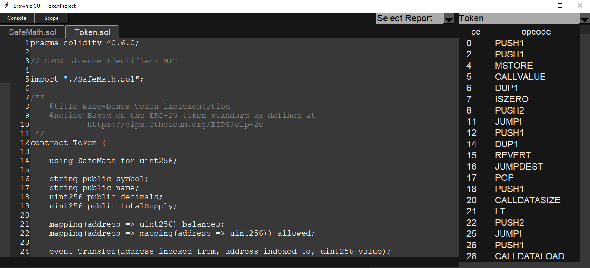
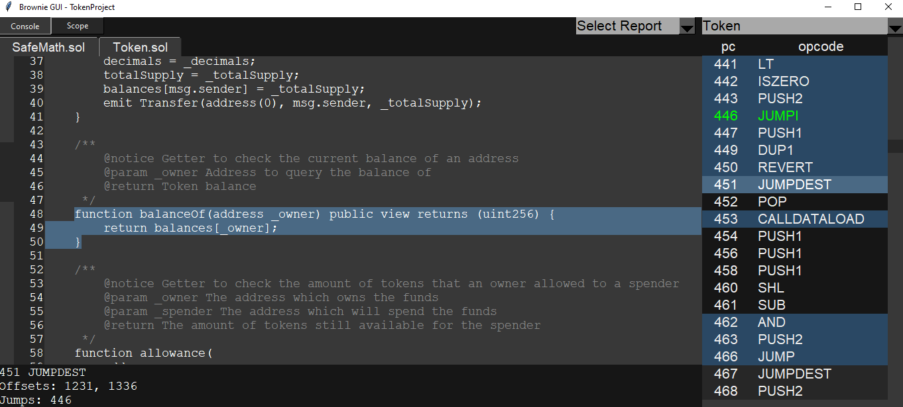
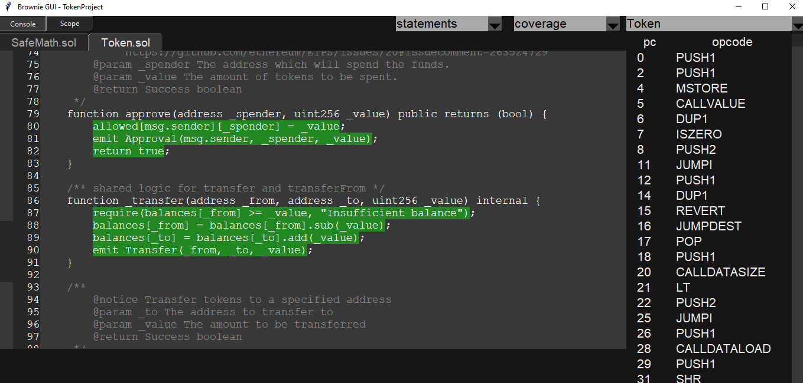

# Обзор инструмента brownie

**Автор:** [Алексей Куценко](https://github.com/bimkon144) 👨‍💻

[Brownie](https://eth-brownie.readthedocs.io/en/stable/index.html) - это фреимворк разработки и тестирования смарт-контрактов на основе Python, ориентированный на виртуальную машину Ethereum. 

Особенности:
- Полная поддержка Solidity и Vyper
- Контракты тестируются через [pythest](https://github.com/pytest-dev/pytest)
- Существует консоль для быстрого взаимодействия с контрактами
- Поддерживает [ethPM](https://www.ethpm.com/) пакеты
- Тестирование на основе свойств и состояний через библиотеку [hypothesis](https://github.com/HypothesisWorks/hypothesis/tree/master/hypothesis-python)
- Встроенный инструмент анализа безопасности контрактов MythX

В этом обзоре мы рассмотрим как инициализировать проект, структуру проекта, узнаем с помощью какой библиотеки пишутся тесты а так же как возможно производить отладку при тестировании кода.

_Важно!_ Для работы с Brownie потребуются базовые знания [web3.py](https://web3py.readthedocs.io/en/stable/index.html).

## Установка brownie

До инициализации проекта необходимо установить согласно [документации](https://eth-brownie.readthedocs.io/en/stable/install.html).


_Важно!_  Для полноценной работы фреимворка без ошибок, необходимо установить:
 - python3 версию 3.6 или выше, python3-dev
 - ganache-cli - проверенный с версией 6.12.2

Следует упомянуть, что для работы графического интерфейса brownie следует убедиться, что библиотека Tkinter установлена. Это можно сделать через команду ```python -m tkinter```. Если по какой-то из причин не установлено, то [тут](https://tkdocs.com/tutorial/install.html) можно прочитать как это сделать.

## Инициализация проекта

Для инициализации нового проекта используем ```brownie init```.
Мы также можем использовать уже готовые [шаблоны](https://github.com/brownie-mix).
Команда для инициализации проекта с шаблонов ```brownie bake nameOfRepo```.

## Структура проекта

contracts/: 
Сами контракты (код и библиотеки).

interfaces/: 
Интерфейсы контрактов.

scripts/: 
Python скрипты.

tests/: 
Тесты проекта.

build/: 
Здесь хранится информация, полученная в результате сборки и деплоя.

reports/: 
Отчёты в формате JSON.

Так же существует файл конфигурации **brownie-config.yaml** — в нём можно указать опции компилятора, данные для подключения к ноде или параметры тестирования. Варианты конфигурации можно посмотреть [тут](https://eth-brownie.readthedocs.io/en/stable/config.html).

## Команды brownie

Основные команды brownie:

 - ```init``` - инициализация нового проекта
 - ```bake``` - инициализация проекта из шаблона
 - ```pm``` - установка и управление внешними пакетами
 - ```compile``` - компилирование контрактов
 - ```console``` - запуск консоли для взаимодействия необходимой сетью (локальное тестовое окружение или подключение к мейннет/тестнетам)
 - ```test``` - запуск всех тестов в папке tests/
 - ```run``` - запуск скрипта в папке scripts/
 - ```accounts``` - позволяет управлять аккаунтами с которых будут происходить транзакции
 - ```networks``` - позволяет смотреть, добавлять/удалять список сетей
 - ```gui``` - запускает графический интерфейс который позволяет посмотреть отчеты test coverage и безопасности, а так же opcodes контрактов
 - ```analyze ``` - скрипт поиска уязвимостей смарт-контракта через инструмент MythX API

Следует более детально рассказать как работают команды ```pm``` и ```gui```:

### pm
  - Brownie позволяет устанавливать другие проекта в виде пакетов, которые дают такие преимущества:
 - Легко импортировать и развивать идеи кода, написанные другими.
 - Уменьшение дублирования кода между проектами.
 - Написание unit тестов, которые проверяют взаимодействие между вашим проектом и другим проектом.

Возможно использовать только github репозитории и [ethpm](https://www.ethpm.com/).

Более детальную информацию о том как устанавливать, управлять пакетами и импортировать их в тесты можно почитать [тут](https://eth-brownie.readthedocs.io/en/stable/package-manager.html).

### gui

Brownie включает в себя графический интерфейс для просмотра данных о тестовом покрытии и анализа скомпилированного байт-кода ваших контрактов.

Если вы не знакомы с opcodes, предлагаю вам ознакомиться с замечательной [статьей](https://github.com/fullstack-development/blockchain-wiki/blob/b062e3a0b385c05120a898eda485a509d5d1745e/ehtereum-virtual-machine/evm-opcodes/README.md#L1).

_Важно!_ Если у вас проблемы с загрузкой gui, вы наверное не установили [Tkinter](#установка-brownie).

После ввода команды ```brownie gui```, у вас запустится графический интерфейс, где вы сможете выбрать контракт, после чего у вас появятся вкладки всех контрактов и библиотек которые импортированы в ваш контракт. Помимо этого, справа в колонке, будут opcodes  и программные счетчики. 



Помимо этого, возможно выделять участки кода и смотреть соответствующие opcodes.



Для того, чтобы сгенерировать отчет покрытия тестами, необходимо вызвать команду ```brownie test --coverage```.

После чего, в графическом интерфейса можно выбрать отчет (Report) и указать режим - branches или statements.

На картинке ниже можно увидеть как появилось покрытие тестами в нашем графическом интерфейсе:



Более детально, можно прочитать [тут](https://eth-brownie.readthedocs.io/en/stable/gui.html).

## Тестирование

Для запуска тестов необходимо вызвать команду ```brownie test```

При написании тестов следует выделить основные функции:
- [Fixtures](https://docs.pytest.org/en/latest/explanation/fixtures.html) (это функция, которая применяется к одной или нескольким тестовым функциям и вызывается перед выполнением каждого теста)
- [Markers](https://docs.pytest.org/en/stable/how-to/mark.html#mark) (Это декоратор который применяется к функции тестирования. Например, можно указать, чтобы тест выполнялся только при запуске в определенной сети)
- [Parametrizing Tests](https://docs.pytest.org/en/latest/how-to/parametrize.html) (Это по сути тот же marker что мы указали выше, только его разновидность, которая позволяет задать нужны аргументы функции в виде массива. Можно задать несколько комплектов аргументов и тогда функция будет вызвана несколько раз с разными аргументами)

Так же следует отметить что имеется возможность установить пакет через команду ```pm```, после чего его возможно импортировать посредством fixtures и задеплоить определенный контракт. Таким образом можно тестировать взаимодействие вашего проекта с другими проектами.

### Тестирование на основе свойств

Тестирование на основе свойств — мощный инструмент для выявления крайних случаев и обнаружения ошибочных предположений в вашем коде.

Основная концепция тестирования на основе свойств заключается в том, что вместо написания теста для одного сценария вы пишете тесты, которые описывают ряд сценариев, а затем позволяете вашему компьютеру исследовать возможности за вас, вместо того, чтобы писать каждый из них вручную.

Процесс состоит из шагов:

- Выберите функцию в своем смарт-контракте, которую вы хотите протестировать.
- Укажите диапазон входных данных для этой функции, который всегда должен давать один и тот же результат.
- Вызовите функцию со случайными данными из вашей спецификации.
- Провести проверку результатов теста

Используя этот метод, каждый тест выполняется много раз с разными произвольными данными. Если найден пример, в котором тест не прошел, делается попытка найти простейший возможный случай, который все еще вызывает проблему. Затем этот пример сохраняется в базе данных и повторяется в каждом последующем тесте, чтобы гарантировать, что после устранения проблемы она останется исправленной.

Таким образом, можно проверить необходимые функции с разным диапазоном аргументов, найти уязвимости и исправить их. Более детально о настройке таких тестов можно почитать [тут](https://eth-brownie.readthedocs.io/en/stable/tests-hypothesis-property.html#what-is-property-based-testing).

### Тестирование на основе состояний 

Тестирование с сохранением состояния — это более продвинутый метод тестирования на основе свойств, используемый для тестирования сложных систем. Для этого используется [Hypothesis](https://github.com/HypothesisWorks/hypothesis). 

Hypothesis — это библиотека для Python, используемая для автоматического. Она основана на методологии "property-based testing" (тестирование на основе свойств). В отличие от традиционного подхода к тестированию, где тесты написаны вручную для конкретных входных данных и ожидаемых результатов, Hypothesis автоматически генерирует тестовые случаи.

В Hypothesis вы определяете "свойства", которые должен удовлетворять ваш код, и библиотека пытается "опровергнуть" эти свойства, генерируя различные входные данные. Если библиотека находит входные данные, которые приводят к нарушению свойства, она сообщает об этом, предоставляя пример, вызывающий ошибку. Это позволяет разработчикам обнаруживать и исправлять потенциальные проблемы и граничные случаи в их коде, о которых они могли не подозревать при ручном написании тестов.

Hypothesis особенно полезен для тестирования функций с широким диапазоном возможных входных данных и для нахождения редких, но критических случаев, которые могут привести к сбоям или ошибкам в программе.

_Важно!_ Этот функционал все еще находится на стадии разработки и считается экспериментальным 


Более детально рекомендую посмотреть [тут](https://eth-brownie.readthedocs.io/en/stable/tests-hypothesis-stateful.html)

### Анализ безопасности с помощью MythX

Brownie имеет интегрированный инструмент анализа [MythX](https://mythx.io/), который позволяет автоматически проверять ваш проект на безопасность.

MythX предлагает как бесплатные, так и платные услуги.

Первым делом необходимо зарегистрироваться у [MythX](https://dashboard.mythx.io/registration#/) и получить API ключ. После этого, необходимо указать этот ключ через команду ```export MYTHX_API_KEY=YourToken``` или через флаг ```brownie analyze --api-key=<string>```.

Далее, для запуска сканирования, можно воспользоваться встроенной командой ```brownie  analyze```

Чтобы посмотреть результат в графическом интерфейса сразу после сканирования, можно воспользоваться командой ```brownie analyze --gui```

Более детально, как работает сканирование рассказывают [тут](https://consensys.io/diligence/blog/2019/11/mythx-pro-security-analysis-explained/#more-37)

## Использование сторонних инструментов вместе с Brownie

- Brownie поддерживает популярный фреймворк Hardhat.

    Для того чтобы использовать, необходимо установить через команду ```npm install --save-dev hardhat```.

    Теперь, когда мы захотим использовать локальную сеть hardhat, мы можем пользоваться командой ```--network hardhat```. Например, запустить консоль ```brownie console --network hardhat```.

- Brownie поддерживает очень быструю локальную сеть [Anvil](https://github.com/foundry-rs/foundry/tree/master/crates/anvil), который является инструментом фреимворка [Foundry](https://book.getfoundry.sh/).
    Посмотреть как установить можно [тут](https://github.com/foundry-rs/foundry/tree/master/crates/anvil).
    После установки, мы можем использовать данную сеть ```--network anvil```.


## Ссылки:

- [Docs: Brownie](https://eth-brownie.readthedocs.io/en/stable/index.html)
- [Docs: hypothesis](https://hypothesis.works/ )
- [Docs: stateful testing](https://hypothesis.works/articles/rule-based-stateful-testing/)
- [Article: stateful testing article](https://hypothesis.works/articles/how-not-to-die-hard-with-hypothesis/)


