# Smart contract automation

**Автор:** [Алексей Куценко](https://github.com/bimkon144) 👨‍💻

## Введение

Смарт-контракты прошли путь от простого управления блокчейн-токенами к гибридным формам с использованием внешних данных и вычислений off-chain. Позже разработчики начали использовать сети оракулов для создания гибридных смарт-контрактов, которые используют внешние данные и вычисления off-chain в приложениях на блокчейне, чтобы открывать новые рынки, такие как DeFi, динамические NFT и GameFi. Теперь на передний план выходит дополнительная инфраструктура — автоматизация смарт-контрактов.

В этой статье мы рассмотрим автоматизацию смарт-контрактов и возможности, которые она открывает, а также сделаем обзор популярных инструментов автоматизации.

## Проблема автоматизации смарт-контрактов


Смарт-контракты — это код, размещенный в блокчейне, который активизируется и исполняет заранее заданные условия только при получении входящей транзакции. Это обеспечивает контролируемое и детерминированное выполнение условий, заложенных в код контракта. Внешняя транзакция выступает в роли «пинка», который активирует смарт-контракт и запускает его логику, подобно тому, как нажатие кнопки может включить свет.

Более детально можно увидеть на картинки ниже: 
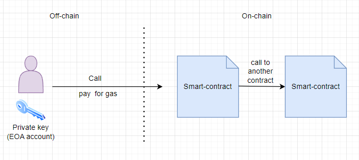

Таким образом, чтобы что-то поменять в блокчейне, нужна транзакция которая будет подписана приватным ключом. Приватный ключ обычно ассоциируется с отдельным пользователем и аккаунтом (EOA) в сети блокчейн.
В этом и заключается основная причина, по которой нельзя просто так вызывать функции на смарт-контрактах. Более того, одного приватного ключа недостаточно, так как этот аккаунт должен еще заплатить за газ в нативной валюте блокчейна. Величина газа будет зависеть от количества и сложности  выполняемых операций в блокчейне. Весь собранный газ пойдет валидаторам, которые получают его в качестве вознаграждения за добавление транзакции в блок.

## Способы решения

Одним из вариантов автоматизации вызова смарт-контракта может быть использование [cron](https://timeweb.com/ru/community/articles/chto-takoe-cron) задач. Реализуется на централизованном сервере. Это гораздо проще, чем использовать ручное выполнение транзакций, когда команда следит за состоянием смарт-контракта и сама инициирует вызовы на смарт-контракте. В подходе, узел автоматизации становится централизованной точкой отказа, что создает риск несвоевременного выполнения функций смарт-контракта (например, простои или задержки). Смарт-контракты, которые не выполняются, когда это необходимо, могут привести к асимметричным эксплойтам и упущенным возможностям, таким как проскальзывание торговли, неплатежеспособность протокола и потеря средств пользователей.

В конце концов, смарт-контракты должны быть полностью децентрализованы, включая автономную инфраструктуру автоматизации, отвечающую за их выполнение.

Другое решение - децентрализованная автоматизация смарт-контрактов, которая позволяет разработчикам автоматически запускать функции смарт-контрактов не беспокоясь о единой точке отказа. 

## Когда автоматическое исполнение смарт-контракта необходимо?

Существует множество ситуаций, когда смарт-контракты должны выполнять операции в сети для обеспечения функционирования и полезности протокола, без прямого вмешательства пользователей для их активации. 

Давайте рассмотрим наиболее интересные:

- [Yield Harvesting and Compounding](https://chain.link/education-hub/what-is-yield-farming) and Compounding. Используется в протоколах которые награждают пользователей за предоставление ликвидности. Например, протокол Beefy использует автоматизацию чтобы вызывать функцию harvest() в смарт-контрактах, чтобы собрать награды когда есть определенный profit, обменять их на необходимый токен и повторно инвестировать по требуемой стратегии. Таким образом инвестора один раз вносят ликвидность а протокол сам организовывает сбор наград и реинвестирование.

- Ликвидации в лендинг протоколах. Например, Aave, протокол DeFi, позволяет пользователям брать и давать взаймы криптоактивы. Если окажется, что займ пользователя недостаточно обеспечена, то часть займа необходимо ликвидировать. Таким образом ликвидаторы могут настроить автоматическую проверку состояния займов пользователей и необходимую ликвидацию, помогая гарантировать, что позиции остаются платежеспособными даже в периоды высокой волатильности рынка и перегрузки сети. Автоматизация будет отслеживать состояние пользовательских кредитов off-chain.

- [Pickle Finance](https://www.pickle.finance/). Протокол использует автоматизацию для управления LP позициями в Uniswap v3. Помогает ребалансировать LP пользователя в необходимый диапазон цен пула, чтобы обеспечить максимум доходности.

- DEX Limit Orders. Благодаря автоматизации, теперь пользователю нет необходимости отслеживать цену активов для покупки или продажи. Это позволяет использовать лимитные ордера в DEX, которые автоматически срабатывают при определенной цене.

- Автоматизированный vesting. Помогает полностью автоматизировать процесс дистрибуции токенов, делая этот процесс еще более децентрализованным.

- Автоматизация DAO(Decentralized Autonomous Organizations). Примером использования автоматизации может быть распределения токенов в виде награды, оплата заработной платы, автоматическое выполнение задачи после завершения голосования и другие необходимые автоматизации.

## Популярные инструменты автоматизации

Давайте кратко пройдемся по популярным инструментам автоматизации смарт-контрактов и узнаем возможности каждого из них.

### Gelato Networks

[Gelato Network](https://www.gelato.network/) - это сервис в области web3, который действует как Decentralized Cloud Platform. Главная задача протокола - решить проблемы отсутствия надежности, масштабируемости и централизации вокруг веб3-приложений, которые хотят дополнить свои смарт-контракты возможностями off-chain автоматизации, чтобы преодолеть ограничения, налагаемые на них нынешними блокчейнами на основе EVM. 

Gelato решает эти проблемы, предоставляя децентрализованные облачные услуги, которые позволяют разработчикам автоматизировать свои смарт-контракты, без газа и off-chain.

#### Автоматизация смарт-контрактов

Для решения задач автоматизации используется Web3 Functions.

- Web3 Functions: мощная система автоматизации, предназначенная для оптимизации и улучшения операций Web3. Функции Web3 служат комплексным инструментом, позволяющим разработчикам легко настраивать, управлять и автоматизировать свои задачи по смарт-контрактам.

Gelato Network по сути состоит из двух сторон. С одной стороны разработчики предлагают автоматизацию транзакций для своих пользователей, а с другой стороны операторы инфраструктуры запускают ботов-исполнителей, которые ищут задачи для выполнения и готовы осуществлять будущие транзакции по указанию пользователей за небольшую [плату](https://docs.gelato.network/web3-services/web3-functions/subscription-and-payments).

Уникальной особенностью Gelato является его способность соединять смарт-контракты с off-chain данными. Это достигается с помощью [Web3 Functions](https://app.gelato.network/functions), позволяющих разработчикам выполнять транзакции в блокчейне на основе информации, хранящейся вне блокчейна, например, данных API или сабграфов. Эти функции написаны на Typescript и хранятся в децентрализованной системе, такой как IPFS, и выполняются сетью Gelato. В данный момент, функция находится в приватной бете.

Настроить автоматизацию можно легко через [UI интерфейс](https://app.gelato.network/functions), [смарт-контракт](https://docs.gelato.network/developer-services/web3-functions/understanding-web3-functions/create-a-web3-function-task/using-a-smart-contract) или [Automate SDK](https://docs.gelato.network/developer-services/web3-functions/understanding-web3-functions/create-a-web3-function-task/using-the-automate-sdk).

Давайте рассмотрим возможные триггеры для автоматизации которые протокол может предложить на примере UI интерфейса. 

**Триггер** - это условие, при достижении которого инициализируется автоматическое выполнение функции смарт-контракта.

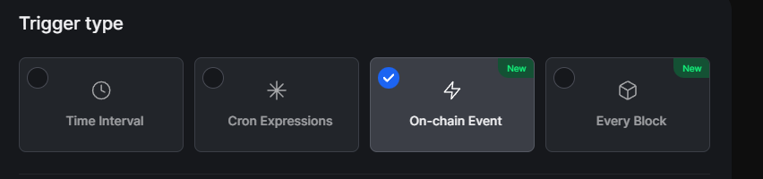

- time interval (временной интервал, например каждые 10 минут).
- cron expressions (запуск задачи в определенные моменты, например каждый вторник в 18:00).
- on-chain event (запуск задачи после определенного события в блокчейне).
- every Block (происходит каждый блок в блокчейне).

Перечень того, что можно запустить:
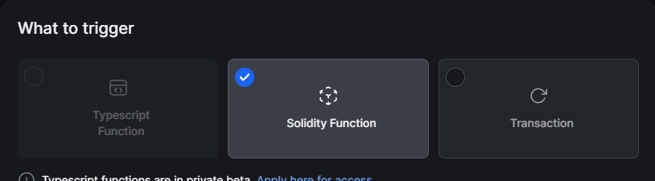

- Typescript function (децентрализованные облачные функции. Они позволяют разработчикам выполнять on-chain транзакции на основе произвольных off-chain данных (API/сабграфы и т. д.) и вычислений. Эти функции написаны на Typescript, хранятся в IPFS и выполняются Gelato).
- Solidity function (это часть логики, написанная на Solidity, которая определяет, выполняются ли определенные условия для выполнения задачи, после которого происходит вызов на необходимом смарт-контракте).
- Transaction (вызов определенной функции смарт-контракта с заданными параметрами).

После создания задания на автоматизацию смарт-контракта, вы можете отслеживать статистику выполнение через [UI интерфейс](https://docs.gelato.network/developer-services/web3-functions/analytics-and-monitoring).

Готовые шаблоны и примеры использования можно посмотреть [тут](https://docs.gelato.network/developer-services/web3-functions/template-and-use-cases).

#### Оплата 

Когда вы используете сервис Gelato, вам необходимо платить:
 - Затраты на газ для ваших выполненных транзакций (или транзакций ваших конечных пользователей, если вы их спонсируете через сервис relay).
 - Плата за обслуживание - подписка на Gelato или % в виде надбавки к стоимости газа за каждую транзакцию.

Для таких целей был создан сервис [1Balance](https://app.gelato.network/1balance). 

Главное преимущество данного сервиса в том, что он позволяет вам легко оплачивать все расходы в одной валюте и во всех сетях. (Нужно закинуть usdc токен в сети polygon).

Кроме того, использование данного сервиса позволяет вам настроить оповещении о пополнении балансе для оплаты в телеграм, дискорде или email. Более детально о планах подписки можно почитать [тут](https://app.gelato.network/1balance/subscriptions/functions). Однако, если вам требуется чтобы транзакция сама платила за себя, то это можно реализовать через UI интерфейс или через [смарт-контракт](https://docs.gelato.network/web3-services/web3-functions/subscription-and-payments#transaction-pays-for-itself).

#### Выводы

Gelato Network представляет собой важный инструмент в экосистеме блокчейна, предлагая решения для автоматизации смарт-контрактов, что делает его ценным инструментом для разработчиков децентрализованных приложений (DApps). Преимущества Gelato включают его способность децентрализовано обеспечивать надежное и эффективное исполнение транзакций, улучшение пользовательского опыта за счет автоматизации задач, снижение затрат на операции и управление, а также предоставление гибкости в интеграции с различными блокчейнами. Эти качества делают Gelato Network ключевым компонентом для создания более эффективных, доступных и масштабируемых DApps, способствуя дальнейшему развитию и инновациям в блокчейн-технологиях.

Посмотреть поддерживаемые сети протокола можно посмотреть [тут](https://docs.gelato.network/developer-services/web3-functions/supported-networks).

Интеграции и клиентов Gelato Networks можно посмотреть [тут](https://gelato-network.notion.site/Gelato-Ecosystem-6706d2a6134d485995484f6ce77dfddb).

### Chainlink

[Chainlink](https://chain.link/) предлагает широкий спектр продуктов, каждый из которых укрепляет инфраструктуру блокчейна и Web3, предоставляя разработчикам и предприятиям надежные инструменты для создания децентрализованных приложений и услуг. 

#### Автоматизация смарт-контрактов

**Chainlink Automation** использует сеть надежных, децентрализованных узлов (называемых Keepers), чтобы обеспечить надежное и безопасное выполнение автоматизированных задач (jobs,tasks).

Разработчики могут регистрировать свои задачи (Upkeeps), а владельцы Node, так называемые операторы, могут зарегистрироваться в регистре автоматизации как Automation Nodes.

Ниже на картинке можно рассмотреть архитектуру автоматизации:

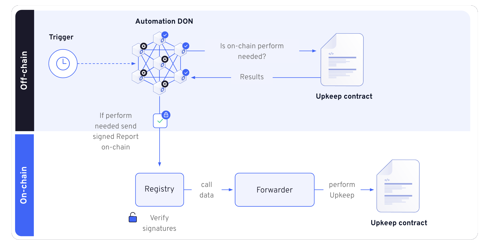

Для большего понимания, можно посмотреть анимацию работы автоматизации.

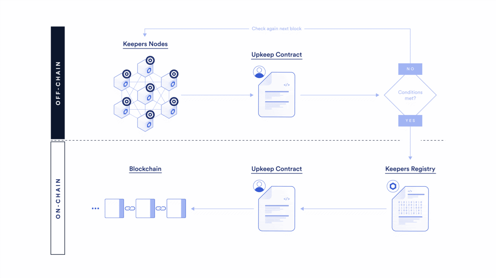

1. **Ноды Chainlink (Automation DON)**: Они являются частью децентрализованной сети и постоянно взаимодействуют друг с другом через протокол [OCR3](https://docs.chain.link/architecture-overview/off-chain-reporting#what-is-ocr) для достижения согласованности действий.

2. **Реестр (Registry)**: Ноды используют реестр для определения списка контрактов Upkeep, которые нужно обслуживать. Реестр содержит информацию о каждом Upkeep контракте и условиях, при которых они должны быть активированы.

3. **Функция `checkUpkeep`**: Эта функция находится внутри каждого Upkeep контракта и определяет, нуждается ли контракт в обслуживании. Ноды локально симулируют вызов этой функции, чтобы проверить, требуется ли выполнить обслуживание.

4. **Консенсус и подписанный отчет**: Когда ноды приходят к соглашению по результатам вызова `checkUpkeep`, они создают и подписывают отчет. Этот отчет содержит данные, которые будут использованы при вызове функции `performUpkeep` в блокчейне.

5. **Валидация отчета**: Подписанный отчет проверяется в реестре, что обеспечивает, что он был согласован и подписан всеми нодами, и предоставляет данные (`performData`) для выполнения в блокчейне.

6. **Выполнение Upkeep (`performUpkeep`)**: После валидации, данные из отчета используются для вызова функции `performUpkeep` в Upkeep контракте, который выполняет запланированные действия.

7. **Отказоустойчивость**: Система рассчитана на работу даже при отказе некоторых нод, что обеспечивает непрерывность обслуживания Upkeep.

Chainlink Automation позволяет автоматизировать выполнение задач смарт-контрактов на блокчейне, при этом обеспечивая высокий уровень децентрализации и безопасности благодаря механизмам консенсуса и криптографической валидации. Для большего понимания, предлагаю посмотреть пример контракта upkeep который содержит функции `checkUpkeep` и`performUpkeep` [тут](https://docs.chain.link/chainlink-automation/guides/compatible-contracts).

Автоматизацию (регистрацию upkeep контракта) можно настроить как через [UI интерфейс](https://automation.chain.link/mumbai/new) так и через [смарт-контракты](https://docs.chain.link/chainlink-automation/guides/register-upkeep-in-contract)

Триггеры для автоматизации смарт-контрактов:
 
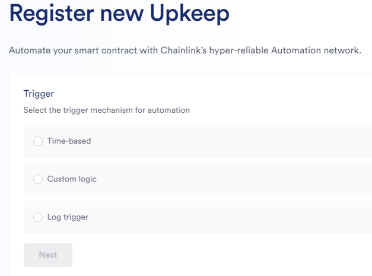

- [Time-based trigger](https://docs.chain.link/chainlink-automation/guides/job-scheduler) - автоматизирует функцию указанного расписания или временного интервала. Можно реализовать прям в UI интерфейсе, без необходимости реализовывать логику в смарт-контракте.
- [Custom logic](https://docs.chain.link/chainlink-automation/guides/register-upkeep) - позволяет использовать необходимую логику определения, когда именно необходимо вызывать функции вашего контракта. Реализуется Контракт проверки логики должен быть наследован от [AutomationCompatibleInterface](https://github.com/smartcontractkit/chainlink/blob/develop/contracts/src/v0.8/automation/interfaces/AutomationCompatibleInterface.sol) и реализовать две необходимые функции - checkUpkeep, для проверки необходимости запуска автоматизации и performUpkeep, которая выполнит необходимую автоматизацию. 
- [Log trigger](https://docs.chain.link/chainlink-automation/guides/log-trigger) - триггер позволяет отслеживать события в необходимом вам контракте и выполнять необходимую вам логику.

Посмотреть примеры вариантов решений задач можно [тут](https://dev.chain.link/resources/quickstarts?product=Automation).

После создания задания на автоматизацию, у вас появится список созданных upkeeps (заданий для автоматизации).

#### Оплата

Chainlink Automation требует комиссию за исполнение транзакций в блокчейне и % в качестве вознаграждения за труд операторов нод. Получается, в нее входит стоимость транзакций + небольшие фиксированные накладные расходы на газ между сетью и Registry, оплата оператора ноды. 

В качестве оплаты требуется токен LINK, созданный компанией Chainlink. Для возможности запуска вашего upKeep, вы должны будите перевести его на upKeeper Contract. 
Более детально можно почитать [тут](https://docs.chain.link/chainlink-automation/overview/automation-economics).

#### Выводы

Chainlink это очень важный децентрализованный, безопасный инструмент автоматизации ваших смарт-конрактов. 

В данный момент компания развивается и привносит много других продуктов, таких как Data Streams, VRF и другие, которые помогают в развитии Dapps и блокчейн решений в целом. Документация хорошо написана и есть все необходимые примеры.

Посмотреть поддерживаемые на текущий момент блокчейны можно [тут](https://docs.chain.link/chainlink-automation/overview/supported-networks#overview)

Если вы хотите стать оператором ноды и получать вознаграждение за работу или быть поставщиком данных, можно обратиться к их [экосистеме](https://chain.link/ecosystem).

### Openzeppelin defender

OpenZeppelin Defender — это веб-приложение, от знаменитой организации [Openzeppelin](https://www.openzeppelin.com/) которое позволяет разработчикам проверять код, деплоить/апгреидить, следить за смарт-контрактами, безопасно управлять и автоматизировать операции смарт-контрактов.

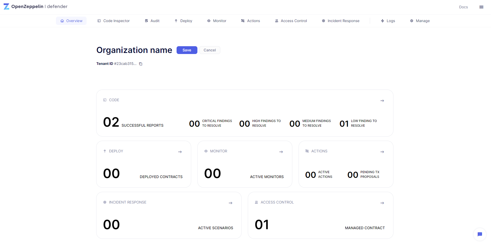

#### Автоматизация смарт-контрактов

Ниже рассмотрим компоненты которые так или иначе позволяют автоматизировать смарт-контрактов:

**Monitor** — отслеживает события, функции и транзакции вашего смарт-контракта и позволяет получать уведомления по электронной почте и задавать автоматические сценарии реагирования.

Возможности данного компонента важны как для реагирования на какие-то события в смарт-контракте, так и для предотвращения возможных сбоев или атак.

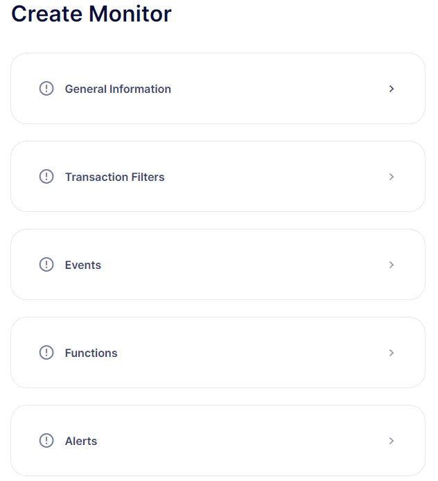 

Возможности:

- Отслеживайте важные события и авторизованные функции, такие как передача прав собственности на смарт-контракт, pause или mint.
- Оповещение о потенциально опасных транзакциях или операционных проблемах.
- Интеграция уведомления в Slack, Telegram, Discord, электронную почту, PagerDuty, Opsgenie или собственные API.
- Использование предустановленных шаблонов, таких как Upgrade Monitor, Ownership Changes, Multisig Monitor и др.
- Использование совместно с другими компонентами Defender 2.0 для автоматического выполнения транзакций при возникновении определенных событий на смарт-контракте.

Получается, используя данный инструмент, мы можем настроить отслеживание смарт-контракта таким образом, чтобы при подозрительных событиях на смарт-контракте у нас автоматически блокировался смарт-контракт и происходило оповещение об опасной ситуации. Более детально о том как создать и настроить мониторинг смарт-контрактов можно посмотреть [тут](https://docs.openzeppelin.com/defender/v2/tutorial/monitor.html).

**Actions** — создавайте автоматизированные действия для выполнения операций on/off-chain. Позволяет настроить предопределенные сценарии реагирования на инциденты, запускаемые автоматически мониторами или по требованию.

Это является главным компонентом построения автоматизации выполнения смарт-контрактов через удобный интерфейс.

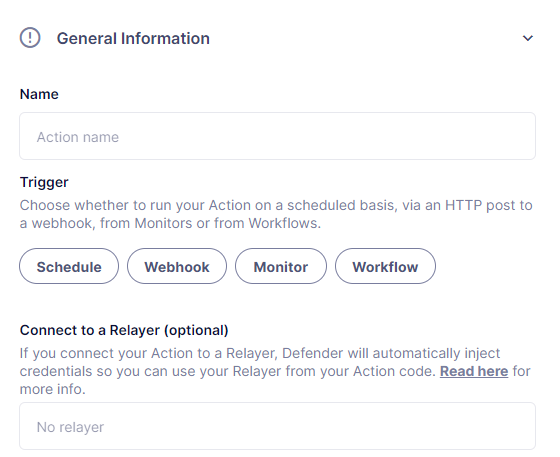
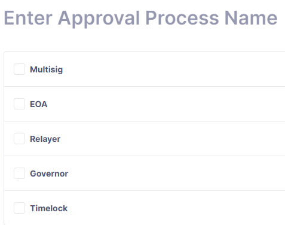

Actions можно использовать для:

- Создания transition proposals c указанием типа approvals который требуется для выполнения транзакции.(Обертка для транзакций может быть один из доступных вариантов: Multisig, EOA одного кошелька, Relayer - внутренний кошелек defender необходимый для транзакций, Governor контракт на котором будет создан proposal, timelock controller address)

- Автоматизации смарт-контрактов с условиями: расписание, webhook, [monitor](#monitor), workflow(группа из нескольких действий, например можно сделать сценарий - сделать паузу на контракте и вывести средства).

В качестве инструкции для отправки транзакции используется javascript код как указано на картинке.

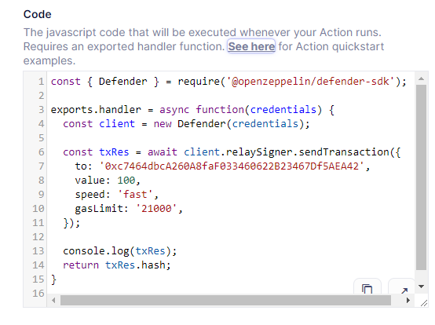

#### Оплата

В данный момент инструмент бесплатный, но проведение аудита является платной процедурой.

#### Выводы

Openzeppelin Defender позволяет командам повысить безопасность смарт-контракта, проверять на наличие уязвимостей, проводить аудит, управлять, автоматизировать смарт-контракты и своевременно автоматически реагировать на угрозы взлома. 

Проект позволяет обеспечить безопасности смарт-контракта как при его разработке так и при его работе.

Возможны интеграции с популярными фреимворками [Hardhat](https://hardhat.org/) и [Foundry](https://book.getfoundry.sh/getting-started/installation). Другие возможные интеграции можно посмотреть [тут](https://docs.openzeppelin.com/defender/v2/integrations)

Сети в которых работает можно посмотреть [тут](https://docs.openzeppelin.com/defender/v2/#networks)

### Keep3r Network

[Keep3r Network](https://keep3r.network/) — это децентрализованная платформа, разработанная [Андре Кронье](https://ru.wikipedia.org/wiki/%D0%90%D0%BD%D0%B4%D1%80%D0%B5_%D0%9A%D1%80%D0%BE%D0%BD%D1%8C%D0%B5), известным в сфере DeFi за свою работу над Yearn Finance. 

Основная цель Keep3r Network — соединять проекты, которым требуются специализированные услуги (Jobs), с так называемыми "Keepers" (хранителями) — лицами или командами, которые могут выполнить эти услуги.

Таким образом Keep3r Network позволяет проектам опубликовать свои потребности в Jobs, а Keepers могут принимать эти работы, выполнять задачи и получать за это вознаграждения. 

Вознаграждения выплачиваются в виде ETH, токенов или внутренней криптовалюты KP3R (токен Keep3r Network). Это стимулирует Keepers качественно выполнять работу, а проекты — к предоставлению справедливого вознаграждения.

В свою очередь jobs и keepers должны быть зарегистрированы для возможности выполнения своих задач.

#### Автоматизация смарт-контрактов

В целом все очень похоже на предыдущие проекты. [Регистрируете](https://keep3r.network/) `job` и реализуете специальный [интерфейс](https://docs.keep3r.network/core/jobs#simple-keeper) в смарт-контракте, который определяет условия вызова и выполняемую логику.

Регистрация jobs:

1) Регистрация через UI интерфейс сайта

Через интерфейс протокола вы можете зарегистрировать смарт-контракт job в протоколе. 

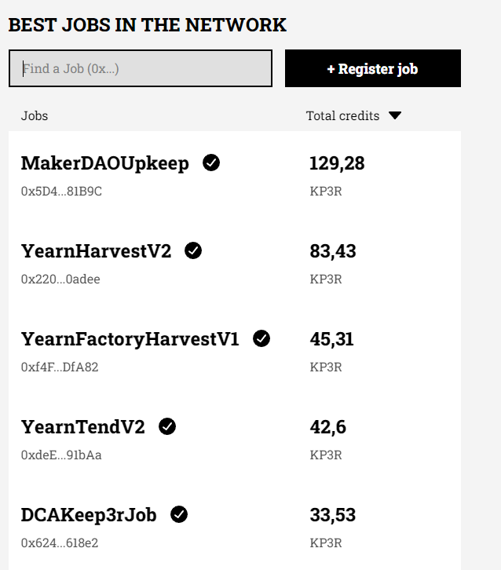

На картинке выше вы видите публичный перечень jobs которые требуют автоматизации и количество KP3R кредитов которые прилагаются для оплаты автоматизации.

Для того чтобы зарегистрированная работа отобразилась на сайте в этом перечне, вам необходимо будет отправить пул реквест в [данный](https://github.com/keep3r-network/web-v2/blob/main/utils/registry.tsx) репозиторий.

2) Регистрация через смарт-контракт - вы можете использовать метод смарт-контракта - [addJob](https://docs.keep3r.network/core/jobs#adding-jobs) 

#### Оплата

Способы оплаты Jobs (заданий на автоматизацию):

1) Credit Mining
    Это механизм оплаты киперам (keepers) доходом накопленным в пуле (keep3r Liquidity Pool - kLP), где пользователь предоставляет ликвидность.

    Работаем таким образом:

    - Пользователь предоставляет ликвидность в пул KP3R и WETH, например Keep3rLP - KP3R/WETH и получает взамен kLP токены. 
    - LP токены стекаются через [addLiquidityToJob](https://github.com/keep3r-network/keep3r-network-v2/blob/956dad62b359a43ca047a8895d6e6a21aa24fddc/solidity/contracts/peripherals/jobs/Keep3rJobFundableLiquidity.sol#L178) и KP3R credits начинают начисляться на счет адреса контракта Job. Таким образом Keeper может получать вознаграждение за выполненную работу а создатель Job может не беспокоится о том что ему нужно постоянно пополнять баланс для выполнения автоматизации. Более детально о работе можно почитать [тут](https://docs.keep3r.network/tokenomics/job-payment-mechanisms/credit-mining).

2) Token Payments

    Позволяет платить за работу киперам в erc-20 токенах. 

    Для этого необходимо:
    - пополнить баланс Job через [addTokenCreditsToJob](https://github.com/keep3r-network/keep3r-network-v2/blob/956dad62b359a43ca047a8895d6e6a21aa24fddc/solidity/contracts/peripherals/jobs/Keep3rJobFundableCredits.sol#L25).

    _Важно!_ Единственный способ добавить KP3R credits к Job — это [Credit Mining](https://docs.keep3r.network/tokenomics/job-payment-mechanisms/credit-mining). Попытка добавить токены KP3R с помощью ```addTokenCreditsToJob``` приведет к отмене транзакции.

    Так же существует [auto-pay](https://docs.keep3r.network/core/jobs#auto-pay) возможность, что позволяет автоматически рассчитать требуемую оплату за автоматизацию.

#### Выводы

Полностью децентрализованный протокол который позволяет любому начать автоматизировать свои смарт-контракты или помочь в выполнении таких задач.

Следует отметить, что информация необходимая для использования протокола, достаточно задокументирована. Но, отсутствует руководства и обучения, которые могли бы помочь начинающим разработчикам. 

Самое главное преимущество протокола - возможность производить оплату за jobs через доход полученный с пула ликвидности, тем самым можно один раз предоставить ликвидность и больше не платить в будущем.

Доступен в таких сетях: Ethereum, Optimism, Polygon, Optimism Goerli.

## Практический пример реализации 

Давайте приведем практический пример из chainlink Automation.

Приведем пример использования автоматизации с пользовательской логикой проверки необходимости вызова.

Задача: Реализовать автоматический вызов счетчика через определенный интервал времени.

Решение этой задачи можно разделить на два этапа: 
- Реализация контракта UpKeeper;
- Регистрация контракта для автоматизации.

### Создание и деплой контракта

Для этого ваш контракт должен наследоваться от интерфейса `AutomationCompatibleInterface`:

```solidity
import {AutomationCompatibleInterface} from "@chainlink/contracts/src/v0.8/automation/AutomationCompatible.sol";

contract Counter is AutomationCompatibleInterface {}
```

Далее, нужно реализовать две функции интерфейса : 
- checkUpkeep (запускается off-chain, чтобы определить, следует ли вызывать функцию PerformUpkeep в блокчейне);
- performUpkeep (содержит логику, которая должна выполняться в блокчейне, когда checkUpkeep возвращает true)

Таким образом, мы получаем контракт настроенный как нам необходимо - для вызова performUpkeep через определенный интервал в секундах:

```solidity
// SPDX-License-Identifier: MIT
pragma solidity 0.8.20;

import {AutomationCompatibleInterface} from "@chainlink/contracts/src/v0.8/automation/AutomationCompatible.sol";

    /**
    * @notice Контракт счетчик, который вызывает performUpkeep метод через заданный промежуток времени, заданный параметром interval в секундах
    * @dev Контракт создан в учебных целях. Не использовать на реальных проектах
    */
contract Counter is AutomationCompatibleInterface {

    /**
     * counter - счетчик вызовов функции
     */
    uint256 public counter;

    /**
     * interval - время между вызовами функции, в секундах 
     * lastTimeStamp - временная метка которая отображает время последнего вызова требуемой функции
     */
    uint256 public immutable interval;
    uint256 public lastTimeStamp;

    constructor(uint256 updateInterval) {
        interval = updateInterval;
        lastTimeStamp = block.timestamp;

        counter = 0;
    }

    // checkData задается при регистрации upKeep. Можно передать закодированные параметры
    function checkUpkeep(
        bytes calldata /* checkData */
    ) 
        external
        view
        override
        returns (bool upkeepNeeded, bytes memory /* performData */)
    {
        upkeepNeeded = (block.timestamp - lastTimeStamp) > interval;
        // Для простоты примера, мы не будем использовать performData, который в свою очередь может передается нодой при вызове метода performUpkeep

    }

    function performUpkeep(bytes calldata /* performData */) external override {
        if ((block.timestamp - lastTimeStamp) > interval) {
            lastTimeStamp = block.timestamp;
            counter = counter + 1;
        }
    }
}
```

Теперь мы можем задеплоить наш контракт в блокчейн, используя [remix](https://remix.ethereum.org/). В качестве аргумента при деплое контракта, необходимо задать updateInterval - время между вызовами функции, указанное в секундах.

### Регистрация нашего контракта для автоматизации:

1) Подключаем наш кошелек на [сайте](https://automation.chain.link/) и выбираем `Register new UpKeep`
2) Выбираем тип триггера - `Custom logic` и вводим адрес нашего контракта
   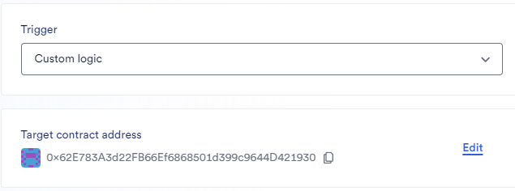
3) Заполняем необходимые данные для регистрации:
   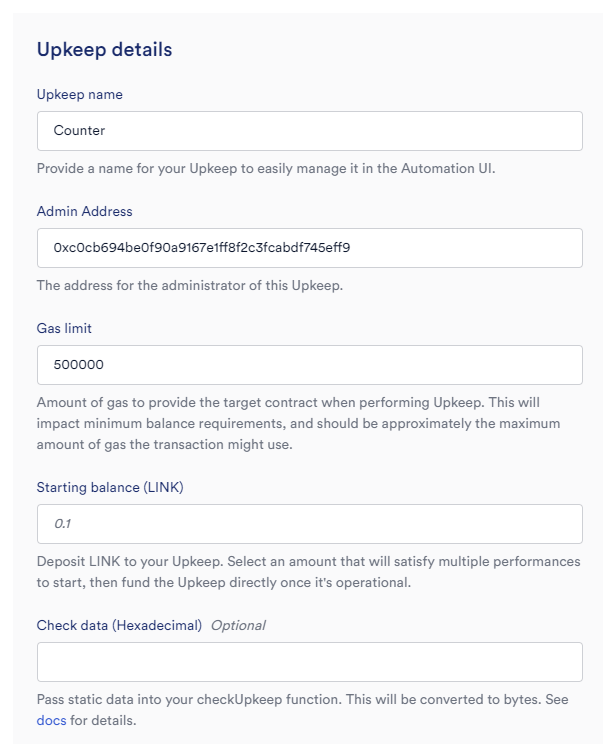
   `Gas limit` - это лимит газа который нода будет задействовать при вызове нашей функции на контракте. В нашем случае, функция потребляет мало газа, поэтому можно оставить как есть. Для более сложных автоматизаций, рекомендуется заранее задеплоить контракт в тестнет и проверить сколько газа уходит на `performUpKeep`;
    `Starting balance (LINK)` - количество LINK токена который будет отправлен в Upkeep для поддержания работы.
    `Check data` - необязательный параметр данных, который может быть отправлен в `checkUpkeep` функцию. В нашем случае оставляем поле пустым.
4) После заполнения данных о регистрации upKeeper, необходимо провести транзакцию 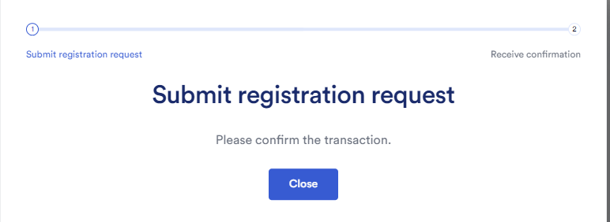

Теперь через личный кабинет мы можем отслеживать:
- Cтатус кипера, название, баланс 
 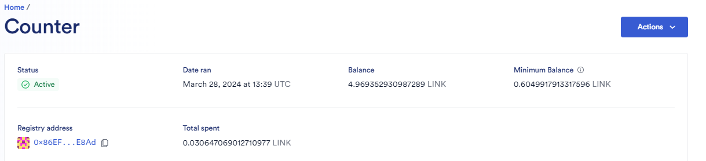 
- Детали и историю операций
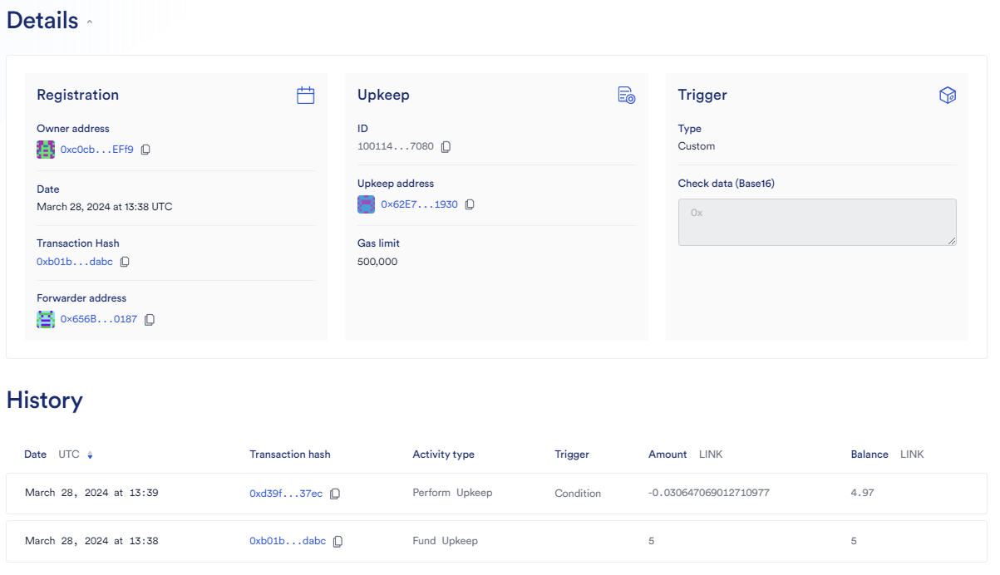

Так же существуют возможности управления нашим upkeep: 
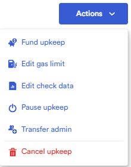 

Таким образом, настроить необходимую автоматизацию смарт-контракта не представляет особой сложности.

## Вывод

Результаты исследований можно представить в виде сравнительной таблицы:
| Категория | Критерий | Gelato Networks | Chainlink Automation | Openzeppelin Defender | Keep3r Network |
|:---------|:---------|:---------------:|:--------------------:|:---------------------:|:--------------:|
| **Изучение** | Документация | ✅ Есть понятная документация с примерами | ✅ Есть понятная документация с примерами | ✅ Есть понятная документация с примерами | ❓ Есть документация, но отсутствуют руководства и обучения |
|  | Поддержка и коммуникация | ✅ Discord, telegram и другие | ✅ Discord, telegram, reddit и другие | ✅ Discord, forum и другие | ✅ Discord, twitter и другие |
| **Запуск и тестирование** | Варианты запуска | ✅ Через UI, smart-contracts, SDK | ✅ Через UI, smart-contracts | ✅ Через UI | ✅ Через UI, смарт-контракт |
|  | Тестирование | ✅ Есть тестнеты | ✅ Есть тестнеты | ✅ Есть тестнеты | ❌ Отсутствует в тестнетах |
| **Особенности** | Децентрализованное выполнение | ✅ Чтобы стать оператором автоматизированной ноды нужно застейкать минимум 150k GEL токена| ✅ Желающие могут стать операторами автоматизированных нод | ❌ централизованные операции | ✅ Полностью децентрализованный протокол |
|  | Оплата и комиссия | ✅ Есть возможность оплаты самой транзакцией, через общий сервис-кошелек 1Balance или платной подпиской. Nodes взимают комиссию в виде процента от общей стоимости газа за выполненную транзакцию. Отсутствие дополнительной комиссии протоколу. | ✅ Транзакции должны быть оплачены LINK токенами на вашем UpKeep контракте. Отсутствие дополнительных комиссий протоколу | ✅ Отсутствует комиссия проекта. Для оплаты транзакций создается Relayer адрес на который необходимо пополнить нативной валютой | ✅ В документации отсутствует информация о расчете комиссии, в том числе оплату keepers за выполнение работы. Существует возможность оплаты в KP3R токене, erc-20, ETH. Возможно заплатить один раз и забыть - застекайть KP3R токены в пул ликвидности |
|  | Оповещение пользователя | ✅ телеграм, дискорд, email оповещении о низком балансе кошелька | ✅ телеграм, дискорд, оповещение о низком балансе кошелька | ✅ телеграм, дискорд, email, webhooks оповещение о низком балансе кошелька | ❌ Реализация отсутствует |
|  | Защита от front running | ✅ Приватный канал с собственным флеш бот майнерами | ❌ Информация отсутствует | ❌ Информация отсутствует | ❌ Информация отсутствует |
| **UI** | Панель управления | ✅ Мониторинг, управления задачами | ✅ Мониторинг, управления задачами | ✅ Удобное управление задачами автоматизации через панель управления | ❓ Возможно добавить job через UI, но отобразиться только после пул реквеста в гитхаб |

Автоматизация смарт-контрактов играет ключевую роль в развитии и расширении возможностей блокчейн-технологий. Она не только сокращает необходимость в ручном вмешательстве, что снижает риск взломов и ошибок, но и открывает новые горизонты для инноваций в разработке децентрализованных приложений. 

Автоматизация улучшает пользовательский опыт, делая взаимодействие с блокчейном более интуитивным и доступным. Кроме того, она способствует созданию более сложных и функциональных систем, которые могут служить основой для нового поколения децентрализованных сервисов. 

Важно, чтобы разработка и внедрение автоматизированных смарт-контрактов шли рука об руку с обеспечением их безопасности и децентрализации на всех этапах, включая внешнюю инфраструктуру, отвечающую за их активацию. Это обеспечит долгосрочный успех и устойчивость экосистемы блокчейна, способствуя ее расширению и интеграции в широкий спектр отраслей.

Каждый протокол имеет свои преимущества и недостатки. Выбирайте протокол исходя из потребностей вашего проекта.

## Ссылки:

- [Docs: Gelato Network](https://docs.gelato.network/introduction/gelato-the-web3-cloud-platform)
- [Docs: Chainlink Automation](https://docs.chain.link/chainlink-automation)
- [Docs: Openzeppelin Defender](https://docs.openzeppelin.com/defender/v2/)
- [Docs: Keep3r Network](https://docs.keep3r.network/)
- [Article: smart contract use cases](https://chain.link/education-hub/smart-contract-automation)
- [KP3R token supply info](https://dune.com/nesk/keep3r-network)
- [Keep3r Network github](https://dune.com/nesk/keep3r-network)


