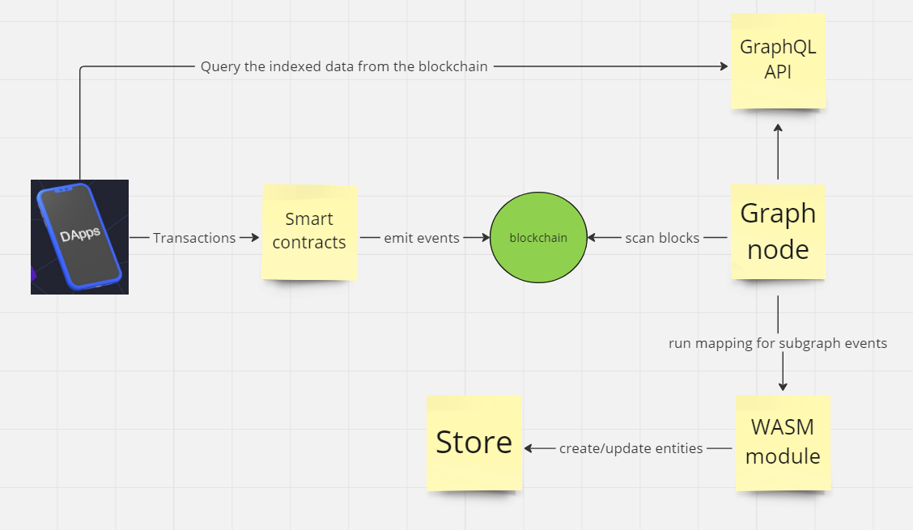

# The Graph

**Автор:** [Алексей Куценко](https://github.com/bimkon144) 👨‍💻

## Что такое The Graph?

**The Graph** — это децентрализованный протокол для индексации и запроса данных блокчейна. The Graph позволяет запрашивать данные, которые трудно запросить напрямую с контракта.

**Индексация** – это процесс организации и обработки данных блокчейна таким образом, чтобы их можно было быстро и эффективно запросить. Это аналогично тому, как поисковые системы индексируют веб-страницы, чтобы предоставлять быстрые ответы на поисковые запросы пользователей

Например, проекты со сложными смарт-контрактами, такие как Uniswap, и  NFT, такие как Bored Ape Yacht Club, хранят данные в блокчейне, что очень затрудняет чтение чего-либо, кроме основных данных, непосредственно из блокчейна.

В случае NFT Bored Ape Yacht Club, мы можем выполнять основные операции чтения контракта, такие как получение владельца определенного id токена, получение URI контента  на основе id токена, или totalSupply, поскольку эти функция записаны в смарт-контракт. Более сложные запросы и операции реального мира, такие как агрегация, поиск, отношения и нетривиальная фильтрация, невозможны.

Например, если бы мы хотели запросить id токенов, принадлежащих определенному адресу, и отфильтровать по одной из его характеристик, мы не смогли бы получить эту информацию, взаимодействуя непосредственно с самим контрактом.

Чтобы получить эти данные необходимо:
1. Выгрузить все события `transfer`
2. Прочитать метаданные из IPFS. Для этого понадобиться id токена и базовый url IPFS сервиса
3. Агрегировать полученные данные.

Даже на такие относительно простые действия децентрализованному приложению (dapp), работающему в браузере, потребуются не мало времени.

Альтернативное решение может включать в себя:
1. Создание собственного сервера
2. Выгрузка всех событий `transfer`
3. Сохранение событий в базе данных
4. Создание API, чтобы запрашивать агрегированные данные.

Однако этот вариант также является [ресурсоемким](https://thegraph.com/docs/en/network/benefits/). Он требует обслуживания, представляет собой единую точку отказа, которая нарушает важные свойства безопасности, необходимые для децентрализации приложения.

Индексировать данные блокчейна очень и очень сложно.
Свойства блокчейна, такие как завершенность, реорганизация цепочки или неподключенные блоки, еще больше усложняют этот процесс и делают не только трудоемким, но и концептуально трудным получение правильных результатов запроса из данных блокчейна.

The Graph решает эту проблему с помощью децентрализованного протокола, который индексирует и обеспечивает эффективный процесс получения данных из блокчейна с последующей структуризацией и предоставлением внешнего API для работы с этими данными"

Сегодня есть [hosted service](https://thegraph.com/docs/en/deploying/hosted-service/), который позволяет деплоить сабграфы бесплатно, не используя децентрализованную сеть, а также децентрализованный протокол с теми же возможностями. Оба поддерживаются реализацией [Graph Node](https://github.com/graphprotocol/graph-node) с открытым исходным кодом.

>Важно: Обратите внимание, что в 2023 году хостинговая служба начнет закрываться, но она останется доступной для сетей, которые не поддерживаются в децентрализованной сети. Разработчикам рекомендуется обновить свои сабграфы до The Graph Network. Хостинговые службы в каждой сети будут закрываться постепенно, чтобы у разработчиков было достаточно времени для обновления сабграфов до децентрализованной сети. Подробнее о прекращении действия размещенной службы можно прочитать [тут](https://thegraph.com/blog/sunsetting-hosted-service/).

## Как он работает?

The Graph индексирует данные блокчейна, на основе описаний subgraph, известных как subgraph manifest.

После написания subgraph manifest вы используете Graph CLI для сохранения описания в IPFS и указываете индексатору начать индексацию данных для этого subgraph.


**Разберем порядок работы сабграфов:**

- Децентрализованное приложение добавляет данные в блокчейн через транзакции при взаимодействии со  смарт-контрактом.
- Смарт-контракт генерирует одно или несколько событий при обработке транзакции.
- Graph Node постоянно сканирует блокчейн на наличие новых блоков и данных для вашего subgraph, которые они могут содержать.
- Graph Node находит события блокчейн для вашего subgraph в этих блоках и запускает предоставленные вами mapping handlers. Обработчик — это модуль WASM, который создает или обновляет объекты данных, которые Graph Node хранит в ответ на события блокчейн.
- Децентрализованное приложение запрашивает у Graph Node данные, проиндексированные из блокчейна, используя [node's GraphQL endpoint](https://graphql.org/learn/). Graph Node, в свою очередь, преобразует запросы GraphQL в запросы к своему базовому хранилищу данных, чтобы получить эти данные, используя возможности индексирования хранилища. Децентрализованное приложение отображает эти данные в пользовательском интерфейсе для конечных пользователей, которые они используют для создания новых транзакций в блокчейн. Цикл повторяется.

## Создание subgraph

В этом разделе мы разберемся в трех ключевых элементах при создании subgraph.

Разберем создание основных элементов сабграфа на простом контракте который задеплоен в сети [Sepolia](https://sepolia.etherscan.io/address/0x90d092977ad098E1E0382fbD5Cc2D07D458369f3#code).

Первым делом рекомендую пройти регистрацию и создать свой сабграф [тут](https://thegraph.com/hosted-service/dashboard). При инициализации  выбираем тип ethereum, сеть sepolia и тип сервиса hosted-service, указываем адрес контракта. Будет произведена автоматическая инициализация проекта

Определение subgraph состоит из нескольких файлов:

 - **subgraph.yaml**: YAML файл который содержит subgraph manifest. В нем указываются информация необходимая для индексации и запроса к определенному сабграфу.
 - **schema.graphql**: GraphQL схема, которая определяет, какие данные хранятся для вашего subgraph и как запрашивать их через GraphQL.
 - **AssemblyScript Mappings**: Код [AssemblyScript](https://github.com/AssemblyScript/assemblyscript), который преобразует данные c событий в сущности, определенные в schema.graphql файле.

> Словарь терминов для статьи:
**Сущность** (entity) - это часть схемы сабграфа, по которой мы будем определять как записывать, хранить, и как получать эти данные при запросе.
Сопоставление (маппинг, mapping) - это Файл `assebmlyScript`, в котором написаны все функции, которые обрабатывают будь то тригер event, вызов функции, блок и обновляют/создают новою сущность в схеме сабграфа.

### **1. Определение subgraph.yaml**

Любой формат данных, который имеет четко определенное отображение с каноническим форматом [IPLD]( https://github.com/ipld/ipld), может использоваться для определения манифеста сабграфа. Сюда входят YAML и JSON.
Манифест сабграфа и все связанные с ним файлы — это то, что развертывается в IPFS и хешируется для создания идентификатора сабграфа, на который можно ссылаться и который можно использовать для извлечения сабграфа в The Graph.

Примеры в этом документе представлены в формате YAML.

Самый первый шаг - определить subgraph manifest с использованием синтаксиса YAML. Полную спецификацию сабграф манифеста можно посмотреть [тут](https://github.com/graphprotocol/graph-node/blob/master/docs/subgraph-manifest.md).

Мы можем посмотреть сгенерированный файл и разобраться в нем:
```javascript
specVersion: 0.0.5
//Удобочитаемое описание того, что представляет собой сабграф.
//Это описание отображается в Graph Explorer при развертывании сабграфа в hosted service.
description: Wiki
//URL-адрес репозитория, в котором можно найти манифест подграфа. Это также отображается в Graph Explorer
repository: https://github.com/graphprotocol/graph-tooling
//Путь до сабграф схемы
schema:
  file: ./schema.graphql
//Новые функции сабграфа, которые уже можно использовать, объявляются тут. Более подробно расскажем далее.
features:
  - fullTextSearch
//Указываем источник в виде сети, названия, адреса и abi контракта
dataSources:
  - kind: ethereum
    name: Wiki
    network: sepolia
    source:
      address: "0x90d092977ad098E1E0382fbD5Cc2D07D458369f3"
      abi: Wiki
//Это необязательный параметр, который позволяет вам определить, с какого блока в начнется индексация.
//Установка начального блока позволяет источнику данных потенциально пропускать миллионы ненужных блоков.
//Обычно разработчик сабграфа устанавливает startBlock для блока, в котором был создан смарт-контракт.
      startBlock: 4423006 //Тут автоматически должен установиться блок деплоя контракта, если не установился, укажите блок создания контракта
//Раздел который описывает сущности схемы, abi контрактов и все типы хендлеров обрабатываемые контрактом.
    mapping:
      kind: ethereum/events
      apiVersion: 0.0.6
      language: wasm/assemblyscript
//Сущности, которые источник данных записывает в хранилище.  Данные сущности были сгенерированы автоматически, мы должны будем сами их поменять согласно сущностям которые создадим позже.
      entities:
        - NewBook
        - NewPerson
        - NewProduct
        - NewWiki
//Перечень abi для всех контрактов, с которыми мы будем взаимодействовать при написании маппингов
      abis:
        - name: Wiki
          file: ./abis/Wiki.json
//Перечисляет события смарт-контракта, на которые реагирует сабграф, и хендлеры, которые преобразуют эти события в сущности согласно схеме сабграфа. У вас должны автоматически подтянуться с контракта, либо необходимо самим записать.
      eventHandlers:
        - event: NewBook(uint256,string,string)
          handler: handleNewBook
        - event: NewPerson(uint256,string,string)
          handler: handleNewPerson
        - event: NewProduct(string,uint256,string)
          handler: handleNewProduct
        - event: NewWiki(uint256,address,string,string)
          handler: handleNewWiki
//Перечисляет функции смарт-контракта, на которые реагирует сабграф, и хендлеры,
//Которые преобразуют входные и выходные данные при вызове функции в сущности в схеме. Например возьмем функцию createWiki
      callHandlers:
        - function: createWiki(string,string)
          handler: handleCreateWiki
//Перечисляет блоки, на которые реагирует сабграф, и хендлеры в маппингах, которые
//Выполняются при добавлении блока в цепочку. Без фильтра обработчик блока будет запускаться в каждом блоке.
//Дополнительный фильтр вызовов можно предоставить, добавив в обработчик поле фильтра с kind: call.
//Обработчик будет запущен только в том случае, если блок содержит хотя бы один вызов контракта источника данных.
      blockHandlers:
        - handler: handleBlock
        - handler: handleBlockWithCall
          filter:
            kind: call
//Путь где хранятся маппинги для обработки событий, блоков, вызовов функций
      file: ./src/yourName.ts
```
Один сабграф может индексировать данные сразу из нескольких смарт-контрактов, для этого необходимо просто указать еще один источник данных после поля ```DataSources:```

Но что будет если в одном блоке будет и тригер ивента и тригер вызова функции, а если еще и добавить блок к этому всему? В какой последовательности будут обрабатывать это все хендлеры в маппингах?

Для этого существуют правила, которые определяют, в какой последовательности будут запущены хендлеры в нашем манифесте для смарт-контракта внутри одного блока транзакций:

**1. Триггеры событий и вызовов сортируются по индексу транзакции в блоке.**
Это значит, что если в одном блоке несколько транзакций, сначала будут запущены все триггеры из первой транзакции, потом из второй и так далее.

**2. Внутри одной транзакции сортировка идет по типу: сначала триггеры событий, потом триггеры вызовов функций.**
Если в одной транзакции есть и события, и вызовы функций, то сначала будут обработаны все события, а потом все вызовы.
Кроме того, учитывается порядок, заданный в манифесте.

**3. Триггеры, относящиеся к блоку, запускаются после всех остальных.**
Эти триггеры сработают после того, как будут обработаны все события и вызовы во всех транзакциях этого блока.

>В будущем алгоритм упорядочивания может быть пересмотрен.

### **2. Определение schema.graphql**

Схемы GraphQL определяются с помощью языка определения интерфейса GraphQL. Если вы никогда не писали схему GraphQL, рекомендуется ознакомиться с [этим](https://thegraph.com/docs/en/querying/graphql-api/#schema) учебником по системе типов GraphQL. В учебнике можно ознакомиться с понятием entities(сущности).

Перед определением сущностей важно подумать о том, как наши данные структурированы и связаны. Все запросы будут выполняться к модели данных, определенной в схеме сабграфа, и сущностям, индексированным подграфом. Поэтому важно  хорошо определить схему подграфа так, чтобы она соответствовала потребностям децентрализованного приложения. Лучше всего представлять сущности как «объекты, содержащие данные», а не как события или функции.

Мы просто определяем типы сущностей в `schema.graphql`, а Graph node генерирует поля верхнего уровня для запроса отдельных экземпляров и коллекций этого типа сущностей. Каждый тип, который должен быть сущностью, должен быть аннотирован директивой `@entity`. По умолчанию, сущности являются изменяемыми. Это означает, что маппинги могут загружать существующие сущности, изменять их и сохранять новую версию этой сущности. Изменчивость имеет свою цену, и для типов сущностей, о которых известно, что они никогда не будут изменены, рекомендуется помечать их как неизменяемые с помощью `@entity(immutable: true)`. Маппинги могут вносить изменения в неизменяемые сущности, если эти изменения происходят в том же блоке, в котором была создана сущность. Неизменяемые сущности гораздо быстрее пишутся и запрашиваются, поэтому их следует использовать везде, где это возможно.

Давайте определим первую сущность для нашего контракта:
```javascript
type Wiki @entity {
  id: ID!
  owner: String!
  wikiId: String!
}
```
Каждая сущность должна иметь поле идентификатора (id), которое должно быть типа `Bytes!` или `String!`. Обычно рекомендуется использовать `Bytes!`, если идентификатор не содержит удобочитаемый текст, поскольку объекты с `Bytes!` id будет быстрее записать и запросить, чем те, у которых есть `String!` идентификатор. Поле `id` служит первичным ключом и должно быть уникальным среди всех сущностей одного типа. По историческим причинам тип `ID!` также принимается и является синонимом `String!`.

Поля сущности могут быть определены как обязательные или необязательные. Обязательные поля отмечены в схеме восклицательным знаком `!`. Если в маппинге не задано обязательное поле, вы получите эту ошибку при запросе поля: ```Null value resolved for non-null field 'name'```. Поэтому если мы делаем обязательное поле, то должны присвоить ему начальное значение, либо убрать пометку обязательности поля в схеме сабграфа.

Иногда, для создания уникальных сущностей можно использовать конкатенацию двух других `id` сущностей, например ``let id = left.id.concat(right.id)``. Тут мы создаем `id` третью сущность из сущности `left b right`.

Мы узнали как создать сущность в схеме сабграфа, но какие еще типы (scalars) полей сущности могут быть?

| Type  | Description|
| ----- | --------- |
| Bytes    | Массив байтов, представленный в виде шестнадцатеричной строки. Обычно используется для хэшей и адресов блокчейна|
| String     | Скаляр для строковых значений. Нулевые символы не поддерживаются и автоматически удаляются.         |
| Boolean     | Скаляр для логических значений|
| Int     | Спецификация GraphQL определяет размер Int как 32 байта |
| BigInt     | Большие целые числа. Используется для типов  uint32, int64, uint64, ..., uint256. Примечание: Все, что ниже uint32, например int32, uint24 или int8, представляется как i32|
| BigDecimal    | BigDecimal Десятичные числа высокой точности, представленные в виде мантиссы и экспоненты. Диапазон показателей составляет от -6143 до +6144.|

Также при определении сабграфа можно использовать `enum`, например, давайте определим:
```javascript
enum WikiType {
  small
  averange
  big
}

И можем указать поле сущности в виде enum

type Wiki @entity {
  id: ID!
  owner: String!
  wikiId: String!
  type: WikiType!
}
```
Но самое интересное, что сущности могут иметь взаимосвязь с другими сущностями.

#### **Взаимосвязь  сущностей**

Взаимосвязь определяются для сущностей так же, как и любое другое поле, за исключением того, что указанный тип относится к другой сущности, например:

 - **One-To-One Relationships**

Представим ситуацию, когда у нас есть человек и его паспорт. В большинстве стран у каждого человека может быть только один действующий паспорт, и у каждого паспорта может быть только один владелец. Это хороший пример связи "один к одному".
Создадим две новые сущности:

```javascript
type Person @entity {
  id: ID!
  name: String!
  passport: Passport
}

type Passport @entity {
  id: ID!
  passportNumber: String!
  owner: Person
}
```

Каждый человек `(Person)` имеет уникальный идентификатор `(id)`, имя `(name)` и может быть связан с одним паспортом `(Passport)` через поле passport.

Каждый паспорт `(Passport)` имеет уникальный идентификатор `(id)`, номер паспорта `(passportNumber)` и связан с одним конкретным человеком `(Person)` через поле owner.

Таким образом, у нас есть чёткая связь "один к одному" между человеком и его паспортом.

 - **One-To-Many Relationships**

```javascript
 type Author @entity(immutable: true) {
  id: ID!
  name: String!
}

type Book @entity {
  id: ID!
  title: String!
  author: Author!
}
```

`Author` является сущностью, представляющей автора. У каждого автора есть уникальный идентификатор `(id)` и имя `(name)`.

`Book` является сущностью, представляющей книгу. У каждой книги есть уникальный идентификатор `(id)`, название `(title)` и ссылка на автора этой книги `(author: Author!)`.

Связь `author: Author!` в `Book` означает, что каждая книга обязательно связана с одним автором. Это и есть однонаправленная связь "один ко многим" (one-to-many): один Author может быть автором множества книг, но каждая `Book` связана только с одним `Author`.

Пример в реальной жизни:

Представьте, что у нас есть автор с именем "Лев Толстой" и у него есть идентификатор `ID = "AUTHOR_1"`. Этот автор написал много произведений, таких как "Война и мир", "Анна Каренина" и так далее. Каждое из этих произведений будет представлено отдельной записью `Book`, но все они будут ссылаться на одну и ту же запись `Author с ID = "AUTHOR_1"`.


 - **Reverse Lookups**

Задача:
Представьте, что у нас есть онлайн-магазин, который продает различные товары. У каждого товара есть производитель. Нам нужно иметь возможность быстро определить все товары, которые были произведены определенным производителем.

Сущности:

 - `Product` (Товар)

У каждого товара есть уникальный `ID`, название, цена и производитель.

 - `Manufacturer` (Производитель)

У каждого производителя есть уникальный ID и название. Мы также хотим иметь возможность быстро узнать все товары, произведенные этим производителем.

```javascript
type Product @entity {
  id: ID!
  name: String!
  price: BigInt!
  manufacturer: Manufacturer!
}

type Manufacturer @entity {
  id: ID!
  name: String!
  products: [Product!]! @derivedFrom(field: "manufacturer")
}

```

Принцип работы:
В сущности `Product`, мы имеем поле manufacturer, которое указывает на сущность `Manufacturer`.
В сущности `Manufacturer`, мы имеем поле `products`, которое является списком всех Product, произведенных этим производителем. Используя директиву `@derivedFrom`, мы указываем, что это поле выводится из связи поля `manufacturer` в сущности `Product`.
Таким образом, при запросе определенной сущности Manufacturer, вы можете получить список всех `Product`, произведенных этим производителем, без необходимости явного хранения этой связи в сущности Manufacturer. Это и есть концепция **Reverse Lookups** в действии.

- **Many-To-Many Relationships⁠**

Отношения "многие ко многим" могут быть представлены в виде массивов в каждой из двух задействованных сущностей.

Простой способ:
```javascript
type Author @entity {
  id: ID!
  name: String!
  books: [Book!]!
}

type Book @entity {
  id: ID!
  title: String!
  authors: [Author!]! @derivedFrom(field: "books")
}
```

Здесь каждый автор имеет список книг, которые он написал, и каждая книга имеет список авторов, которые ее написали.

В сущности `Author` есть массив `books`, который содержит книги `(Book)`.
В сущности `Book` есть виртуальное поле authors, которое получено через `@derivedFrom(field: "books")`. Это означает, что при запросах, поле `authors` в сущности `Book` будет выдавать результат поиска всех сущностей `Author`, у которых поле `books` будет включать идентификатор `(id)` сущности `Book`. Тем самым мы можем узнать список авторов книги - сущностей `Author` в которых есть наша `Book`.

Этот подход прост и непосредственен, но он может быть менее эффективным, особенно если у вас много данных.

Более производительный способ:

```javascript
type Author @entity {
  id: ID!
  name: String!
  writtenBooks: [AuthorBook!]! @derivedFrom(field: "author")
}

type Book @entity {
  id: ID!
  title: String!
  authorsOfThisBook: [AuthorBook!]! @derivedFrom(field: "book")
}

type AuthorBook @entity {
  id: ID! # Например, `author.id.concat(book.id)`
  author: Author!
  book: Book!
}
```

Вместо того чтобы прямо связывать `Author` и `Book`, используется отдельная сущность `AuthorBook` как "таблица связей". Она имеет поля `author` и `book`, каждое из которых связывается с одной из основных сущностей.

У `Author` и `Book` есть виртуальные поля, которые выводятся из соответствующих полей в `AuthorBook`.

При выполнении запросов необходимо "спуститься" на один дополнительный уровень, чтобы получить информацию. Например, чтобы узнать книги конкретного автора, вы сначала получите AuthorBook для этого автора, а затем из этого запроса получите книгу.

Например:
```javascript
query authorsAndTheirBooks {
  authors {
    name
    writtenBooks {
      # this is an AuthorBook entity
      book {
        title
      }
    }
  }
}
```

Этот подход является более сложным, но он обычно более производителен. С точки зрения базы данных, это экономит пространство и уменьшает объем данных, который необходимо индексировать и запрашивать, что делает процесс индексации и выполнения запросов быстрее.

Когда вы моделируете свои данные, выбор способа представления отношений зависит от ваших потребностей. Если производительность является ключевым приоритетом и у вас есть много данных, рекомендуется использовать подход с отдельной "таблицей связей".

Но каким образом мы можем сделать запрос к схеме сущностей, чтобы найти сущности, поля которых содержат определенные текстовые значения?
Тут нам поможет [Fulltext Search Fields](https://thegraph.com/docs/en/developing/creating-a-subgraph/#experimental-features).
>Важно: Этот тип поиска относится к Experimental features и поэтому, чтобы эти запросы работали, начиная с версии specVersion 0.0.4 и выше, в s`ubgraph.yaml` необходимо  указать - `fullTextSearch` в разделе features сабграф манифеста, как мы это делали при составлении манифеста.

Например, составим для нашей сущности `Author`

```javascript
type _Schema_
  @fulltext(
    name: "authorSearch",
    language: en,
    algorithm: rank,
    include: [{ entity: "Author", fields: [{ name: "name" }] }]
  )
```
Пример поля authorSearch можно использовать в запросах для фильтрации сущностей Author на основе текста в полях имени. [Тут](https://thegraph.com/docs/en/querying/graphql-api/#fulltext-search-queries) можно посмотреть подробности составления запросов.

```javascript
query {
  authorSearch(text: "Толстой") {
    id
    name
  }
}
```
На данный момент, у нас должны быть сущности как в этой [схеме](./examples/schema.graphql). Можете поправить манифест и обновить там сущности. После написания, можно запустить команду генерации типов - graph codegen , позже расскажу подробней для чего это нужно.

### **3.Написание AssemblyScript Mappings**

Последняя важная часть при  написании сабграфа, это умение обработать данные полученные с ивентов/функций и создать/обновить сущность схемы сабграфа.

Для этого существует маппинг. Маппинги написаны на подмножестве TypeScript под названием [AssemblyScript](https://www.assemblyscript.org/), которое можно скомпилировать в WASM ([WebAssembly](https://webassembly.org/)).
AssemblyScript более строгий, чем обычный TypeScript, но обеспечивает знакомый синтаксис. В нашем случае маппинги будут храниться в src/имяКотороеВыДали.ts

#### Event Handlers

Для каждого `event handler` который определен в subgraph.yaml в разделе `mapping.eventHandlers` необходимо создать экспортирующую функцию с таким же названием, причем каждая функция должен принимать один параметр event, тип которого должен соответствовать названию ивента.

Составим маппинги для [нашего](#1-определение-subgraphyaml) сабграфа:

```javascript
//src/wiki.ts
import {
  Wiki,
  NewBook,
  NewPerson,
  NewProduct,
  NewWiki
} from "../generated/Wiki/Wiki"
import { Author, AuthorBook, Book,  } from "../generated/schema"

export function handleNewWiki(event: NewWiki): void {
  let wiki = new WikiEntity(event.params.id.toString() + "-" + event.logIndex.toString());
  wiki.owner = event.params.owner.toString();
  wiki.wikiId = event.params.id.toString();
  wiki.type = "small";
  wiki.save();
}

export function handleNewBook(event: NewBook): void {}

export function handleNewPerson(event: NewPerson): void {}

export function handleNewProduct(event: NewProduct): void {}
```
Как мы видим из примера, в функции handleNewWiki, создается новая сущность WikiEntity  с ```event.params.id + "-" + event.logIndex.toString()```, далее, в нашу созданные сущности записываем параметры события, которые произошли при вызове метода createWiki в соответствующем [смарт-контракте](https://sepolia.etherscan.io/address/0x90d092977ad098E1E0382fbD5Cc2D07D458369f3#code). Если нам необходимо, мы можем не только сохранять новые сущности, но и пытаться загрузить старые по их id.

Попробуйте сами дописать остальные 3 функции. Если не получится - [вот](./examples/wiki.ts) заполненный пример.

Как мы ранее говорили, каждая сущность должна иметь уникальный id среди сущностей одинакового типа. id присваивается при создании сущности и должно быть типа string.
Рекомендуется создавать id таким образом:
event.params.id.toHex()
event.transaction.from.toHex()
event.transaction.hash.toHex() + "-" + event.logIndex.toString()

Вы наверное заметили, откуда мы берем типы ивентов и что за папка generated?

Да, для того, чтобы упростить и обеспечить безопасность типов работы со смарт-контрактами, событиями и сущностями,  Graph CLI(команда graph codegen) может генерировать типы AssemblyScript из схемы GraphQL сабграфа и ABI контракта, включенных в data sources сабграф манифеста.

Таким образом, когда мы вызываем `graph codegen` происходит три важные генерации типов:
 - Класс AssemblyScript для каждого смарт-контракта в файлах ABI, упомянутых в subgraph.yaml, что позволяет привязывать эти инстансы контрактов к определенным адресам при написании маппингов и вызывать методы контракта только для чтения.
  - Класс для каждого события контракта, чтобы обеспечить легкий доступ к параметрам события, а также к блоку и транзакции, из которых возникло событие.
  - В дополнение к этому для каждого типа сущности в схеме GraphQL сабграфа создается один класс. Эти классы обеспечивают типобезопасную загрузку сущностей, доступ для чтения и записи к полям сущностей, а также метод `save()` для записи сущностей для хранения. Все классы сущностей записываются в `<OUTPUT_DIR>/schema.ts`, что позволяет импортировать в маппингах.

>Важно: Генерацию кода необходимо выполнять заново после каждого изменения схемы GraphQL или ABI, включенных в манифест. Это также необходимо выполнить хотя бы один раз перед созданием или развертыванием подграфа.

>Важно: Генерация кода не проверяет ваш код маппингов, если вам нужно проверить прежде чем деплоить сабграф, вы можете вызывать `npm build` и выявить любые синтаксические ошибки, которые может обнаружить компилятор TypeScript.

Таким образом, мы можем импортировать из вновь сгенерированой папки generated, типы ивентов, сущность схемы, или контракт который можем привязать к нужному адресу и вызвать методы чтения.

#### Call Handlers

Вы уже видели как задавать call handlers которые будут обрабатываться при вызове функции  [тут](#1-определение-subgraphyaml).

Разница от event handlers в том, что в манифесте вы указываете ```callHandlers```, в котором прописываете функцию при вызове которой будут срабатывать обработчики в маппинге.
И в самом маппинге, указываете тип входящего аргумента функции - ```createGravatarCall```, которая генерируется через команду ```graph codegen```.

Например, допишим наши маппинги:
```javascript
export function handleCreateWiki(call: CreateWikiCall): void {
  let wiki = new WikiEntity(call.transaction.hash.toString());
  wiki.owner = call.inputs._newWiki;
  wiki.wikiId = call.inputs._wikiType;
  wiki.type = "small";
  wiki.save();
}
```
Таким образом, в случае если в смарт-контрате необходимо получить данные которые нельзя получить через события, мы можем прибегнуть к такому методу.

#### Block Handlers

Возможно вам необходимо вызывать handler на каждый блок сети или только когда происходит вызов вашего смарт-контракта? В этом вам поможет block handlers, но следует учитывать что не все сети поддерживают данный тип обработчиков, например BNB chain  и Arbitrum.

Для того, чтобы handler работал только когда в блоке вызывали ваш смарт-контракт, не забудьте указать данную настройку в вашем манифесте:

```javascript
filter:
 kind: call
```

Пример маппинга для обработки информации.
Сперва добавим в нашу схему и повторно запустим graph codegen.
```javascript
type Block @entity(immutable: true) {
  id: ID!
  number: BigInt!
  timeUnix: BigInt!
  updatedAtBlock: BigInt!
}
```
Далее в маппингах пропишем создание этой сущности:
```javascript
import { ethereum } from '@graphprotocol/graph-ts'

export function handleBlock(block: ethereum.Block): void {
  let id = block.hash.toString();
  //read smartcontract
  //create or update entities
  let entity = new Block(id)
  entity.save()
}
```
После такой большой проделанной работы, предлагаю закрепить важные знания - задеплоить наш сабграф и проверить, как можно делать запросы через веб-сервис.
Для этого заходим на [сайт](https://thegraph.com/hosted-service/). В раздел dashboards находите свой сабграф и выполняете команды в разделе "Deploy". Таким образом, у вас на странице сабграфа появится playground в котором вы можете сделать пробные запросы и посмотреть что данные действительно проиндексированы и хранятся сабграфом.

Теперь необходимо дождаться синхронизации и создание сущностей и можно делать запросы. Если хотите проверить, как он обрабатывает новые данные с контракта, вы можете зайти на сам контракт в сети Sepolia, вызвать пару методов и посмотреть как новые данные появятся в вашем сабграфе.

Мы научились писать сабграф манифест, схему сабграфа, маппинги которые их обрабатывают. Так же теперь мы умеем деплоить и делать запросы к сабграфу через playground.

Но есть несколько важных моментов, которые следует знать. Если вы хорошо знакомы с DeFi, то у вас возникнет вопрос, а если нам не всегда заранее известно, какой адрес будет у контракта? Ведь часто в смарт-контрактах используется такой тип контрактов как registry или factory, где один контракт создает, управляет или ссылается на произвольное количество других контрактов, каждый из которых имеет свое собственное состояние и события. Получается, что адреса этих субконтрактов могут быть не известны заранее, что означает мы не можем определить заранее источники данных и необходим более динамичный подход

Верно, тут нам на помощь пришли шаблонные типы источников, о которых сейчас расскажу.

#### Data Source Templates

Тут будет теоретическая часть не связанная нашим кодом. Вы можете поэкспериментировать и написать такой пример для настоящего Uniswap.
Для примера возьмем Uniswap Factory, который каждый раз деплоит новый контракт NewExchange.

Для начала, мы создаем data source для основного контракта Factory, как указано в примере:

```javascript
dataSources:
  - kind: ethereum/contract
    name: Factory
    network: mainnet
    source:
      address: '0xc0a47dFe034B400B47bDaD5FecDa2621de6c4d95'
      abi: Factory
    mapping:
      kind: ethereum/events
      apiVersion: 0.0.6
      language: wasm/assemblyscript
      file: ./src/mappings/factory.ts
      entities:
        - Directory
      abis:
        - name: Factory
          file: ./abis/factory.json
      eventHandlers:
        - event: NewExchange(address,address)
          handler: handleNewExchange
```
Как мы видим, у нас есть ивент NewExchange, который генерируется, когда через фабрику создают новый контракт.

Затем, вы добавляете в манифест источник данных ```templates```. Этот источник данных идентичен ```dataSources```, только отсутствует заранее указанный адрес контракта.

```javascript
dataSources:
  - kind: ethereum/contract
    name: Factory
    # ... other source fields for the main contract ...
templates:
  - name: Exchange
    kind: ethereum/contract
    network: mainnet
    source:
      abi: Exchange
    mapping:
      kind: ethereum/events
      apiVersion: 0.0.6
      language: wasm/assemblyscript
      file: ./src/mappings/exchange.ts
      entities:
        - Exchange
      abis:
        - name: Exchange
          file: ./abis/exchange.json
      eventHandlers:
        - event: TokenPurchase(address,uint256,uint256)
          handler: handleTokenPurchase
        - event: EthPurchase(address,uint256,uint256)
          handler: handleEthPurchase
        - event: AddLiquidity(address,uint256,uint256)
          handler: handleAddLiquidity
        - event: RemoveLiquidity(address,uint256,uint256)
          handler: handleRemoveLiquidity
```

Как можете заметить, под этот источник можно указать свой маппинг, abi контракта, eventHandlers- ```./src/mappings/exhange.ts```.

Теперь, необходимо сгенерировать код через команду ```graph codegen```, в маппингах контракта фабрики ```./src/mappings/factory.ts``` импортировать Exchange template из папки generated, и добавить строку ```Exchange.create(event.params.exchange)``` которая позволяет начать индексировать новый контракт.

```javascript

//./src/mappings/factory.ts
import { Exchange } from '../generated/templates'

export function handleNewExchange(event: NewExchange): void {
  // Start indexing the exchange; `event.params.exchange` is the
  // address of the new exchange contract
  Exchange.create(event.params.exchange)
}
```
При инициализации нового контракта, так же можно передать дополнительную информацию, через [data source context](https://thegraph.com/docs/en/developing/creating-a-subgraph/#data-source-context).

Таким образом, каждый раз когда наша фабрика будет деплоить новый контракт, по нашему шаблону будет создаваться новый контракт, который будет обрабатываться и индексироваться согласно указанным параметрам в манифесте.

#### File Data Sources⁠

Одна из новых функциональностей сабграфа, это возможность чтения IPFS во время обработки маппингов.

**Что это нам дает?**
Теперь, например, мы можем не только индексировать события токенов ERC-721, но и читать IPFS хеш данных токенов, т.е прямо во время обработки событий контракта. Мы можем читать данные с IPFS только что сминченного токена, и тут же создавать новые сущности в сабграфе.
Более детально, можно прочитать [тут](https://thegraph.com/docs/en/developing/creating-a-subgraph/#file-data-sources).

## Unit Test Framework

Компания LimeChain создала фреймворк [Matchstick](https://thegraph.com/docs/en/developing/unit-testing-framework/), который позволяет разработчикам тестировать логику их маппингов, тем самым с уверенностью деплоить сабграф.


## Ссылки

-   [Основная документация по протоколу The Graph](https://thegraph.com/docs/en/)
-   [Документация по graphQL](https://graphql.org/learn/)
-   [Hosted service](https://thegraph.com/hosted-service)
-   [Graph explorer](https://thegraph.com/explorer)
-   [Модули для индексации openzeppelin контрактов](https://docs.openzeppelin.com/subgraphs/0.1.x/)
-   [Информация о децентрализованном сабграфе](https://coinmarketcap.com/alexandria/article/a-deep-dive-into-the-graph)

