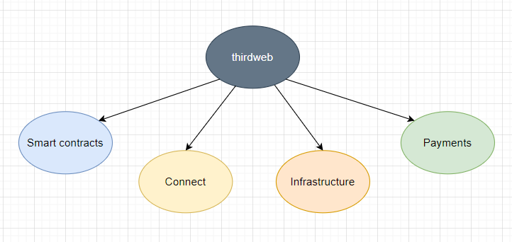
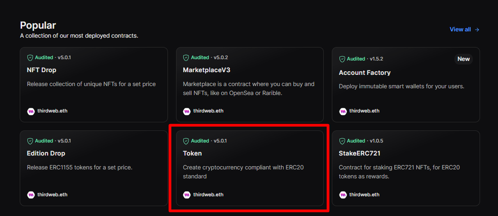
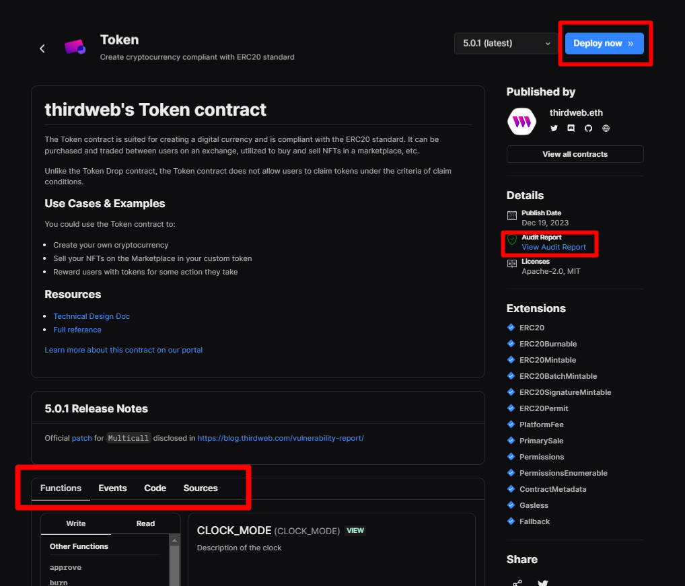
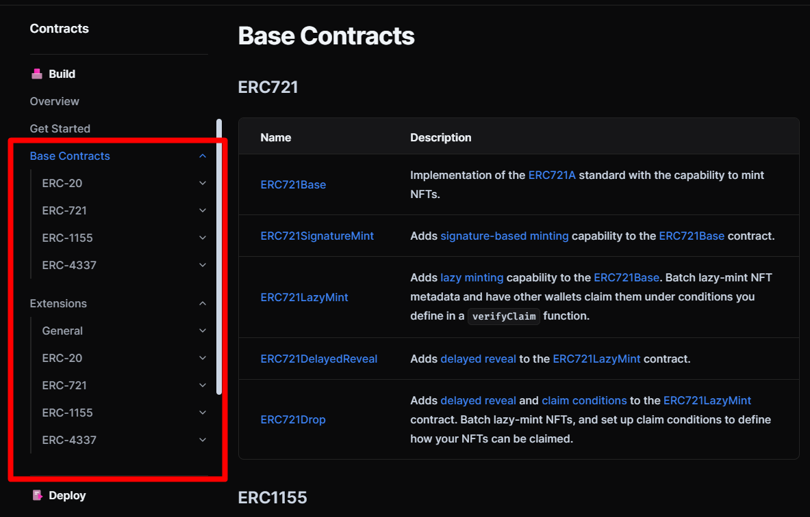
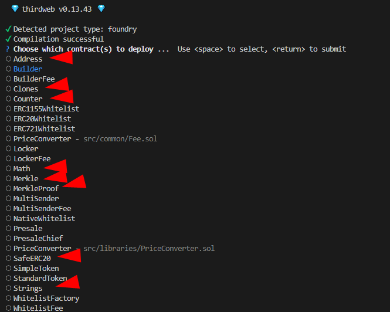
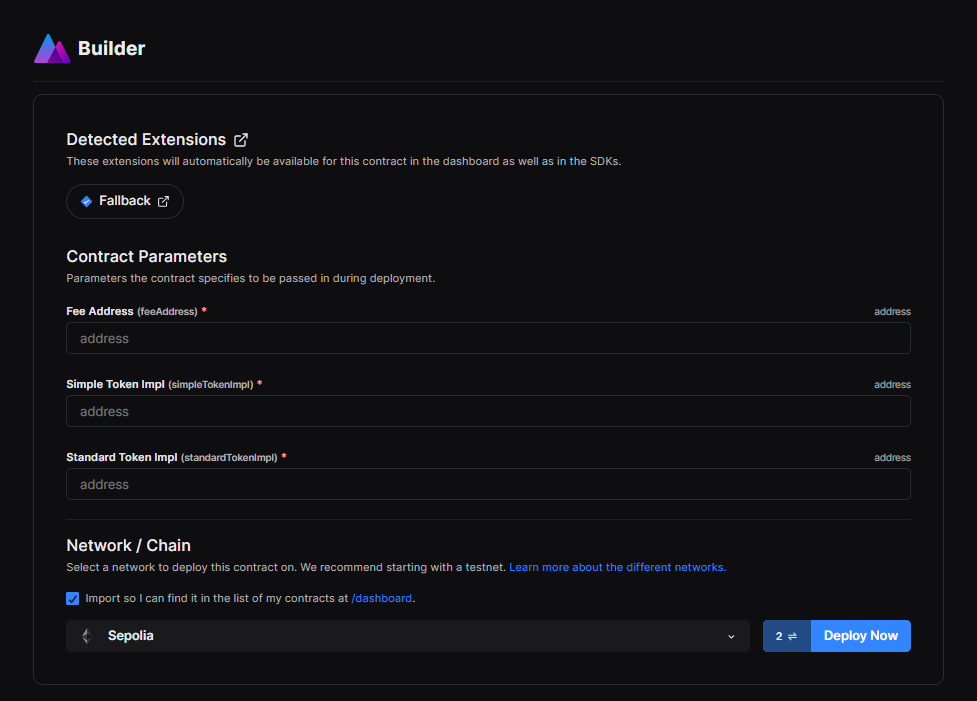
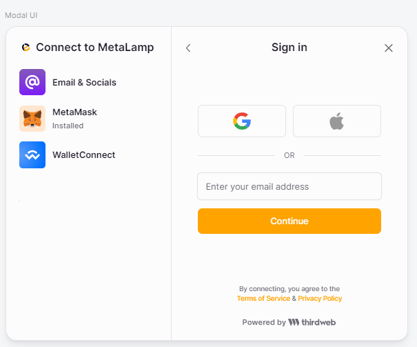
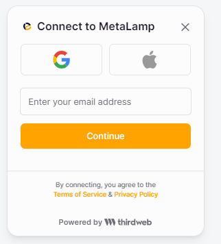
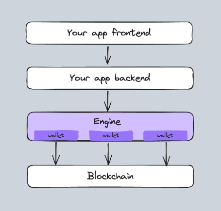
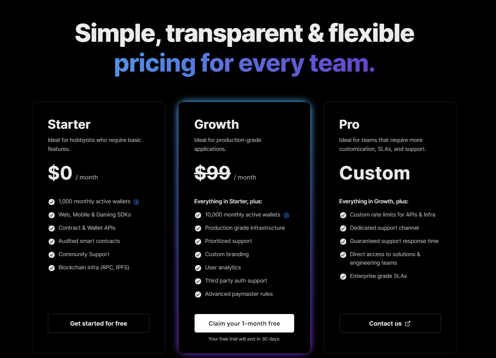

# Обзор инструмента thirdweb

**Автор:** [Павел Найданов](https://github.com/PavelNaydanov) 🕵️‍♂️

> ThirdWeb mission: "Making the internet more open and valuable for builders and users".

_Опр!_ **thirdweb** - платформа для web3 разработки. Позволяет интегрировать работу с кошельками пользователей в собственное приложение, разворачивать смарт-контракты, принимать фиатные и криптовалютные платежи.

Для того, чтобы зарегистрироваться на платформе, понадобиться кошелек и email.

## Экосистема

Я бы охарактеризовал этот продукт, как набор инструментов для web3 разработки. Хотя сам thirdweb называет инструменты полноценными **продуктами**.



1. **Smart-contracts**. Позволяет безопасно разворачивать свои смарт-контракты или смарт-контракты (прошли аудит) платформы на любой EVM совместимой сети, взаимодействовать со смарт-контрактами.
2. **Connect**. Предлагает использовать UI компонент для подключения кошелька пользователя. Помимо этого, возможно настроить работу абстрактного кошелька (АА) или web2 авторизации (по логину и паролю, социальным сетям)
3. **Infrastructure**. Предоставляет децентрализованное хранилище файлов на базе IPFS, rpc endpoints, HTTP server с возможностью вызова смарт-контрактов.
4. **Payments**. Продажа нфт с помощью кредитной карты, gasless transaction (безгазовые транзакции для пользователей).

## Features

Предметно поговорим на счет **функциональных** возможностей, который дает каждый из продуктов thirdweb.

### Contracts

Продукт позволяет безопасно работать со смарт-контрактами в любой EVM совместимой сети. Ниже разберем составляющие инструменты для работы со смарт-контрактами.

#### Explore

Представляет собой предварительно созданный набор смарт-контрактов командой thirdweb. Покрывает наиболее встречающиеся варианты использования смарт-контрактов (нфт, marketplaces, airdrops, staking) и на каждый случай реализован шаблон.

Все контракты доступны на странице [explore](https://thirdweb.com/explore).



Можно выбрать любой из доступных шаблонов смарт-контрактов. Посмотрим на самый простой, шаблон токена.



Приятно, что контракты проходили аудит, под рукой находится отчет компании [macro](https://0xmacro.com/) и с ним можно ознакомиться. Это хороший тон, что протокол не боится показывать аудит своего смарт-контракта.

В верхнем правом углу находится кнопка `Deploy` и разработчик может задеплоить готовый шаблон токена. Панель в середине страницы предоставляет описание функции, событий смарт-контракта, кода (это код взаимодействия со смарт-контрактом со стороны фронтенда), исходники смарт-контракта. Достаточно удобно, я без проблем получил готовый задеплоенный и верифицированный контракт токена в сети [Sepolia](https://sepolia.etherscan.io/address/0x247876BBaF940BC0721678057277522926B85B04#code).

_Важно!_ Контракт токена простой, повсеместно используемый. Однако на мой взгляд, чтобы понять, как взаимодействовать с любым из шаблонов разработчику придется попотеть над описанием и документацией к нему. На мой взгляд самая полезная вкладка здесь `source`, как первоисточник того, что смарт-контракт делает.

Код всех шаблонов можно найти в [репозитории](https://github.com/thirdweb-dev/contracts/tree/90ca7b442ba9534134bf627888e16ae818d2ec28/contracts/prebuilts).

Документация довольно подробная и позволяет обойтись без разработчика смарт-контрактов.

#### Build

Build или **Solidity SDK** - это инструмент, который призван помочь эффективнее создавать свои собственные смарт-контракты.

Подразумевается, что мы должны установить набор готовых смарт-контрактов, как зависимость, внутрь своего проекта. Например, команда для Foundry:

```bash
forge install https://github.com/thirdweb-dev/contracts
```

Дальше мы используем это, как набор базовых контрактов (аналогично [OpenZeppelin](https://www.openzeppelin.com/) библиотеке) и наши смарт-контракты наследуются от смарт-контрактов Solidity SDK.

_Мнение!_ Я бы предложил использовать это, как источник вдохновения, но не более того. Подсмотреть какой-то кейс и повторить его в своих смарт-контрактах. Для этого не обязательно тянуть большой сборник наработок, который не будет использоваться в проекте.

Список подобных наработок можно найти в документации, в разделе [build](https://portal.thirdweb.com/contracts/build/base-contracts). Красной рамкой выделены разделы по наработкам под каждый стандарт.



Почему я говорю, что лучше относится к этому, как к наработкам. Попробуем посмотреть на смарт-контракт `ERC721Base.sol`. Заявляется, что контракт использует оптимизацию [ERC721A](https://www.erc721a.org/).

Это интересно! Тогда мой вопрос: "под капотом, мы еще тянем репозиторий с ERC721A?"

Давайте изучим [ERC721Base.sol](https://github.com/thirdweb-dev/contracts/blob/main/contracts/base/ERC721Base.sol#L33). Наследуемся от `ERC721AQueryable.sol`, а он наследуется от [ERC721A.sol](https://github.com/thirdweb-dev/contracts/blob/main/contracts/eip/ERC721A.sol).

А теперь посмотрим на самый последний оптимизированный вариант оригинального [ERC721A.sol](https://github.com/chiru-labs/ERC721A/blob/main/contracts/ERC721A.sol). Заметил разницу? Совершенно разный код. Вот поэтому я и считаю, что SDK можно использовать, как хороший крепкий набор заготовок, но не забывать, про оригинальные или более лучшие решения.

#### Deploy

Это инструмент для развертывания смарт-контрактов. Все просто, говорит нам [документация](https://portal.thirdweb.com/contracts/deploy/overview), переходим в проект со смарт-контрактами и запускаем лишь одну команду:

```bash
npx thirdweb deploy
```

Далее thirdweb автоматически находит и проверяет смарт-контракты, открывает информационную панель и легко проводит по процессу деплоя.

Пробуем, я взял один из своих домашних проектиков, в котором достаточно много контрактов, примерно 15 и запустил `npx thirdweb deploy`. Прошел авторизацию в браузере и мне предложили выбрать смарт-контракт для деплоя. Первое неудобство, заключается в том, что конечно же инструмент предлагает к деплою все найденные контракты.



Remix, например, тоже всегда предлагает самостоятельно выбирать контракт для деплоя среди всех возможных.

После выбора смарт-контракта, я выбрал контракт `Builder.sol`, была сгенерирована ссылка, которая отправляет в браузер, где интерфейс показывает параметры деплоя смарт-контракта.



Заполнив поля для конструктора смарт-контракта я успешно его задеплоил. Верифицировать конечно необходимо отдельно, но мой скептицизм к этому инструменту все равно улетучился. Деплой прошел быстро и удобно. Я впечатлен!

_Мнение!_ Однако я считаю, что инструмент подходит для деплоя одного смарт-контракта. Когда необходимо разворачивать протокол, где множество взаимосвязанных контрактов и различных настроек, я бы все-таки использовал деплой скрипты от Foundry или Hardhat (лучше Foundry).

#### Publish

Этот инструмент тоже про деплой смарт-контрактов с той лишь разницей, что цель развертывание заключается в совместном использовании. То есть можно поделиться своим смарт-контрактом с другими разработчиками для его тестирования и изучения. Для такого смарт-контракта будет специально создана отдельная страница.

Для запуска необходимо в корне проекта запустить команду:

```bash
npx thirdweb publish
```

Дальнейший процесс очень похож на процесс деплоя. Я опубликовал смарт-контракт `Builder.sol` из своего домашнего проекта. Теперь вы можете оценить качество моего [кода](https://thirdweb.com/0x9b5DCAA3002d77fB9dEDfc1006838d08977a3432/Builder). 😅

#### Interact

Инструмент для взаимодействия с развернутыми смарт-контрактами. Поддерживает несколько языков: SDK для Unity, TypeScript, React, Python и GO.

На примере [документации](https://portal.thirdweb.com/typescript/v4) к языку typescript я увидел возможность делать:
- Прямые вызовы к смарт-контрактам (**call**)
- Вызывать функции смарт-контрактов на базе ABI
- Разворачивать смарт-контракты (**deployBuiltInContract**)
- Верифицировать смарт-контракты (**verifyContract**)

Полное Typescript SDK [тут](https://portal.thirdweb.com/references/typescript/v4/types). Как solidity разработчик, не берусь судить насколько удобнее его использовать, чем более традиционные библиотеки (ethers.js, wagmi).

### Connect

Продукт который отвечает за подключение кошельков пользователей внутрь приложения. Состоит из нескольких частей, ниже я про них расскажу.

#### Connect component

Предлагает готовый компонент **ConnectWallet** или **Wallet SDK** для создания собственного интерфейса подключения кошельков пользователей.

Для понимания того, что можно кастомизировать с помощью этого продукта, thirdweb сделал отдельный [playground](https://thirdweb.com/dashboard/connect/playground), где можно создать собственное модальное окно.

Я собрал вот такое окно.



#### Embedded Wallet

Этот продукт позволяет пользователям входить в приложение, используя свой адрес электронной почты и пароль или социальные сети. После аутентификации предоставляется кошелек, который можно использовать для выполнения сетевых действий, таких как создание NFT и отправка транзакций.



_Важно!_ Однако все не так просто, в бесплатном плане, на данный момент есть ограничение на 1000 активных кошельков в месяц.

Опытный разработчик должен задать вопрос, а как создается кошелек, где хранится приватный ключ этого кошелька, если пользователь заходит по почте и паролю.

Приватный ключ создается и разделяется на три части при помощи алгоритма [Shamir's Secret Sharing](https://en.wikipedia.org/wiki/Shamir%27s_secret_sharing):
- Первая часть хранится на устройстве пользователям
- Вторая часть зашифрована и хранится в Amazon KMS
- Третья часть шифруется на данных аутентификации пользователя и хранится в KMS Amazon

Получается, что несмотря на то, что thirdweb **хранит** части ключей на своих серверах у них **нет возможности расшифровать** этот ключ.

_Важно!_ Если пользователь потеряет доступ к своей электронной почте, то он не сможет восстановить доступ.

Подключение кошелька в коде для начала работы достаточно простое.

```js
import {
  ThirdwebProvider,
  ConnectWallet,
  embeddedWallet,
} from "@thirdweb-dev/react";

export default function App() {
  return (
    <ThirdwebProvider
      activeChain="goerli"
      clientId="YOUR_CLIENT_ID"
      supportedWallets={[embeddedWallet()]}
    >
      <ConnectWallet />
    </ThirdwebProvider>
  );
}
```

#### Account abstraction (AA)

Позволяет реализовать абстракцию аккаунта из коробки согласно стандарту [ERC-4337](https://eips.ethereum.org/EIPS/eip-4337). Включает в себя самый важный функционал:
- Безгазовые транзакции
- Несколько владельцев у одного кошелька
- Выполнение транзакций (single и batch)

На мой взгляд, как человека, который успел немного поработать с АА, не то здесь ценено, что этот функционал есть. Классно то, что его можно использовать в связке с **Embedded Wallet**.

Объясню, что я имею ввиду. AA представляет собой группу смарт-контрактов, которые позволяют сделать кошельком пользователя обычный смарт-контракт. Но для использования такой абстракции (под использованием понимаем вызовы на смарт-контракте кошелька), как не крути необходим [EOA](https://ethereum.org/en/developers/docs/accounts/#types-of-account). Это означает, что нужен приватный ключ от этого аккаунта, который пользователю нужно хранить. Не всегда понятно пользователю, в чем его абстракция, если он все равно имеет приватный ключ и использует тот же Metamask для подписания транзакций.

И вот тут связка **AA** c **Embedded Wallet** позволяет действительно абстрагировать кошелек пользователя и управлять он им будет использую только свою электронную почту и пароль.

Нам, как разработчикам, может быть действительно удобно, что полная реализации процесса абстракции может быть легко сделана с помощью только одного продукта thirdweb и нам не надо собирать солянку: отдельно сервис для АА (например [Alchemy](https://accountkit.alchemy.com/packages/aa-alchemy/)) + сервис для хранения приватника ([Fireblocks MPC](https://www.fireblocks.com/what-is-mpc/)).

#### Auth

Этот инструмент не что иное, как SDK для разработчиков, который позволяет интегрировать все, что описано в разделах продукта **Connect**. С помощью Auth разработчики могут создавать приложения с безопасной и самостоятельной аутентификацией.

Под капотом аутентификация работает на базе [JWT](https://portal.thirdweb.com/connect/auth/how-it-works#how-does-authentication-work). Идентификация пользователя происходит по web3 кошельку и чтобы доказать пользователю, что это он, ему необходимо дать свою подпись. В этом плане все стандартно для web3 приложений.

Пример аутентификации на Next.js можно посмотреть [тут](https://github.com/thirdweb-dev/js/tree/main/packages/auth).

### Engine

Это HTTP server для вызова смарт-контрактов с использованием собственных кошельков.



Подразумевается, что он будет прослойкой между вашим приложением и блокчейном, предоставляя API endpoints для более дружелюбного взаимодействия приложения с блокчейном.

Из списка функциональных возможностей, мне понравились следующие:
1. **Создание и управление сервисными кошельками**. Можно создавать и управлять своими кошельками на бекенде. Это может помочь организовать безгазовые транзакции или управление протоколом от имени администратора.
2. **Абстракция аккаунта**. Полноценная организация абстракции аккаунта с деплоем смарт-контрактов и проведением транзакций от имени пользователей.
3. **Безгазовые транзакции**. То, чего часто не хватает для приложений, в которых знания пользователя о блокчейне минимально и пользователям сложно объяснить, зачем им нужен метамаск, оплатить газ, для того, чтобы получить токены (например, игры).
4. **Сканер транзакций**. В каждом втором приложении, которое я писал, необходимо индексировать события. Здесь за индексацию будет отвечать engine.

_Важно!_ Развернуть engine можно в собственной инфраструктуре или воспользоваться возможностями thirdweb и не беспокоиться о настройке и обслуживании.

В гайдах предлагается несколько примеров. Первый - [airdrops NFT](https://portal.thirdweb.com/engine/guides/airdrop-nfts), второй - [NFT оплата](https://portal.thirdweb.com/engine/guides/nft-checkout).

Я вот ознакомился со всей документацией и если честно не вижу смысла использовать **engine** в своих проектах при наличии квалифицированной команды, которая может весь необходимой функционал по взаимодействию с блокчейном реализовать внутри своего бекенда. Возможно, это может быть актуально, когда команда не имеет соответствующей квалификации, а настроить взаимодействие с блокчейном надо. Но тут есть минус, надо разбираться с engine, который выступает промежуточным звеном, но понимать, как работает сам блокчейн тоже надо. Как-будто то экономия времени на старте по реализации своего взаимодействия, может выстрелить в ногу в будущем.

### Payments

Предлагает максимально простой способ оплаты при покупке NFT.

Thirdweb принимает **фиатные платежи** через кредитные и дебетовые карты, Apple Pay и Google Pay. Также поддерживает оплату в **криптовалюте** для некоторых популярных блокчейнов (Ethereum, Polygon, Avalanche). Подробнее про поддержку можно посмотреть [тут](https://portal.thirdweb.com/payments#supported-chains-and-currencies-for-developers).


Checkouts компоненты не поддерживают русский язык, зато поддерживают: английский, французский, японский, китайский и некоторые другие.

На мой взгляд, значимой фичей здесь может выступать ссылка для единоразовой оплаты. Это заранее предварительно настроенный интерфейс оформления заказа для каждого покупателя, которы позволяет совершить не больше одной покупки.

## Для чего может применяться

**Thirdweb** предлагает применять себя в нескольких предметных областях:

- Решение для **game** индустрии. Интеграция web3 механик в игры
- **Minting**. Создание и использование NFT
- **Программа лояльности**. Реализует специальные карты, в виде NFT, которые открывают новые возможности для пользовательского опыта
- Функционал **marketplace**. Возможность добавить функционал продажи/покупки активов
- **Инструменты разработки**. Использование продукта, как набор инструментов (кошельки, контракты, оплаты и так далее) для построения собственного приложения
- **Онбординг в web3**. Предлагает проработанное, эргономичное решение пользовательского опыта в подключении кошельков и начала работы с web3 приложением.

## Pricing

На момент написания статьи thirdweb предлагает три **плана**:
1. **Starter**. Бесплатный план. До 1000 активных кошельков в месяц. 1Gb для pin файлов в ipfs. 100 запросов в секунду.
2. **Growth**. 99$ долларов в месяц. 5Gb для pin файлов в ipfs. 500 запросов в секунду. Часы поддержки
3. **Pro**. Индивидуальный план для команд. Включает поддержку, дополнительную кастомизацию и другие договоренности.



На мой взгляд, бесплатный план хорош и он позволяет построить mvp приложения. Для проверки гипотезы может подойти идеально, а дальше уже можно задумываться о повышении плана.

Актуальную стоимость планов thirdweb смотри в разделе [pricing](https://thirdweb.com/pricing).

## Вывод

Продукт безусловно большой, содержит в себе много инструментов, много вариантов использования, кучу документации и гайдов. Заслуживает ли он внимания разработчиков? Безусловно, заслуживает, как минимум того, чтобы попробовать завести это в рамках настоящего проекта. Я думаю, thirdweb может помочь в случае, когда ресурс команды ограничен и в штате нет разработчиков смарт-контрактов и достаточно опытных специалистов по разработки бекенд части для взаимодействия с блокчейном.

Если у вас есть самодостаточная команда, то на мой взгляд этот инструмент будет излишним или использоваться точечно. Например для оплаты NFT в фиате или account abstraction + embedded wallet.

## Links

1. [Thirdweb](https://thirdweb.com/)
2. [Thirdweb github](https://github.com/thirdweb-dev)